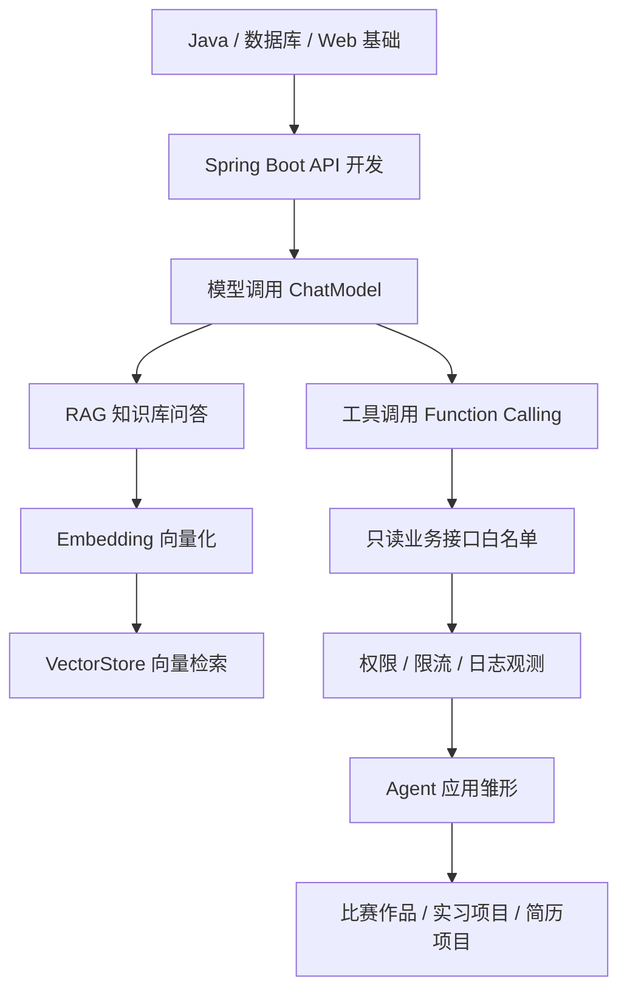
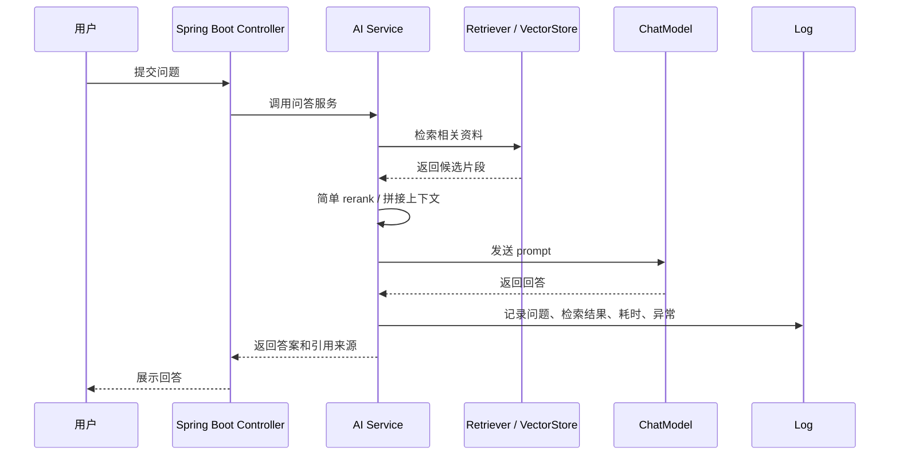

<!-- generated_at: 2026-07-12T08:31:43+08:00 -->

# 2026-07-12 从 Spring AI 看 Java AI 工程化：给大二升大三学生的学习文章

> 生成时间：2026-07-12  
> 读者定位：中北大学软件学院大二升大三学生，已具备 Java、数据库、Web 基础，正在补工程化与 AI 应用开发能力。  
> 今日主题：用 Spring AI 这类 Java AI 工程框架，把“模型调用、RAG、工具调用、权限边界、比赛与求职方向”串成一条可执行的学习路线。

## 目录

| 序号 | 部分 | 你能读到什么 |
|---:|---|---|
| 1 | [一、先用一张图建立整体认识](#一先用一张图建立整体认识) | Java 后端学生学习 AI 应用开发时，应该先抓住哪些主线 |
| 2 | [二、今日核心项目](#二今日核心项目) | 为什么选择 Spring AI，以及它和 Spring Boot、RAG、Agent、工具调用的关系 |
| 3 | [三、最新信息怎么影响学习](#三最新信息怎么影响学习) | AI 新闻、GitHub 项目、招聘和比赛对学习方向的共同指向 |
| 4 | [四、适合当前阶段的知识拆解](#四适合当前阶段的知识拆解) | 用 Java 后端能理解的话解释模型调用、RAG、Embedding、工具调用、Agent、MCP 等概念 |
| 5 | [五、今天可以动手做什么](#五今天可以动手做什么) | 3-5 个适合今天完成的小工程任务 |
| 6 | [六、资料来源](#六资料来源) | 本文用到的新闻、GitHub、招聘和比赛来源 |

## 一、先用一张图建立整体认识

大二升大三的阶段，不建议一上来就追求“训练大模型”。对 Java 后端方向来说，更现实的切入点是：**把大模型当成一个外部能力，学习如何在 Spring Boot 项目里稳定、安全、可维护地调用它**。

也就是说，你现在要补的不是“会不会问 ChatGPT”，而是下面这条工程链路：



这张图里，`Spring Boot API 开发` 是你已经接触过的 Web 基础；`ChatModel`、`Embedding`、`VectorStore`、`工具调用` 是 AI 应用多出来的部分；`权限、限流、日志` 则是企业项目非常看重的工程化能力。

今天的主线项目选 **Spring AI**，原因很直接：它贴近 Java 和 Spring 生态，适合把你已经学过的 Spring Boot、数据库、接口开发经验迁移到 AI 应用里。

## 二、今日核心项目


| 项目 | 内容 |
|---|---|
| 项目名 | `spring-projects/spring-ai` |
| GitHub 链接 | <https://github.com/spring-projects/spring-ai> |
| 主要语言 | Java |
| 数据中的描述 | Spring 生态的 AI 应用抽象层，覆盖模型接入、向量库、工具调用、ETL 与 RAG |
| 适合人群 | 已经学过 Java、Spring Boot、数据库、Web 基础，想进入 AI 应用开发的学生 |

Spring AI 可以理解为：**Spring 生态给 AI 应用开发提供的一层统一接口**。

以前你写 Java Web 项目时，常见结构是：

```text
Controller -> Service -> Mapper/Repository -> Database
```

到了 AI 应用里，结构会变成：

```text
Controller -> Service -> ChatModel / EmbeddingModel / VectorStore / Tool -> LLM 或业务系统
```

也就是说，原来你的 Service 主要调用数据库；现在它可能还会调用大模型、向量数据库、文档解析组件、业务工具接口。

Spring AI 和这些方向有关：

| 方向 | 和 Spring AI 的关系 | 对 Java 学生的意义 |
|---|---|---|
| Spring Boot | Spring AI 可以放进 Spring Boot 项目中使用 | 不需要完全换技术栈，可以在已有 Web 项目基础上加 AI 能力 |
| RAG | 支持围绕文档、向量库、检索增强生成构建问答应用 | 可以做“校园制度问答”“课程资料问答”“企业知识库问答”等项目 |
| Embedding | 把文本转成向量，方便做相似度检索 | 对应数据库之外的新型检索方式，是 RAG 的基础 |
| 工具调用 | 让模型在受控条件下调用 Java 方法或业务接口 | 可以让 AI 不只聊天，还能查课表、查订单、查库存，但必须加权限边界 |
| Agent | 可以作为更复杂任务编排的基础 | 适合后续做“能拆解任务、选择工具、执行步骤”的智能体应用 |
| 工程化 | 涉及配置、日志、异常处理、限流、可观测性 | 这是企业招聘真正关心的部分，不只是能跑 demo |

注意：数据里 GitHub 访问返回了 HTTP 403，所以本文不编造 star、fork、最近更新时间，只基于给出的项目描述和原始链接进行学习分析。

## 三、最新信息怎么影响学习

今天的数据里有几类信息：AI 新闻、GitHub 项目、招聘方向、比赛活动。它们看起来分散，其实都在指向同一件事：**AI 应用正在从“会调用模型”变成“会构建可控、可扩展、可接入业务系统的工程”**。

OpenAI Developers 里出现了 `Docs MCP`，说明文档、工具、外部系统和模型之间的连接方式正在标准化。对 Java 学生来说，这不是让你马上研究协议细节，而是提醒你：未来一个 AI 应用可能不是一个孤立接口，而是要和企业内部文档、服务、数据库、工具平台连接起来。

Hugging Face Blog 里有 `Data for Agents`、`Native-speed vLLM transformers modeling backend`、PyTorch profiling 相关内容。虽然这些更偏模型和推理基础设施，但它给后端同学的启发是：Agent 不只是 prompt，它需要数据、工具、性能和稳定性支撑。你可以不先做模型训练，但要理解“数据怎么进入系统、检索怎么发生、模型服务怎么被调用”。

Planet AI 里有两条值得注意：一条是长上下文并不免费，另一条是大模型仍然会编造内容。它们刚好对应 RAG 项目的两个关键问题：

| 问题 | 对学生项目的提醒 | 对 Java 工程的要求 |
|---|---|---|
| 长上下文成本高 | 不能把所有文档一股脑塞进 prompt | 要做检索、摘要、重排、上下文裁剪 |
| 模型会编造 | 不能把模型回答直接当事实 | 要返回引用来源、增加置信判断、限制可执行动作 |
| Agent 需要数据 | 智能体不是空想，它要能访问结构化和非结构化数据 | 要会设计数据库表、接口、权限和日志 |
| 工具调用有风险 | 模型不能随便调用删除、支付、修改类接口 | 要设计白名单、只读接口、审批流或二次确认 |

再看 GitHub 项目。除了 Spring AI，数据中还有 `langchain4j/langchain4j`、`alibaba/spring-ai-alibaba`、`modelcontextprotocol/java-sdk`、`microsoft/semantic-kernel`。这说明 Java AI 生态不是空白，方向包括：

| 项目 | 数据中的定位 | 可以关注的学习点 |
|---|---|---|
| `langchain4j/langchain4j` | Java LLM 应用开发框架 | ChatModel、RAG、Embedding、工具调用、Agent 编排 |
| `spring-projects/spring-ai` | Spring 生态 AI 抽象层 | 和 Spring Boot 项目结合，适合 Java Web 学生入门 |
| `alibaba/spring-ai-alibaba` | 国内模型服务和云生态的 Spring AI 扩展 | 国内模型服务接入、企业落地方式 |
| `modelcontextprotocol/java-sdk` | MCP 的 Java SDK | Java 服务如何接入模型工具协议生态 |
| `microsoft/semantic-kernel` | AI 编排 SDK，包含 Java SDK | 插件、函数调用、Agent workflow |
| `github/copilot-sdk` | 用 Java 等语言集成 GitHub Copilot Agent | AI 编程助手和业务系统集成 |

招聘动态也在呼应这些能力。阿里巴巴、腾讯、字节跳动、百度、美团的方向里，都出现了 Java 后端、AI 平台、大模型应用、智能体应用、平台工程这些关键词。它们不是要求你现在就会训练模型，而是希望你具备下面几种能力：

| 招聘关注点 | 学生阶段可以准备什么 |
|---|---|
| Java 后端基础 | Spring Boot、MyBatis/JPA、Redis、MySQL、接口设计 |
| AI 工程化 | 模型调用封装、异常处理、日志、限流、权限控制 |
| 大模型应用 | RAG 问答、工具调用、Agent 简单编排 |
| 平台工程 | 配置管理、任务队列、服务监控、接口稳定性 |
| 业务理解 | 能把“AI 能力”接到真实场景，而不是只做聊天页面 |

比赛和活动方面，`AI4J Intelligent Java Conference` 明确关注 Java AI、Spring AI、LangChain4j、RAG、Agent；中国人工智能大赛、WAIC、Google Cloud Next 则更偏产业趋势、云端 AI 和应用创新。对你来说，最合适的方式是把比赛当作项目驱动：比如做一个“课程资料 RAG 问答系统”或“校园服务智能助手”，再把日志、权限、工具调用白名单补齐，这比只做一个聊天框更有含金量。

## 四、适合当前阶段的知识拆解

下面这些概念，建议你不要死记名词，而是把它们放回 Java 后端项目里理解。

| 概念 | 朴素解释 | 和 Java 后端学习的关系 |
|---|---|---|
| 模型调用 | 后端通过 API 把用户问题发给大模型，再拿到回答 | 类似调用第三方支付、短信、地图 API，只是返回结果是自然语言 |
| RAG | 先从自己的资料库里检索相关内容，再让模型基于这些内容回答 | 适合做知识库问答，能减少模型胡编；后端要负责文档入库、检索和结果拼接 |
| Embedding | 把一段文字变成一组数字向量，用来比较语义相似度 | 类似“模糊搜索”的升级版，不只按关键词匹配，还能按意思匹配 |
| VectorStore | 存储和检索向量的组件 | 可以理解为 AI 场景下的特殊数据库，常和 RAG 配合使用 |
| 工具调用 | 让模型在需要时调用后端提供的方法或接口 | Java 后端要设计哪些接口能被调用、参数怎么校验、失败怎么处理 |
| Agent | 能根据目标拆步骤、选工具、执行任务的 AI 应用形态 | 它不是一个神秘东西，本质是“模型 + 工具 + 状态 + 控制逻辑” |
| MCP | 一种让模型客户端和外部工具/数据源连接的协议思路 | 对 Java 学生来说，可以关注 Java 服务如何以标准方式暴露工具能力 |
| 日志观测 | 记录模型请求、检索结果、工具调用、异常和耗时 | 企业项目必须知道系统为什么回答错、哪里慢、哪个接口失败 |
| 限流 | 限制单位时间内的请求次数 | 模型 API 通常有成本和并发限制，后端要防止接口被刷爆 |
| 权限 | 控制模型和用户能访问哪些数据、能执行哪些动作 | 工具调用尤其需要权限，不能让模型随便改库、删数据、发请求 |

对当前阶段最重要的是：**先把模型调用当作后端集成能力来学，再逐步加 RAG、工具调用、权限和日志**。这样你做出来的项目会更像企业应用，而不是简单 demo。

## 五、今天可以动手做什么

今天不建议贪多，选 3-5 个小任务做完，并留下产出物。产出物可以放进 GitHub 仓库，也可以整理成学习笔记。

| 任务 | 建议耗时 | 具体做法 | 产出物 |
|---|---:|---|---|
| 设计工具调用白名单 | 40 分钟 | 假设你有课程、学生、成绩 3 类接口，只允许模型调用 2-3 个只读接口，例如查询课程表、查询课程介绍、查询教师信息 | 一份 `tool-whitelist.md`，写清接口名、参数、是否只读、权限边界 |
| 对比 Spring AI 与 LangChain4j 抽象 | 60 分钟 | 阅读两个项目介绍，围绕 `ChatModel`、`EmbeddingModel`、`VectorStore`、工具调用写 5 条差异或相似点 | 一份对比表格，说明哪个更贴近 Spring Boot 项目 |
| 实现意图识别 prompt | 45 分钟 | 写一个 prompt，把用户问题分成“问答、检索、任务执行、闲聊”四类，并准备 10 条测试输入 | 一个 `intent-prompt.md` 和测试样例表 |
| 给 RAG 加最小 rerank 思路 | 60-90 分钟 | 先检索出 5 条候选文档，再按“是否包含关键词、是否来自可信文档、是否更短更直接”等规则重排 | 一段伪代码或 Java Service 方法草稿 |
| 补一份 AI 接口日志字段设计 | 30 分钟 | 设计记录用户问题、模型名、检索文档 ID、工具调用名、耗时、异常信息的日志结构 | 一张日志字段表，可后续变成数据库表 |

一个适合今天完成的小闭环是：



如果你今天只能做一件事，优先做“工具调用白名单”。因为它能训练你从工程安全角度思考 AI：模型可以很强，但后端必须规定它能做什么、不能做什么。

## 六、资料来源

| 类型 | 名称 | 链接 |
|---|---|---|
| GitHub 仓库 | `spring-projects/spring-ai` | <https://github.com/spring-projects/spring-ai> |
| GitHub 仓库 | `langchain4j/langchain4j` | <https://github.com/langchain4j/langchain4j> |
| GitHub 仓库 | `1Panel-dev/MaxKB` | <https://github.com/1Panel-dev/MaxKB> |
| GitHub 仓库 | `alibaba/spring-ai-alibaba` | <https://github.com/alibaba/spring-ai-alibaba> |
| GitHub 仓库 | `microsoft/semantic-kernel` | <https://github.com/microsoft/semantic-kernel> |
| GitHub 仓库 | `modelcontextprotocol/java-sdk` | <https://github.com/modelcontextprotocol/java-sdk> |
| GitHub 近期项目 | `github/copilot-sdk` | <https://github.com/github/copilot-sdk> |
| GitHub 近期项目 | `thedaviddias/llms-txt-hub` | <https://github.com/thedaviddias/llms-txt-hub> |
| GitHub 近期项目 | `jgravelle/jcodemunch-mcp` | <https://github.com/jgravelle/jcodemunch-mcp> |
| 新闻源 | OpenAI Developers | <https://developers.openai.com/> |
| 新闻文章 | Docs MCP | <https://developers.openai.com/learn/docs-mcp/> |
| 新闻文章 | OpenAI Developers plugin | <https://developers.openai.com/learn/developers-codex-plugin/> |
| 新闻文章 | Realtime and audio guide | <https://platform.openai.com/docs/guides/realtime> |
| 新闻源 | Hugging Face Blog | <https://huggingface.co/blog> |
| 新闻文章 | Data for Agents | <https://huggingface.co/blog/nvidia/open-data-for-agents> |
| 新闻文章 | Native-speed vLLM transformers modeling backend | <https://huggingface.co/blog/native-speed-vllm-transformers-backend> |
| 新闻文章 | Profiling in PyTorch: Attention is all you profile | <https://huggingface.co/blog/torch-attention-profile> |
| 新闻源 | Planet AI | <https://planet-ai.net/> |
| 新闻文章 | Long Context Isn’t Free | <https://towardsdatascience.com/long-context-isnt-free-i-built-a-safe-prompt-pruning-layer-that-makes-llm-systems-work/> |
| 新闻文章 | Why Frontier AI Still Makes Things Up | <https://towardsdatascience.com/that-is-embarrassing-why-frontier-ai-still-makes-things-up-and-what-to-do-about-it/> |
| 招聘官网 | 阿里巴巴招聘 | <https://talent.alibaba.com/> |
| 招聘官网 | 腾讯招聘 | <https://careers.tencent.com/> |
| 招聘官网 | 字节跳动招聘 | <https://jobs.bytedance.com/> |
| 招聘官网 | 百度招聘 | <https://talent.baidu.com/> |
| 招聘官网 | 美团招聘 | <https://zhaopin.meituan.com/> |
| 比赛 / 活动 | AI4J Intelligent Java Conference | <https://ai4j.io/> |
| 比赛 / 活动 | 中国人工智能大赛 | <https://www.aicomp.cn/> |
| 比赛 / 活动 | 世界人工智能大会 WAIC | <https://www.worldaic.com.cn/> |
| 比赛 / 活动 | Google Cloud Next | <https://cloud.withgoogle.com/next> |
