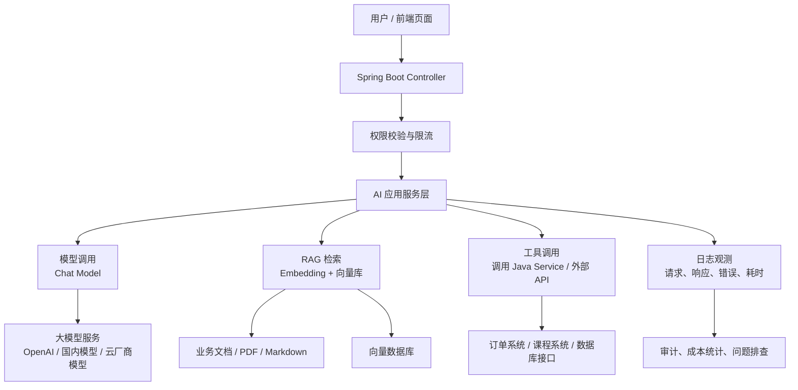

<!-- generated_at: 2026-07-16T08:31:45+08:00 -->

# 2026-07-16 从 Spring AI 看 Java AI 工程化：给大二升大三学生的学习文章

> 生成时间：2026-07-16  
> 读者定位：中北大学软件学院大二升大三学生，已具备 Java、数据库、Web 基础，正在补工程化与 AI 应用开发能力。  
> 今日主题：用 Spring AI 理解“Java 后端如何把大模型、RAG、工具调用和企业工程能力串成一个可运行系统”。

## 目录

| 序号 | 部分 | 你能读到什么 |
|---|---|---|
| 1 | [一、先用一张图建立整体认识](#一先用一张图建立整体认识) | 从 Java Web 基础出发，看 AI 应用的整体工程结构 |
| 2 | [二、今日核心项目](#二今日核心项目) | 重点认识 Spring AI：它为什么适合 Java 学生入门 AI 工程 |
| 3 | [三、最新信息怎么影响学习](#三最新信息怎么影响学习) | 把 AI 新闻、GitHub 项目、招聘和比赛放到同一条学习主线里 |
| 4 | [四、适合当前阶段的知识拆解](#四适合当前阶段的知识拆解) | 用大二升大三能理解的话解释 RAG、Embedding、工具调用、Agent 等概念 |
| 5 | [五、今天可以动手做什么](#五今天可以动手做什么) | 3-5 个可以当天完成的小工程任务 |
| 6 | [六、资料来源](#六资料来源) | 本文用到的 GitHub、新闻、招聘和比赛链接 |

## 一、先用一张图建立整体认识

如果你已经学过 Java、数据库、Web，那么可以先把 AI 应用理解成一种“增强版后端系统”：以前用户请求进来，Controller 调 Service，Service 查数据库；现在中间多了模型调用、向量检索、工具调用、日志观测和权限控制。



这张图里最值得你抓住的是：AI 应用不是“写一个 prompt 就结束”，而是要把模型放进一个稳定、可维护、可观测的后端系统里。对 Java 后端同学来说，真正有竞争力的方向不是只会聊天接口，而是知道如何用 Spring Boot、数据库、接口设计、权限、安全和日志，把 AI 能力做成一个能给别人使用的产品。

## 二、今日核心项目

今天的核心项目选择：**spring-projects/spring-ai**。


| 项目 | 内容 |
|---|---|
| GitHub 仓库 | [spring-projects/spring-ai](https://github.com/spring-projects/spring-ai) |
| 主要语言 | Java |
| 项目描述 | Spring 生态的 AI 应用抽象层，覆盖模型接入、向量库、工具调用、ETL 与 RAG |
| 适合人群 | 已经学过 Spring Boot，想进入 AI 应用开发的 Java 学生 |
| 注意 | 数据源未确认 star、fork、更新时间，因此本文不引用这些指标 |

Spring AI 的价值在于：它把大模型应用开发尽量放回 Java 后端同学熟悉的 Spring 体系里。你不用一上来就切换到完全陌生的技术栈，而是可以继续用 Controller、Service、配置文件、Bean、依赖注入这些知识，去接入 Chat Model、Embedding Model、Vector Store 和 Tool Calling。

对大二升大三的同学来说，它适合做第一阶段主线项目，原因有三个。

第一，它和 Spring Boot 的关系非常近。你已经知道如何写接口、如何读配置、如何组织 Service，那么 Spring AI 就可以作为“AI 能力层”接入已有后端项目。例如你可以写一个 `/api/chat` 接口，后端收到问题后调用模型，再返回回答。

第二，它能帮助你理解 RAG。RAG 的全称是 Retrieval-Augmented Generation，可以粗略理解为“先查资料，再让模型回答”。比如你把学校课程介绍、实验要求、项目文档切成小段，存进向量库。用户提问时，系统先找出最相关的文档片段，再把这些片段和问题一起交给模型。这样模型回答就更接近你的业务资料，而不是只靠它原本的通用知识。

第三，它能连接工具调用和工程化。工具调用不是让模型“自己真的执行代码”，而是让模型判断需要调用哪个后端能力，然后由 Java 程序安全地执行。例如模型判断用户要查课程表，Java 后端再调用课程表 Service。这里就会涉及权限、参数校验、日志审计、限流和异常处理，这些都是企业项目会关注的能力。

| Spring AI 相关能力 | 和 Java 后端学习的关系 | 你可以怎么练 |
|---|---|---|
| 模型接入 | 类似接第三方 API，只是输入输出更偏自然语言 | 用配置文件管理 endpoint、key、model name |
| RAG | 类似“搜索 + 生成”的组合系统 | 把 Markdown 文档切分后做问答 |
| 向量库 | 类似数据库，但查的是语义相似度 | 理解文本如何变成向量，如何检索相关片段 |
| 工具调用 | 类似让模型选择调用哪个 Service 方法 | 把天气、课程、订单等接口包装成工具 |
| ETL | 文档进入知识库前的清洗、切分、转换 | 写一个文档导入流程 |
| 工程化 | 让 AI 功能稳定、可控、可维护 | 加日志、异常处理、权限、限流 |

## 三、最新信息怎么影响学习

今天的数据里有几类信息：AI 新闻、Java AI GitHub 项目、招聘官网、比赛活动。它们看起来分散，其实都在指向同一件事：**AI 应用正在从“能调用模型”走向“能被工程化交付”**。

Hugging Face Blog 中的文章《What building Shippy taught us about building agents》关注 Agent 构建经验。Agent 可以理解为“能分步骤完成任务的 AI 程序”，它不只是回答一句话，而是可能会规划步骤、调用工具、检查结果。对 Java 学生来说，这提醒我们：以后做 AI 应用，不能只停留在 prompt，而要会设计任务流程、工具边界和失败处理。

Hugging Face Blog 里的《Model Routing Is Simple. Until It Isn’t.》提到模型路由。模型路由可以理解为：不同问题交给不同模型处理。简单问题用便宜快速的模型，复杂问题用更强模型。它对后端学习的影响很直接：你以后写的不是一个固定模型调用，而可能是一个“模型网关”，根据任务类型、成本、延迟、权限来选择模型。

OpenAI Developers 中出现了 Docs MCP。MCP，即 Model Context Protocol，可以理解为“让模型以统一方式连接外部工具和上下文的协议”。这和 Java 的关系也很明确：如果你能用 Java 写 MCP Server，就能把自己的后端服务、数据库查询、业务接口，以更规范的方式暴露给 AI 应用使用。

Planet AI 中提到 NVIDIA Jetson Thor 和 Edge AI，说明 AI 不只在云端，也在向机器人、边缘设备发展。虽然你当前重点还是 Java 后端，但要知道未来 AI 系统可能由云端服务、边缘设备、模型服务、业务系统共同组成。后端同学负责的是其中“稳定连接各部分”的能力。

再看招聘动态。阿里巴巴、腾讯、字节跳动、百度、美团的招聘方向都出现了 Java 后端、AI 平台、大模型应用、智能体应用、平台工程等关键词。这说明企业不是只招“会调模型的人”，而是需要能把 AI 功能做进真实业务系统的人。也就是说，你现在学 Spring Boot、数据库、接口、安全、日志，并没有过时，反而是进入 AI 工程化的底座。

比赛活动也能帮助你选方向。AI4J Intelligent Java Conference 明确关注 Java AI 应用开发、Spring AI、LangChain4j、RAG、Agent；中国人工智能大赛关注大模型应用和智能体；WAIC 更偏产业趋势；Google Cloud Next 则偏云端 AI 应用开发。对于学生来说，比赛和会议不是只用来看热闹，而是可以反推学习任务：你能不能做出一个有后端接口、有知识库、有权限控制、有日志的 AI 小系统？

| 信息类型 | 今天看到的信号 | 对你的学习启发 |
|---|---|---|
| AI 新闻 | Agent、模型路由、MCP、边缘 AI 都在升温 | 不要只学 prompt，要学系统设计和工具接入 |
| GitHub 项目 | Spring AI、LangChain4j、MCP Java SDK 等项目都围绕 Java AI 工程 | 可以用熟悉的 Java 技术栈进入 AI 应用开发 |
| 招聘动态 | 大厂关注 Java 后端、AI 平台、大模型工程、智能体应用 | 简历项目要体现工程能力，而不是只有一个聊天页面 |
| 比赛活动 | RAG、Agent、企业级 AI 应用是常见主题 | 可以把课程项目升级成 AI 知识库或智能助手 |

## 四、适合当前阶段的知识拆解

下面这些概念不需要一次学到论文级别，但要能说清楚它们和 Java 后端有什么关系。

| 概念 | 朴素解释 | 和 Java 后端的关系 |
|---|---|---|
| 模型调用 | 后端把用户问题发给大模型服务，再拿到回答 | 类似调用第三方接口，需要配置 key、处理超时、异常和返回格式 |
| Embedding | 把一段文字变成一组数字，用来表示语义 | 类似给文本建立“语义索引”，后面可以做相似度搜索 |
| RAG | 先从知识库查相关资料，再让模型基于资料回答 | 需要文档处理、向量库、检索逻辑和回答组装 |
| 工具调用 | 模型判断该调用哪个功能，Java 后端真正执行 | 可以把已有 Service 方法包装成工具，但必须做权限和参数校验 |
| Agent | 能围绕目标进行多步推理和工具调用的 AI 应用 | 类似一个会调度多个后端能力的流程控制器 |
| MCP | 一种让模型连接工具和上下文的协议 | Java 可以写 MCP Server，把业务接口规范地开放给 AI 系统 |

这里特别提醒一点：AI 工程里很多词听起来很新，但落到代码里经常是你熟悉的后端问题。

比如“模型调用”落地后就是 HTTP 请求、配置管理、异常处理；“RAG”落地后就是文档入库、索引、查询、结果拼接；“工具调用”落地后就是接口设计、参数校验、权限控制；“Agent”落地后就是流程编排、状态管理和失败重试。

所以，你现在最好的学习策略不是脱离 Java 去追所有热点，而是用 Java 后端项目把这些概念一个个接住。

## 五、今天可以动手做什么

今天的小任务建议选 3 个完成即可，不追求大而全，重点是留下可展示的产出物。

| 任务 | 建议耗时 | 具体做法 | 产出物 |
|---|---:|---|---|
| 画一个 AI 应用工程架构图 | 30-45 分钟 | 画出入口、权限、模型网关、RAG、工具调用、日志审计、成本统计 | 一张 Mermaid 图或 draw.io 图 |
| 阅读一个大厂 AI / Java 岗位 JD | 40-60 分钟 | 从阿里、腾讯、字节、百度、美团官网任选一个岗位，提取 5 个能力关键词 | 一份“岗位关键词 -> 学习任务”表格 |
| 设计一个 MCP Server 草案 | 60-90 分钟 | 假设把“课程查询接口”开放给 AI，列出工具名、入参、出参、安全限制 | 一个接口设计 Markdown |
| 写一个最小 Chat API Demo | 90-150 分钟 | 用 Spring AI 或 LangChain4j 写 `/api/chat`，从配置文件切换模型 endpoint 和 key | 一个可运行的 Spring Boot Demo |
| 给 Demo 加工程化细节 | 45-90 分钟 | 增加请求日志、异常返回、简单限流或权限占位 | 一份更像企业项目的后端代码 |

一个比较适合今天的组合是：先画架构图，再读一个 JD，最后写最小 Chat API Demo。这样你既有方向感，也有代码产出，还能把学习内容和就业能力联系起来。

你可以把今天的 Demo 命名为 `java-ai-chat-demo`，目录结构可以先保持简单：

```text
java-ai-chat-demo
├── src/main/java
│   └── com/example/aichat
│       ├── controller
│       ├── service
│       └── config
├── src/main/resources
│   └── application.yml
└── README.md
```

README 里建议写清楚三件事：项目能做什么、怎么配置模型 endpoint 和 key、后续准备加入哪些能力，比如 RAG、工具调用、日志审计。

## 六、资料来源

| 类型 | 名称 | 链接 |
|---|---|---|
| GitHub 仓库 | Spring AI | [https://github.com/spring-projects/spring-ai](https://github.com/spring-projects/spring-ai) |
| GitHub 仓库 | LangChain4j | [https://github.com/langchain4j/langchain4j](https://github.com/langchain4j/langchain4j) |
| GitHub 仓库 | MaxKB | [https://github.com/1Panel-dev/MaxKB](https://github.com/1Panel-dev/MaxKB) |
| GitHub 仓库 | Spring AI Alibaba | [https://github.com/alibaba/spring-ai-alibaba](https://github.com/alibaba/spring-ai-alibaba) |
| GitHub 仓库 | Semantic Kernel | [https://github.com/microsoft/semantic-kernel](https://github.com/microsoft/semantic-kernel) |
| GitHub 仓库 | Model Context Protocol Java SDK | [https://github.com/modelcontextprotocol/java-sdk](https://github.com/modelcontextprotocol/java-sdk) |
| AI 新闻 | OpenAI Developers | [https://developers.openai.com/](https://developers.openai.com/) |
| AI 新闻 | OpenAI Docs MCP | [https://developers.openai.com/learn/docs-mcp/](https://developers.openai.com/learn/docs-mcp/) |
| AI 新闻 | Hugging Face Blog: What building Shippy taught us about building agents | [https://huggingface.co/blog/allenai/shippy-tech-blog](https://huggingface.co/blog/allenai/shippy-tech-blog) |
| AI 新闻 | Hugging Face Blog: Model Routing Is Simple. Until It Isn’t. | [https://huggingface.co/blog/ibm-research/model-routing-is-simple-until-it-isnt](https://huggingface.co/blog/ibm-research/model-routing-is-simple-until-it-isnt) |
| AI 新闻 | NVIDIA Jetson Thor / Edge AI | [https://blogs.nvidia.com/blog/jetson-thor-robotics-edge-ai-agent/](https://blogs.nvidia.com/blog/jetson-thor-robotics-edge-ai-agent/) |
| 招聘官网 | 阿里巴巴招聘 | [https://talent.alibaba.com/](https://talent.alibaba.com/) |
| 招聘官网 | 腾讯招聘 | [https://careers.tencent.com/](https://careers.tencent.com/) |
| 招聘官网 | 字节跳动招聘 | [https://jobs.bytedance.com/](https://jobs.bytedance.com/) |
| 招聘官网 | 百度招聘 | [https://talent.baidu.com/](https://talent.baidu.com/) |
| 招聘官网 | 美团招聘 | [https://zhaopin.meituan.com/](https://zhaopin.meituan.com/) |
| 比赛 / 活动 | AI4J Intelligent Java Conference | [https://ai4j.io/](https://ai4j.io/) |
| 比赛 / 活动 | 中国人工智能大赛 | [https://www.aicomp.cn/](https://www.aicomp.cn/) |
| 比赛 / 活动 | 世界人工智能大会 WAIC | [https://www.worldaic.com.cn/](https://www.worldaic.com.cn/) |
| 比赛 / 活动 | Google Cloud Next | [https://cloud.withgoogle.com/next](https://cloud.withgoogle.com/next) |
