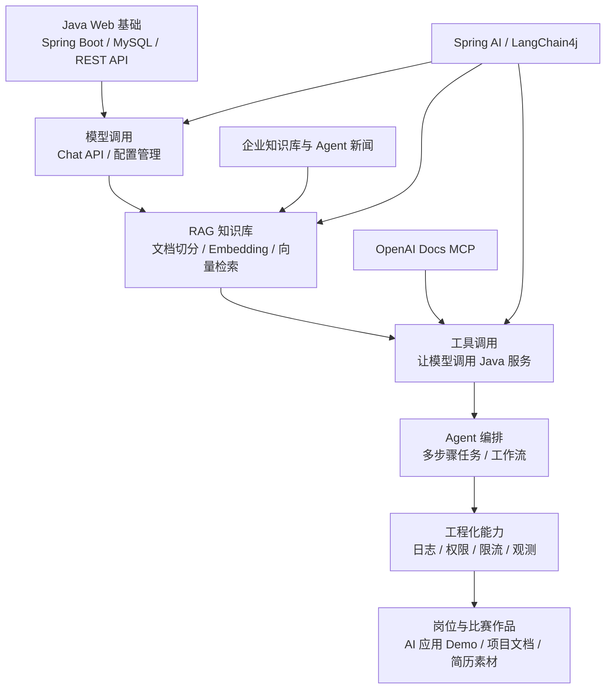

<!-- generated_at: 2026-07-17T08:31:25+08:00 -->

# 2026-07-17 从 Spring AI 看 Java AI 工程化：给大二升大三学生的学习文章

> 生成时间：2026-07-17  
> 读者定位：中北大学软件学院大二升大三学生，已具备 Java、数据库、Web 基础，正在补工程化与 AI 应用开发能力。  
> 今日主题：用 Spring AI 这类 Java 项目理解大模型应用如何从“能聊天”走向“可接入业务系统”。

## 目录

| 序号 | 部分 | 你能读到什么 |
|---|---|---|
| 1 | [一、先用一张图建立整体认识](#一先用一张图建立整体认识) | 把新闻、GitHub 项目、招聘和比赛放到同一条学习主线上 |
| 2 | [二、今日核心项目](#二今日核心项目) | 以 Spring AI 为核心，理解 Java AI 应用开发要学什么 |
| 3 | [三、最新信息怎么影响学习](#三最新信息怎么影响学习) | 从 OpenAI、MCP、企业知识库、岗位和比赛看学习方向 |
| 4 | [四、适合当前阶段的知识拆解](#四适合当前阶段的知识拆解) | 用 Java 后端能理解的话解释模型调用、RAG、Embedding、工具调用等概念 |
| 5 | [五、今天可以动手做什么](#五今天可以动手做什么) | 3-5 个小任务，把信息转成代码、文档和简历素材 |
| 6 | [六、资料来源](#六资料来源) | 本文使用到的 GitHub、新闻、招聘和比赛来源 |

## 一、先用一张图建立整体认识

今天的数据里有三类信号值得你关注。

第一类是 AI 新闻：OpenAI Developers 提到了 Docs MCP，Planet AI 里出现了企业知识库、Agent、长上下文模型等内容。它们说明大模型应用正在从“给模型发一句话”变成“让模型读取文档、调用工具、参与业务流程”。

第二类是 Java 相关开源项目：Spring AI、LangChain4j、spring-ai-alibaba、modelcontextprotocol/java-sdk 等项目都在做同一件事：让 Java 后端程序更容易接入模型、向量库、工具调用和智能体编排。

第三类是招聘和比赛：阿里、腾讯、字节、百度、美团的方向里都出现了 AI 工程化、大模型应用、AI 平台、智能体应用。比赛和会议也在围绕 RAG、Agent、Spring AI、LangChain4j 展开。这对大二升大三学生的启发是：不要只把 AI 当成“调一个接口”，而要把它当成一个新的后端系统能力。



这张图可以当成你接下来一个月的学习路线：先用 Spring Boot 写出能调用模型的接口，再把数据库、文档、权限、日志这些你已经学过的内容接进来，最后形成一个可以展示的 AI 应用小项目。

## 二、今日核心项目

今天选择的核心项目是 **spring-projects/spring-ai**。


| 项目 | 信息 |
|---|---|
| GitHub 仓库 | https://github.com/spring-projects/spring-ai |
| 项目描述 | Spring 生态的 AI 应用抽象层，覆盖模型接入、向量库、工具调用、ETL 与 RAG |
| 主要语言 | Java |
| 适合人群 | 已经学过 Spring Boot、REST API、数据库基础，想做大模型应用的 Java 学生 |
| 注意 | 数据源无法确认 star、fork、更新时间，因此本文不引用这些指标 |

为什么 Spring AI 适合你现在学？

因为你已经学过 Java、数据库、Web 基础，Spring AI 不是让你换一套技术栈，而是把 AI 能力接到你熟悉的 Spring 应用里。以前你写一个 Controller，可能是：

```java
@GetMapping("/users/{id}")
public UserVO getUser(@PathVariable Long id) {
    return userService.getUser(id);
}
```

接入 AI 后，你仍然会写 Controller、Service、配置文件和日志，只是 Service 里面多了模型调用、提示词组装、向量检索、工具调用这些新步骤。它更像是 Java 后端能力的延伸，而不是完全推倒重学。

Spring AI 和常见工程点的关系可以这样理解：

| 工程点 | 在 Spring AI 学习中的意义 | 和 Java 后端的关系 |
|---|---|---|
| Spring Boot | 用来组织接口、配置、依赖注入和业务服务 | 你原来学的 Web 项目结构仍然可用 |
| RAG | 让模型先查资料，再回答问题 | 类似“先查数据库再返回结果”，只是查的是向量库和文档片段 |
| Agent | 让模型按步骤完成任务 | 类似一个会判断下一步该调用哪个 Service 的调度器 |
| 工具调用 | 让模型调用后端函数或接口 | 本质上是把 Java 方法暴露成模型可选择的工具 |
| 工程化 | 日志、异常、配置、权限、限流、部署 | 决定 AI Demo 能不能变成可维护项目 |

举个适合学生项目的例子：你可以做一个“课程资料问答助手”。用户上传 Java、数据库、操作系统课程资料，系统把文档切分后生成 Embedding，存入向量库。用户提问时，后端先检索相关片段，再把片段和问题一起交给模型回答。整个项目可以用 Spring Boot 提供接口，用 Spring AI 接模型和向量库，用数据库保存用户、文档和问答记录。

这个项目不一定要一开始就很大。关键是你要把它做成一个真正的后端系统：有配置文件、有接口文档、有异常处理、有日志、有基本权限，而不是只写一个 main 方法调用模型。

## 三、最新信息怎么影响学习

今天的 AI 新闻、GitHub 项目、招聘动态和比赛活动，指向的是同一个变化：企业更关心“AI 怎么进业务系统”，而不只是“模型本身有多强”。

OpenAI Developers 里的 Docs MCP 说明，模型正在通过标准协议连接外部工具和文档。对 Java 学生来说，这意味着你需要理解 MCP 这类协议背后的思想：模型不是直接拥有所有能力，而是通过规范的接口去调用工具。你以后写的 Java 服务，可能不只是给前端调用，也可能会被模型调用。

Planet AI 里提到 Amazon Bedrock Managed Knowledge Base 用于构建面向 Agent 的企业搜索。这说明 RAG 不是简单的“上传 PDF 然后聊天”，而是企业内部知识、权限、检索质量、元数据管理、Agent 工作流的组合。你学数据库时接触过表结构、索引、权限，学 Web 时接触过接口和用户身份，这些基础在 AI 应用里仍然有用。

GitHub 项目方面，Spring AI 和 LangChain4j 都在帮助 Java 开发者完成模型接入、RAG、工具调用和 Agent 编排。spring-ai-alibaba 则更贴近国内模型服务和云生态。modelcontextprotocol/java-sdk 说明 MCP 不只是 Python 或前端方向，Java 服务也可以接入这个生态。

招聘动态也在给学习方向投票。阿里巴巴、腾讯、字节跳动、百度、美团这些招聘入口中，相关方向集中在 Java 后端、AI 平台、大模型应用、智能体应用、平台工程。对你来说，比较现实的路线不是“我现在就去训练大模型”，而是“我能不能用 Java 做一个稳定的大模型应用后端”。

比赛和会议也类似。AI4J Intelligent Java Conference 明确关注 Java AI 应用开发、Spring AI、LangChain4j、RAG、Agent。中国人工智能大赛、WAIC、Google Cloud Next 则说明 AI 应用已经进入产业场景。学生参加比赛时，不一定要追求最复杂的模型，反而应该把问题定义、数据处理、系统结构、演示效果和工程完整度做好。

可以把这些信息压缩成一张学习判断表：

| 外部信息 | 对学生的提示 | 应该转成什么行动 |
|---|---|---|
| OpenAI Docs MCP | 模型会越来越多地连接外部工具 | 设计一个 Java 服务作为工具接口 |
| 企业知识库与 Agent 新闻 | RAG 正在成为企业 AI 应用基础能力 | 做一个课程资料或社团资料问答系统 |
| Spring AI / LangChain4j | Java 生态已经有成熟方向 | 选择一个框架完成最小 Demo |
| 大厂招聘方向 | AI 工程化能力和后端能力结合更重要 | 阅读 JD，提取能力关键词并补项目经验 |
| AI4J / AI 大赛 / WAIC | 展示型项目需要系统性和场景感 | 把 Demo 整理成可讲清楚的作品 |

## 四、适合当前阶段的知识拆解

下面这些概念不需要一次性背定义，最好结合 Spring Boot 小项目逐个理解。

| 概念 | 朴素解释 | 和 Java 后端学习的关系 |
|---|---|---|
| 模型调用 | 后端把用户问题发给大模型，再拿到回答 | 类似调用第三方接口，需要配置 endpoint、key、超时、异常处理 |
| RAG | Retrieval-Augmented Generation，先检索资料，再让模型基于资料回答 | 类似“查数据库 + 组织返回结果”，只不过查的是文档片段和向量库 |
| Embedding | 把文字转成一组数字，用来计算语义相似度 | 可以理解成给文本建立“语义索引”，方便后续检索 |
| 工具调用 | 模型判断需要执行某个功能时，调用你提供的函数或接口 | Java 的 Service 方法可以被包装成工具，例如查课表、查库存、查订单 |
| Agent | 能分步骤完成任务的 AI 应用形态 | 类似一个带决策能力的流程控制器，但底层仍要依赖接口、数据库和权限 |
| MCP | Model Context Protocol，用统一方式让模型连接工具和上下文 | 对 Java 学生来说，可以理解成“模型调用工具的接口规范” |

再展开一点看。

**模型调用** 是入门第一步。不要只关注“回答好不好”，还要关注配置怎么管理。比如不同环境使用不同模型 endpoint 和 key，不能把密钥硬编码在 Java 类里。这和你学 Spring Boot 时使用 `application.yml` 是同一个工程习惯。

**RAG** 是目前最适合学生做项目的方向。它能把你学过的数据库、文件上传、后端接口、权限校验都串起来。一个 RAG 系统至少要考虑：文档怎么上传、怎么切分、每段内容保存哪些元数据、用户提问时怎么检索、模型回答时怎么引用资料。

**Embedding** 不需要你一开始理解复杂数学。先记住：普通关键词搜索看字面，Embedding 检索看语义相近。例如“Java 异常处理”和“try catch 怎么用”字面不同，但语义接近，Embedding 就是为了处理这种情况。

**工具调用** 是从问答助手走向业务系统的关键。比如用户问：“帮我查一下 2026 级软件工程专业今天有哪些课程。”模型本身不知道数据库内容，但它可以调用你写的 `courseService.queryTodayCourses()`。这时 Java 后端就成了 AI 的工具箱。

**Agent** 不等于“神奇的机器人”。在工程里，它通常意味着多个步骤：理解任务、选择工具、调用接口、根据结果继续下一步、最后组织回答。你现在学习 Agent 时，重点应该放在流程、状态、失败重试和日志上。

**MCP** 可以先理解为模型和工具之间的标准插座。以前每个平台可能有自己的工具接入方式，MCP 的价值是让工具接入更统一。对 Java 后端来说，未来你写的某个服务，可能既能给前端用，也能通过 MCP 给模型用。

## 五、今天可以动手做什么

今天的小任务不追求大而全，重点是把信息转成可见产出。建议任选 2 个完成，时间够的话再做第 3 个。

| 任务 | 建议耗时 | 具体做法 | 产出物 |
|---|---:|---|---|
| 阅读一个大厂 AI / Java 岗位 JD | 30 分钟 | 从阿里、腾讯、字节、百度或美团招聘官网找一个相关岗位，摘出 5 个能力关键词 | 一页 Markdown：岗位关键词 -> 对应学习任务 |
| 写一个最小 Chat API Demo 设计 | 60-90 分钟 | 用 Spring Boot 设计 `/api/chat` 接口，要求模型 endpoint 和 key 从配置文件读取 | Controller、Service、配置项草稿或可运行 Demo |
| 设计一个 MCP Server 草案 | 45 分钟 | 选一个简单内部接口，例如“查课程表”或“查图书信息”，列出工具名、入参、出参和安全限制 | MCP 工具设计表 |
| 整理一个 RAG 知识库样例 | 60 分钟 | 选 3 篇课程资料，设计文档切分规则、Embedding 字段、元数据字段 | 知识库字段设计表 |
| 画出 AI 应用系统结构图 | 30 分钟 | 把用户、Spring Boot、模型、向量库、数据库、日志模块画出来 | 一张 Mermaid 架构图 |

一个可直接使用的 MCP 工具设计表模板如下：

| 字段 | 示例 |
|---|---|
| 工具名 | `query_course_schedule` |
| 工具说明 | 根据学生 ID 和日期查询课程安排 |
| 入参 | `studentId`、`date` |
| 出参 | 课程名、时间、教室、任课教师 |
| 权限限制 | 只能查询本人课表；需要登录态或 token |
| 风险点 | 不能泄露其他学生信息；接口要做限流 |
| Java 对应位置 | `CourseController` / `CourseService` |

如果你今天只能做一件事，建议做“最小 Chat API Demo 设计”。因为它能马上把你熟悉的 Spring Boot 和 AI 模型调用连起来。做完以后，再加 RAG、工具调用、权限和日志，项目就会逐渐从玩具 Demo 变成可以写进简历的工程项目。

## 六、资料来源

| 类型 | 名称 | 链接 |
|---|---|---|
| GitHub 仓库 | spring-projects/spring-ai | https://github.com/spring-projects/spring-ai |
| GitHub 仓库 | langchain4j/langchain4j | https://github.com/langchain4j/langchain4j |
| GitHub 仓库 | alibaba/spring-ai-alibaba | https://github.com/alibaba/spring-ai-alibaba |
| GitHub 仓库 | modelcontextprotocol/java-sdk | https://github.com/modelcontextprotocol/java-sdk |
| GitHub 仓库 | microsoft/semantic-kernel | https://github.com/microsoft/semantic-kernel |
| GitHub 仓库 | 1Panel-dev/MaxKB | https://github.com/1Panel-dev/MaxKB |
| AI 新闻源 | OpenAI Developers | https://developers.openai.com/ |
| AI 新闻 | OpenAI Developers plugin | https://developers.openai.com/learn/developers-codex-plugin/ |
| AI 新闻 | Docs MCP | https://developers.openai.com/learn/docs-mcp/ |
| AI 新闻 | Realtime and audio guide | https://platform.openai.com/docs/guides/realtime |
| AI 新闻源 | Planet AI | https://planet-ai.net/ |
| AI 新闻 | Moonshot AI Releases Kimi K3 | https://www.marktechpost.com/2026/07/16/moonshot-ai-releases-kimi-k3-a-2-8-trillion-parameter-open-moe-model-with-kimi-delta-attention-and-1m-context/ |
| AI 新闻 | Build enterprise search for agents with Amazon Bedrock Managed Knowledge Base | https://aws.amazon.com/blogs/machine-learning/build-enterprise-search-for-agents-with-amazon-bedrock-managed-knowledge-base/ |
| 招聘官网 | 阿里巴巴 | https://talent.alibaba.com/ |
| 招聘官网 | 腾讯 | https://careers.tencent.com/ |
| 招聘官网 | 字节跳动 | https://jobs.bytedance.com/ |
| 招聘官网 | 百度 | https://talent.baidu.com/ |
| 招聘官网 | 美团 | https://zhaopin.meituan.com/ |
| 比赛 / 活动 | AI4J Intelligent Java Conference | https://ai4j.io/ |
| 比赛 / 活动 | 中国人工智能大赛 | https://www.aicomp.cn/ |
| 比赛 / 活动 | 世界人工智能大会 WAIC | https://www.worldaic.com.cn/ |
| 比赛 / 活动 | Google Cloud Next | https://cloud.withgoogle.com/next |
