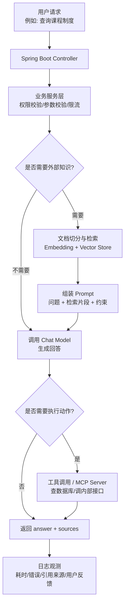

<!-- generated_at: 2026-07-18T08:31:32+08:00 -->

# 2026-07-18 从 Spring AI 看 Java AI 工程化：给大二升大三学生的学习文章

> 生成时间：2026-07-18 00:00  
> 读者定位：中北大学软件学院大二升大三学生，已具备 Java、数据库、Web 基础，正在补工程化与 AI 应用开发能力。  
> 今日主题：用 Spring AI 作为主线，把模型调用、RAG、工具调用、MCP、招聘能力要求和动手任务串成一条 Java AI 学习路线。

## 目录

| 序号 | 部分 | 你能读到什么 |
|---:|---|---|
| 1 | [一、先用一张图建立整体认识](#一先用一张图建立整体认识) | Java 后端学生进入 AI 应用开发时，应该先理解哪些模块 |
| 2 | [二、今日核心项目](#二今日核心项目) | 为什么选择 Spring AI，它和 Spring Boot、RAG、Agent、工具调用有什么关系 |
| 3 | [三、最新信息怎么影响学习](#三最新信息怎么影响学习) | 新闻、GitHub 项目、招聘和比赛背后的共同方向 |
| 4 | [四、适合当前阶段的知识拆解](#四适合当前阶段的知识拆解) | 用 Java 后端视角解释模型调用、RAG、Embedding、工具调用、MCP、观测与权限 |
| 5 | [五、今天可以动手做什么](#五今天可以动手做什么) | 3-5 个能落地的小任务，带建议耗时和产出物 |
| 6 | [六、资料来源](#六资料来源) | 本文使用到的新闻源、GitHub 仓库、招聘官网和比赛活动官网 |

## 一、先用一张图建立整体认识

对已经学过 Java、数据库、Web 的同学来说，AI 应用开发不是“重新学一个完全陌生的专业”，而是在你熟悉的后端系统里，新增一类能力：让系统可以调用大模型、检索知识库、使用工具、记录调用过程，并把结果稳定地交给用户。

可以先把 Java AI 应用理解成下面这条链路：

这张图里，灰度最大的地方不是“会不会调一个模型接口”，而是“能不能把它做成一个可维护的后端功能”。这正是 Java 学生的优势：你已经学过 Controller、Service、数据库、权限、接口设计，现在只是把大模型接入这套工程体系。

## 二、今日核心项目

今天选择的核心项目是：[spring-projects/spring-ai](https://github.com/spring-projects/spring-ai)。

Spring AI 是 Spring 生态中的 AI 应用抽象层，数据中给出的描述是：它覆盖模型接入、向量库、工具调用、ETL 与 RAG。对于 Java 后端方向的同学，它的价值不在于“看起来很新”，而在于它尽量用 Spring 的方式组织 AI 应用开发。

也就是说，你不需要一上来就跳到陌生的工程体系里，而是可以继续沿着熟悉的路线理解：

| 你已经会的 Java Web 内容 | Spring AI 中对应的新内容 | 学习时应该关注什么 |
|---|---|---|
| Spring Boot 配置文件 | 模型 endpoint、key、模型名称配置 | 不把密钥写死在代码里，支持不同环境切换 |
| Controller / Service | Chat API、RAG API、工具调用服务 | AI 能力也要分层，不要把所有逻辑塞进 Controller |
| MySQL / Redis / ORM | Vector Store、元数据、会话记录 | 向量库不是替代数据库，而是补充“相似度检索”能力 |
| 接口鉴权 | 工具调用权限、MCP 工具边界 | 模型不能想调什么接口就调什么接口 |
| 日志与异常处理 | 模型调用耗时、失败重试、回答来源 | AI 应用更需要可追踪，否则很难排查问题 |

Spring AI 和几个关键词的关系可以这样理解：

| 关键词 | 和 Spring AI 的关系 | 对 Java 学生的意义 |
|---|---|---|
| Spring Boot | Spring AI 可以作为 Spring Boot 应用的一部分使用 | 你可以用熟悉的项目结构做 AI demo |
| RAG | Spring AI 覆盖向量库、ETL、检索增强生成 | 可以把“知识库问答”做成后端接口，而不是只写脚本 |
| Agent | Spring AI 涉及工具调用等 Agent 基础能力 | Agent 不是神秘概念，本质是“模型 + 可调用工具 + 执行流程” |
| 工具调用 | 让模型在需要时调用后端函数或服务 | 和你写过的 Service 方法、内部接口很接近 |
| 工程化 | 配置、抽象、日志、权限、可替换模型 | 企业项目最看重的是稳定性和可维护性 |

为什么它适合中北大学软件学院大二升大三的同学？因为这个阶段最重要的不是追逐每一个模型新闻，而是完成一次“从课堂代码到项目代码”的升级。Spring AI 正好把 AI 能力放回 Java 工程体系里，让你能练习配置管理、接口设计、异常处理、数据建模和模块拆分。

## 三、最新信息怎么影响学习

今天的数据里有几类信息：AI 新闻、GitHub 项目、招聘方向和比赛活动。它们看起来分散，但其实指向同一个趋势：企业更需要能把大模型接入真实业务系统的人，而不只是会聊天工具的人。

OpenAI Developers 中出现了 Docs MCP，说明“让模型读取文档、连接工具、按协议访问外部能力”正在变得重要。对 Java 学生来说，这意味着你以后写的后端接口，可能不只给前端页面调用，也可能给 AI Agent 调用。接口设计要更规范：工具名、入参、出参、权限、错误码都要清楚。

Hugging Face Blog 中有模型微调、安全事件披露等内容。它提醒我们两件事：第一，模型能力还在快速进步；第二，安全不是可选项。你做 RAG 或 Agent 时，不能只关心“回答像不像人”，还要关心数据来源、敏感信息、权限边界和日志审计。

Planet AI 中出现了 Agentic Event Venue Operator 这类内容，说明智能体正在从“聊天”走向“处理具体业务流程”。它可能要查数据库、安排事件、调用多个服务。对于 Java 后端学习者，这和你熟悉的业务系统很接近：订单、库存、用户、审批、通知，本质上都是流程编排。

GitHub 项目也在说明这个方向。Spring AI、LangChain4j、modelcontextprotocol/java-sdk 都和 Java AI 工程化直接相关；QwenLM/qwen-code、code-review-graph 则说明 AI 正在进入代码阅读、代码审查、命令行开发流程；test-automation-skills-agents 提醒我们，测试自动化也会变成 Agent 的重要落地场景。

招聘动态同样很明确。阿里巴巴、腾讯、字节跳动、百度、美团这些公司的关注点里，反复出现 Java 后端、AI 平台、大模型应用、智能体、平台工程。它们并不是在招“只会调 prompt 的人”，而是在招能把 AI 能力接进系统、接进数据、接进业务流程的人。

比赛活动方面，AI4J Intelligent Java Conference 直接聚焦 Java AI 应用开发、Spring AI、LangChain4j、RAG、Agent；中国人工智能大赛和 WAIC 更偏产业与应用；Google Cloud Next 关注云端 AI 应用开发。对学生来说，比赛和会议的价值不是“看热闹”，而是帮你判断哪些技术正在从实验室进入企业项目。

可以把今天的信息压缩成一句学习建议：先选一个 Java AI 框架做小项目，再围绕 RAG、工具调用、MCP、日志观测和权限补工程能力。

## 四、适合当前阶段的知识拆解

下面这些概念不需要一次学到论文级别，先理解它们和 Java 后端开发的关系。

| 概念 | 朴素解释 | 和 Java 后端学习的关系 |
|---|---|---|
| 模型调用 | 后端向大模型服务发请求，传入问题或上下文，拿回回答 | 类似调用第三方 HTTP API，但要处理 key、超时、重试、错误和响应格式 |
| RAG | 先从知识库找相关资料，再把资料和问题一起交给模型回答 | 适合做“学校制度问答”“项目文档助手”“企业知识库问答” |
| Embedding | 把文本变成一组数字向量，用来计算语义相似度 | 和数据库索引有点像，都是为了更快找到相关内容，但查询方式不是精确匹配 |
| 工具调用 | 模型判断需要外部能力时，调用你定义的函数或接口 | 本质上是把 Java Service 暴露成模型可使用的“工具”，必须限制权限 |
| Agent | 模型不只回答，还能规划步骤、调用工具、根据结果继续执行 | 可以理解为“会思考下一步的业务流程编排器”，但工程上要防止失控 |
| MCP | Model Context Protocol，用统一协议把工具、文档、服务接给模型 | 对 Java 学生来说，MCP Server 可以看作一种特殊的后端服务接口 |
| 日志观测 | 记录模型调用了什么、耗时多久、检索了哪些文档、是否报错 | 没有日志的 AI 应用很难调试，尤其是回答错误时 |
| 权限与限流 | 控制谁能用、能查什么、调用频率是多少 | AI 接口通常成本更高、风险更大，更需要鉴权和限流 |

这里特别提醒两点。

第一，RAG 不等于“把一堆 PDF 扔给模型”。真正的 RAG 至少包括文档清洗、切分、Embedding、向量检索、Prompt 组装、来源返回和日志记录。你做项目时，可以先从 Markdown 或纯文本开始，不必一开始就处理复杂文件格式。

第二，Agent 不等于“让模型自由发挥”。在企业项目里，Agent 能调用哪些工具、每个工具能访问哪些数据、失败后怎么办，都要由后端系统控制。Java 后端学生要把 Agent 当成一个有权限边界的业务模块，而不是魔法按钮。

## 五、今天可以动手做什么

今天的小任务尽量围绕工程实践，不要求一次做大，但要有明确产出物。

| 任务 | 建议耗时 | 具体做法 | 产出物 |
|---|---:|---|---|
| 1. 写一个最小 Chat API demo | 60-90 分钟 | 用 Spring Boot 建一个 `/api/chat` 接口，把模型 endpoint 和 key 放到配置文件中 | 一个可运行的后端接口，README 写清配置项 |
| 2. 设计一个 RAG 文档元数据表 | 45-60 分钟 | 选 3 篇课程制度或项目文档，设计 `doc_id`、`title`、`source_url`、`chunk_id`、`content`、`embedding_id` 等字段 | 一份表结构 SQL 或 Markdown 设计文档 |
| 3. 给 RAG 返回引用来源 | 60 分钟 | 让接口返回 `answer`、`source_title`、`source_url`、`chunk_id`，不要只返回一段回答 | 一个 JSON 返回格式示例 |
| 4. 写 MCP Server 设计草案 | 45 分钟 | 选一个内部接口，例如“查询课程表”或“查询项目任务”，列出工具名、入参、出参和安全限制 | 一份 MCP 工具设计表 |
| 5. 增加日志字段 | 30-45 分钟 | 为模型调用设计日志：用户 ID、请求时间、模型名、耗时、是否命中知识库、错误信息 | 一份日志字段清单或简单建表语句 |

一个适合今天完成的最小目标是：不要追求“智能体全自动”，先做出一个可配置、可返回来源、可记录日志的 Chat/RAG 接口。这个目标不炫，但很接近企业项目对初级后端同学的真实要求。

## 六、资料来源

| 类型 | 名称 | 关注点 | 链接 |
|---|---|---|---|
| GitHub 仓库 | spring-projects/spring-ai | Spring 生态 AI 应用抽象层，模型接入、向量库、工具调用、ETL、RAG | <https://github.com/spring-projects/spring-ai> |
| GitHub 仓库 | langchain4j/langchain4j | Java LLM 应用开发框架，聊天模型、RAG、Embedding、工具调用、Agent 编排 | <https://github.com/langchain4j/langchain4j> |
| GitHub 仓库 | modelcontextprotocol/java-sdk | MCP Java SDK，用于把 Java 服务接入模型工具协议生态 | <https://github.com/modelcontextprotocol/java-sdk> |
| GitHub 仓库 | alibaba/spring-ai-alibaba | 面向国内模型服务和云生态的 Spring AI 扩展与应用实践 | <https://github.com/alibaba/spring-ai-alibaba> |
| GitHub 仓库 | microsoft/semantic-kernel | AI 编排 SDK，包含 Java SDK，可用于插件、函数调用和 Agent workflow | <https://github.com/microsoft/semantic-kernel> |
| GitHub 仓库 | fugazi/test-automation-skills-agents | 面向 QA 自动化工程师的 Agent、指令和技能库 | <https://github.com/fugazi/test-automation-skills-agents> |
| GitHub 仓库 | QwenLM/qwen-code | 运行在终端中的开源 AI 编码 Agent | <https://github.com/QwenLM/qwen-code> |
| 新闻源 | OpenAI Developers | Developers plugin、Docs MCP、Realtime and audio guide | <https://developers.openai.com/> |
| 新闻源 | Hugging Face Blog | 模型微调、安全事件披露、模型生态动态 | <https://huggingface.co/blog> |
| 新闻源 | Planet AI | Agent 应用、AI 行业动态与案例 | <https://planet-ai.net/> |
| 招聘官网 | 阿里巴巴 | Java 后端、AI 工程化、大模型应用 | <https://talent.alibaba.com/> |
| 招聘官网 | 腾讯 | 后台开发、AI 平台、智能体应用 | <https://careers.tencent.com/> |
| 招聘官网 | 字节跳动 | 后端研发、AI 平台、大模型工程 | <https://jobs.bytedance.com/> |
| 招聘官网 | 百度 | AI 原生应用、智能云、大模型平台 | <https://talent.baidu.com/> |
| 招聘官网 | 美团 | Java 后端、平台工程、AI 应用场景 | <https://zhaopin.meituan.com/> |
| 比赛/活动 | AI4J Intelligent Java Conference | Java AI 应用开发、Spring AI、LangChain4j、RAG、Agent | <https://ai4j.io/> |
| 比赛/活动 | 中国人工智能大赛 | 大模型应用、智能体、行业 AI 创新赛事 | <https://www.aicomp.cn/> |
| 比赛/活动 | 世界人工智能大会 WAIC | AI 产业趋势、企业级 AI 应用、开发者生态 | <https://www.worldaic.com.cn/> |
| 比赛/活动 | Google Cloud Next | Gemini、Vertex AI、Agent Builder、云端 AI 应用开发 | <https://cloud.withgoogle.com/next> |
