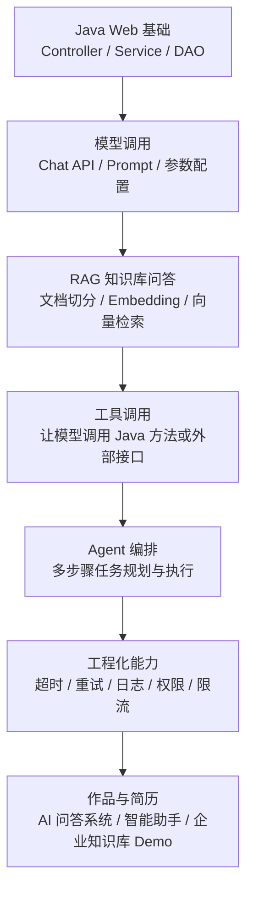
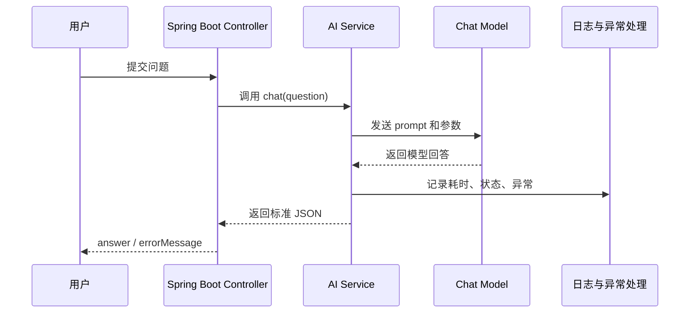

<!-- generated_at: 2026-07-19T08:31:37+08:00 -->

# 2026-07-19 从 Spring AI 看 Java AI 工程化：给大二升大三学生的学习文章

> 生成时间：2026-07-19  
> 读者定位：中北大学软件学院大二升大三学生，已具备 Java、数据库、Web 基础，正在补工程化与 AI 应用开发能力。  
> 今日主题：用 Spring AI 作为主线，把模型调用、RAG、工具调用和企业级 Java 后端工程能力串起来。

## 目录

| 序号 | 部分 | 你能读到什么 |
|---:|---|---|
| 1 | [一、先用一张图建立整体认识](#一先用一张图建立整体认识) | Java 后端同学学习 AI 应用开发时，应该先抓住哪条主线 |
| 2 | [二、今日核心项目](#二今日核心项目) | 以 Spring AI 为核心，理解它为什么适合 Java AI 入门与工程化 |
| 3 | [三、最新信息怎么影响学习](#三最新信息怎么影响学习) | 把新闻、GitHub 项目、招聘、比赛放在一条学习路径里看 |
| 4 | [四、适合当前阶段的知识拆解](#四适合当前阶段的知识拆解) | 用 Java 后端能理解的话解释模型调用、RAG、Embedding、Agent 等概念 |
| 5 | [五、今天可以动手做什么](#五今天可以动手做什么) | 3-5 个能真正落地的小任务，适合一天内启动 |
| 6 | [六、资料来源](#六资料来源) | 本文使用到的新闻源、GitHub 仓库、招聘官网和比赛官网 |

## 一、先用一张图建立整体认识

对已经学过 Java、数据库、Web 的同学来说，AI 应用开发不要一上来就陷入“模型参数”“论文公式”“各种榜单”。更适合的切入点是：**把大模型看成一个新的后端能力，然后学习如何把它接进 Spring Boot 项目里，并让它能查资料、调工具、记录日志、处理异常。**

也就是说，你不是从零发明一个模型，而是先学会做一个“可靠的 AI 后端应用”。



这张图的意思很简单：你现在已有的 Spring Boot、数据库、接口开发能力并没有过时，反而是进入 AI 应用开发最重要的地基。AI 时代的 Java 后端，不只是“会调一个接口”，而是要能把模型能力做成稳定、可维护、可上线的业务系统。

## 二、今日核心项目

今天选择的核心项目是 **spring-projects/spring-ai**。


| 项目 | 内容 |
|---|---|
| 项目名 | spring-projects/spring-ai |
| 语言 | Java |
| 原始链接 | <https://github.com/spring-projects/spring-ai> |
| 项目描述 | Spring 生态的 AI 应用抽象层，覆盖模型接入、向量库、工具调用、ETL 与 RAG |
| Star / Fork / 更新时间 | 数据源无法确认，本文不编造具体数值 |

Spring AI 可以理解为：**Spring 生态给 AI 应用开发做的一层统一封装**。以前你用 Spring Boot 写 Web 项目时，会接 MySQL、Redis、RabbitMQ、Elasticsearch；现在做 AI 应用，还要接 Chat Model、Embedding Model、Vector Store、Tool Calling、RAG Pipeline。Spring AI 的价值，就是尽量让这些东西以 Spring 开发者熟悉的方式组织起来。

### 为什么它适合 Java AI 学习

第一，它和 Spring Boot 的学习路线天然衔接。你不需要换成完全陌生的技术栈，也不需要一开始就深入训练模型。你可以从一个普通 Controller 开始，写一个 `/chat` 接口，然后在 Service 层调用模型。

第二，它覆盖了 AI 应用最常见的工程场景。比如 RAG 知识库问答、工具调用、向量库接入、模型配置、Prompt 管理，这些都是企业项目里会遇到的问题。

第三，它能帮助你形成“AI 后端工程”的思维。学校课程里常见的项目可能是学生管理系统、商城、博客、图书管理系统，这些项目主要训练 CRUD 和权限。Spring AI 适合在这些基础上加一层智能能力，比如“根据商品文档回答售后问题”“根据课程资料生成复习建议”“根据数据库查询结果生成自然语言报告”。

### 它和哪些关键能力有关

| 能力点 | 在 Spring AI 学习中的体现 | 和 Java 后端的关系 |
|---|---|---|
| Spring Boot | 用 Controller、Service、配置文件组织 AI 接口 | 延续已有 Web 项目结构 |
| RAG | 把文档切分、向量化、检索，再交给模型回答 | 类似“搜索 + 业务组装 + 接口返回” |
| Agent | 让模型按步骤完成任务，不只是单轮问答 | 类似复杂业务流程编排 |
| 工具调用 | 让模型调用 Java 方法、查询数据库或访问外部 API | 本质是把后端能力暴露给模型使用 |
| 工程化 | 超时、重试、错误分类、日志、权限、限流 | 决定系统能不能稳定运行 |

如果你今天只记住一句话：**Spring AI 不是让你“学会 AI 魔法”，而是让你把 AI 能力纳入 Java 后端工程体系。**

## 三、最新信息怎么影响学习

今天的数据里有几类信息：OpenAI Developers 的文档更新、多个 Java AI 相关 GitHub 项目、企业招聘方向、AI 比赛与开发者活动。它们看起来分散，但其实都指向同一个趋势：**大模型应用正在从“能聊”变成“能接系统、能查资料、能调工具、能被观测和治理”。**

OpenAI Developers 里出现了 **Docs MCP** 和开发者插件相关内容，说明模型和外部工具、文档、开发环境之间的连接越来越重要。MCP 可以先简单理解为一种“让模型知道有哪些工具可以用、怎么调用工具”的协议思路。对 Java 学生来说，这意味着后端服务不再只是给前端调用，也可能会被 AI Agent 调用。

GitHub 项目里，除了今天的核心项目 Spring AI，还有几个值得放在同一张地图里理解：

| 项目 | 主要方向 | 对 Java AI 学习的启发 |
|---|---|---|
| langchain4j/langchain4j | Java LLM 应用开发框架，覆盖聊天模型、RAG、Embedding、工具调用和 Agent 编排 | 适合和 Spring AI 对比，理解 Java 生态里不同 AI 框架的设计方式 |
| alibaba/spring-ai-alibaba | 面向国内模型服务和云生态的 Spring AI 扩展与应用实践项目 | 如果使用国内模型服务，可以关注它如何适配 Spring AI |
| modelcontextprotocol/java-sdk | Model Context Protocol 的 Java SDK | 适合理解 Java 服务如何接入 MCP 工具体系 |
| microsoft/semantic-kernel | AI 编排 SDK，包含 Java SDK | 可以了解插件、函数调用、Agent workflow 的跨语言设计 |
| microsoft/TypeAgent | 个人 Agent 架构探索项目 | 虽然是 TypeScript，但能帮助理解 Agent 如何和应用协作 |
| javahongxi/whatsmars | Java 生态研究，覆盖 Spring Boot、Redis、Dubbo、RocketMQ、Elasticsearch | 提醒我们：AI 应用仍然需要扎实的 Java 中间件和后端基础 |

招聘动态也能反推学习重点。阿里巴巴、腾讯、字节跳动、百度、美团的方向里都出现了 Java 后端、AI 平台、大模型应用、智能体应用、平台工程等关键词。这不是说每个大二学生都要马上做出复杂平台，而是说明企业更需要“懂后端工程，又能接 AI 能力”的人。

比赛和会议则提供了作品方向。AI4J Intelligent Java Conference 更偏 Java AI 应用开发，关注 Spring AI、LangChain4j、RAG、Agent；中国人工智能大赛和 WAIC 更偏产业与应用创新；Google Cloud Next 则会涉及 Gemini、Vertex AI、Agent Builder 等云端 AI 应用开发。对学生来说，比赛不是只为了拿奖，更重要的是逼自己把 Demo 做完整：有接口、有数据、有页面或测试、有说明文档。

所以今天的学习结论是：**不要只学“怎么问模型一个问题”，要学“怎么把模型接进一个可靠的 Java 系统”。**

## 四、适合当前阶段的知识拆解

下面这些概念，建议你用“和 Java 后端有什么关系”来理解。

### 1. 模型调用

模型调用就是你的 Java 程序通过 API 请求大模型，让它返回文本、JSON 或其他结果。它和你平时调用第三方短信接口、支付接口很像，只是请求体里通常会包含 prompt、上下文、模型名称、温度参数等。

在 Spring Boot 里，你可以把模型 endpoint、key、model name 放到 `application.yml`，然后在 Service 中封装调用逻辑。工程上要注意超时、异常处理、重试和返回格式校验。

### 2. RAG

RAG 是 Retrieval-Augmented Generation，中文常说“检索增强生成”。它解决的问题是：模型本身不知道你的课程资料、公司制度、项目文档，所以回答前先去知识库查相关内容，再把查到的内容交给模型生成答案。

它和 Java 后端的关系很紧密。你要做文档上传、文本切分、元数据保存、向量检索、结果排序、接口返回，这些都属于后端工程。

### 3. Embedding

Embedding 可以理解为“把一段文字变成一组数字向量”。这样数据库或向量库就能根据语义相似度检索内容，而不是只靠关键词匹配。

比如用户问“怎么申请补考”，知识库里写的是“缓考与补考流程说明”，关键词不完全一样，但语义接近。Embedding 能帮助系统找出相关文档片段。对 Java 学生来说，可以把它理解成一种特殊的索引方式。

### 4. 工具调用

工具调用是让模型不只是生成文字，还能调用你写好的函数或接口。比如模型判断用户想查订单，就调用 `orderService.findById(orderId)`；用户想查天气，就调用天气 API；用户想生成报表，就调用统计服务。

它和后端权限特别相关。不是所有方法都应该给模型调用，调用前要检查用户身份、参数是否合法、是否越权。否则模型“想调用什么就调用什么”，系统会很危险。

### 5. Agent

Agent 可以理解为“能分步骤完成任务的 AI 程序”。普通 Chat API 更像一问一答，Agent 则可能会先分析任务，再选择工具，再执行，再根据结果继续下一步。

比如“帮我分析这批学生成绩，并生成预警名单”，Agent 可能需要读取表格、计算平均分、查询历史成绩、生成说明。对大二升大三的同学来说，不建议一上来做复杂 Agent，可以先从“单个工具调用 + 明确流程”开始。

### 6. MCP

MCP 是 Model Context Protocol，重点是让模型和外部工具、数据源之间形成更规范的连接方式。你可以把它类比成“AI 工具世界里的接口协议”。

如果未来你写了一个 Java 服务，希望 AI 助手能安全地调用它，那么 MCP Java SDK 这类项目就值得关注。它和普通 REST API 不冲突，而是在 AI Agent 场景下提供一种更适合模型理解和调用的方式。

## 五、今天可以动手做什么

今天不建议只收藏链接。下面这些任务更适合你真正开始写代码。

| 任务 | 建议耗时 | 产出物 |
|---|---:|---|
| 用 Spring AI 或 LangChain4j 写一个最小 Chat API Demo，支持从配置文件切换 endpoint 和 key | 1.5-2 小时 | 一个 Spring Boot 项目，包含 `/api/chat` 接口和配置文件 |
| 整理一个小型课程知识库样例，设计文档切分、Embedding 字段和元数据字段 | 1 小时 | 一份 Markdown 设计文档，包含 `chunk_id`、`source_title`、`source_url` 等字段 |
| 给 RAG Demo 增加引用来源返回 | 1-1.5 小时 | 接口返回 `answer`、`source_title`、`source_url`、`chunk_id` |
| 为模型调用增加超时、重试、错误分类和 fallback 文案 | 1.5 小时 | 一段健壮的 Service 层代码和错误日志 |
| 阅读 Spring AI README，并画出你理解的模块关系图 | 40 分钟 | 一张 Mermaid 或手绘结构图 |

可以从第一个任务开始。最小目标不是做一个炫酷产品，而是跑通这条链路：



建议你今天的项目目录先保持简单：

```text
spring-ai-demo
├── src/main/java
│   └── com/example/demo
│       ├── controller
│       │   └── ChatController.java
│       ├── service
│       │   └── ChatService.java
│       └── config
│           └── AiProperties.java
├── src/main/resources
│   └── application.yml
└── README.md
```

README 里至少写清楚四件事：如何配置模型 key、如何启动项目、如何调用接口、失败时会返回什么。很多同学做 Demo 时只关注“能不能回答”，但真正的工程能力体现在这些细节里。

## 六、资料来源

| 类型 | 名称 | 链接 | 本文使用方式 |
|---|---|---|---|
| 新闻源 | OpenAI Developers | <https://developers.openai.com/> | 参考 Developers plugin、Docs MCP、Realtime and audio guide 等开发者资料方向 |
| GitHub 仓库 | spring-projects/spring-ai | <https://github.com/spring-projects/spring-ai> | 作为今日核心项目，分析 Spring 生态下的 AI 工程化学习路线 |
| GitHub 仓库 | langchain4j/langchain4j | <https://github.com/langchain4j/langchain4j> | 用于对照 Java LLM 应用框架的常见能力：RAG、Embedding、工具调用、Agent |
| GitHub 仓库 | alibaba/spring-ai-alibaba | <https://github.com/alibaba/spring-ai-alibaba> | 参考国内模型服务和 Spring AI 扩展实践方向 |
| GitHub 仓库 | modelcontextprotocol/java-sdk | <https://github.com/modelcontextprotocol/java-sdk> | 参考 MCP 在 Java 生态中的接入方式 |
| GitHub 仓库 | microsoft/semantic-kernel | <https://github.com/microsoft/semantic-kernel> | 参考插件、函数调用和 Agent workflow 的编排思路 |
| GitHub 仓库 | microsoft/TypeAgent | <https://github.com/microsoft/TypeAgent> | 参考个人 Agent 与应用 Agent 协作的架构探索 |
| GitHub 仓库 | javahongxi/whatsmars | <https://github.com/javahongxi/whatsmars> | 作为 Java 后端基础能力补强参考 |
| 招聘官网 | 阿里巴巴招聘 | <https://talent.alibaba.com/> | 观察 Java 后端、AI 工程化、大模型应用方向 |
| 招聘官网 | 腾讯招聘 | <https://careers.tencent.com/> | 观察后台开发、AI 平台、智能体应用方向 |
| 招聘官网 | 字节跳动招聘 | <https://jobs.bytedance.com/> | 观察后端研发、AI 平台、大模型工程方向 |
| 招聘官网 | 百度招聘 | <https://talent.baidu.com/> | 观察 AI 原生应用、智能云、大模型平台方向 |
| 招聘官网 | 美团招聘 | <https://zhaopin.meituan.com/> | 观察 Java 后端、平台工程、AI 应用场景方向 |
| 比赛 / 活动 | AI4J Intelligent Java Conference | <https://ai4j.io/> | 关注 Java AI 应用开发、Spring AI、LangChain4j、RAG、Agent |
| 比赛 / 活动 | 中国人工智能大赛 | <https://www.aicomp.cn/> | 关注大模型应用、智能体、行业 AI 创新赛事 |
| 比赛 / 活动 | 世界人工智能大会 WAIC | <https://www.worldaic.com.cn/> | 关注 AI 产业趋势、企业级 AI 应用、开发者生态 |
| 比赛 / 活动 | Google Cloud Next | <https://cloud.withgoogle.com/next> | 关注 Gemini、Vertex AI、Agent Builder 和云端 AI 应用开发 |

今天的学习重点可以收束成一句话：**把 Spring AI 当作入口，用 Java 后端工程的方法学习 AI 应用开发；先做出一个稳定的小接口，再逐步加 RAG、工具调用和观测能力。**
