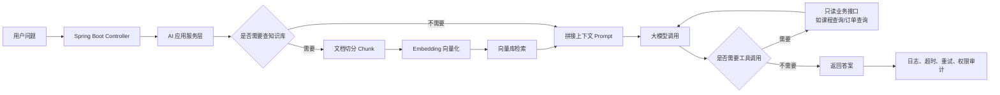

<!-- generated_at: 2026-07-20T08:31:43+08:00 -->

# 2026-07-20 从 Spring AI 学 RAG 工程化：给大二升大三学生的 Java AI 学习文章

> 生成时间：2026-07-20
> 读者定位：中北大学软件学院大二升大三学生，已具备 Java、数据库、Web 基础，正在补工程化与 AI 应用开发能力。
> 今日主题：用 Spring AI 这类 Java AI 框架，把“调用大模型”升级成可落地的 RAG、工具调用和企业级后端能力。

## 目录

| 序号 | 部分 | 你能读到什么 |
|---:|---|---|
| 1 | [一、先用一张图建立整体认识](#一先用一张图建立整体认识) | Java 后端学生应该怎样理解模型、知识库、工具调用和工程化之间的关系 |
| 2 | [二、今日核心项目](#二今日核心项目) | 以 Spring AI 为主线，理解它为什么适合作为 Java AI 入门项目 |
| 3 | [三、最新信息怎么影响学习](#三最新信息怎么影响学习) | 把 AI 新闻、GitHub 项目、招聘方向和比赛活动串成学习判断 |
| 4 | [四、适合当前阶段的知识拆解](#四适合当前阶段的知识拆解) | 用 Java 后端视角解释 RAG、Embedding、工具调用、Agent、MCP、日志观测 |
| 5 | [五、今天可以动手做什么](#五今天可以动手做什么) | 4 个当天可完成的小任务，偏工程实践，有产出物 |
| 6 | [六、资料来源](#六资料来源) | 本文使用到的 GitHub、新闻、招聘和比赛来源 |

## 一、先用一张图建立整体认识

对已经学过 Java、数据库和 Web 的同学来说，AI 应用开发不要先想得太玄。它本质上还是一个后端系统：有 Controller，有 Service，有数据库，有外部 API 调用，只是多了“大模型调用”“向量检索”“工具调用”“安全边界”和“观测日志”。

一个典型的 Java AI 应用可以这样理解：



如果把它映射到你熟悉的 Java Web 项目：

| AI 应用里的东西 | 类比到 Java 后端 | 你现在需要补的能力 |
|---|---|---|
| 模型调用 | 调第三方 REST API | 超时、重试、异常分类、fallback |
| RAG 知识库问答 | 搜索系统 + 问答接口 | 文档切分、向量检索、引用来源 |
| Embedding | 把文本变成可检索的向量字段 | 理解字段设计和元数据设计 |
| 工具调用 | 模型触发后端方法 | 接口白名单、权限边界、参数校验 |
| Agent | 能多步执行任务的 AI 服务 | 状态管理、流程编排、失败处理 |
| 日志观测 | 后端日志、链路追踪 | 记录请求、模型响应、错误原因 |

这也是为什么 Java AI 学习不能停留在“写一段 prompt”。真正能进项目、进简历、进面试的能力，是把 AI 能力接入到一个稳定、可测试、可维护的后端系统里。

## 二、今日核心项目

今天选择的核心项目是 GitHub 上真实存在的 [spring-projects/spring-ai](https://github.com/spring-projects/spring-ai)。


Spring AI 的项目描述是：Spring 生态的 AI 应用抽象层，覆盖模型接入、向量库、工具调用、ETL 与 RAG。

这句话对大二升大三的 Java 学生非常关键。因为你们已经接触过 Spring Boot、数据库和 Web 开发，下一步不是换一套完全陌生的技术栈，而是把 AI 能力接入到自己熟悉的 Spring 生态里。

| 项目 | 原始链接 | 语言 | 适合学习的原因 |
|---|---|---|---|
| spring-projects/spring-ai | https://github.com/spring-projects/spring-ai | Java | 和 Spring Boot 生态天然接近，适合用 Java 后端思维理解模型调用、RAG、工具调用和工程化 |
| langchain4j/langchain4j | https://github.com/langchain4j/langchain4j | Java | Java LLM 应用开发框架，覆盖聊天模型、RAG、Embedding、工具调用和 Agent 编排 |
| alibaba/spring-ai-alibaba | https://github.com/alibaba/spring-ai-alibaba | Java | 面向国内模型服务和云生态的 Spring AI 扩展与实践 |
| modelcontextprotocol/java-sdk | https://github.com/modelcontextprotocol/java-sdk | Java | 用 Java 接入 MCP，把后端服务变成模型可调用的工具 |
| microsoft/semantic-kernel | https://github.com/microsoft/semantic-kernel | C# / Java / Python | 关注插件、函数调用和 Agent workflow，有 Java SDK 可参考 |
| 1Panel-dev/MaxKB | https://github.com/1Panel-dev/MaxKB | Python | 企业知识库问答和智能体编排样本，适合参考产品形态和系统设计 |

注意：本文不使用未确认的 star、fork、更新时间。给定数据里 `spring-projects/spring-ai` 的这些指标无法确认，所以这里重点分析它的学习价值和工程关系。

Spring AI 适合 Java AI 学习，主要因为它把 AI 开发中常见的能力抽象成 Spring 风格的组件。你可以把它理解为：以前你在 Spring Boot 里接 MySQL、Redis、消息队列，现在多接了聊天模型、Embedding 模型和向量数据库。

它和几个核心方向的关系如下：

| 方向 | Spring AI 相关点 | 和 Java 后端学习的关系 |
|---|---|---|
| Spring Boot | 可以把 AI 能力封装成 Service，再暴露 REST API | 你可以继续使用 Controller、Service、配置文件、依赖注入这些熟悉方式 |
| RAG | 支持模型接入、向量库、文档处理等能力 | 能做“基于课程资料/业务文档的问答系统”，比普通聊天机器人更像真实项目 |
| Agent | 可结合工具调用、上下文和流程编排 | 让模型不只是回答，还能调用后端能力完成任务 |
| 工具调用 | 让模型按规则调用 Java 方法或业务接口 | 需要你设计接口权限、参数校验、调用边界 |
| 工程化 | 涉及超时、重试、日志、异常处理、配置管理 | 这些正是企业项目和面试最看重的后端能力 |

如果你现在做一个“校园课程资料问答系统”，Spring AI 可以成为后端 AI 层的候选方案：前端提交问题，后端检索课程文档，拼接上下文，调用模型生成答案，并返回引用来源。这个项目比单纯写一个 ChatGPT 页面更有工程含量。

## 三、最新信息怎么影响学习

今天的数据里有几类信息：AI 新闻、GitHub 项目、招聘方向、比赛活动。它们看起来分散，但可以串成一个明确判断：Java 后端学生要尽快从“会写 CRUD”升级到“会做 AI 应用工程化”。

OpenAI Developers 里出现了 Docs MCP、Developers plugin、Realtime and audio guide 等内容。这里最值得你关注的是 MCP 和插件化思路。MCP 可以理解成一种“让模型知道如何调用外部工具和数据源的协议”。对 Java 学生来说，它不是单纯的 AI 概念，而是后端接口规范问题：哪些接口能开放给模型？参数怎么校验？调用结果怎么返回？出错时怎么处理？

Hugging Face Blog 里有模型微调、模型能力对比和安全事件披露相关内容。你现在不一定要马上学习大规模训练或微调，但要建立一个意识：AI 应用不只是“模型越强越好”，还涉及安全、数据泄露、权限控制和部署稳定性。尤其是安全事件披露这类信息，提醒我们做知识库问答时不能随便把内部文档、用户数据、密钥配置发给模型。

GitHub 项目方面，除了 Spring AI 和 LangChain4j，还有一些值得从不同角度看：

| 项目 | 给当前学习的启发 |
|---|---|
| jobright-ai/2026-Software-Engineer-New-Grad | 新毕业生岗位集合，说明 2026 届软件工程岗位竞争会更看重项目和工程能力 |
| apache/texera | Human-AI Collaborative Data Science Using Visual Workflows，说明 AI 正在进入数据处理和可视化工作流 |
| AAswordman/Operit | Android 上的 AI Agent 软件，说明 Agent 不只存在于服务端，也会进入移动端和个人助手场景 |
| ShaftHQ/SHAFT_ENGINE | Java 测试自动化框架，提醒 AI 项目也要重视测试、报告和端到端验证 |
| mock-server/mockserver-monorepo | 支持模拟 API、检查流量、注入失败，还提到 AI/LLM APIs，适合学习如何测试模型调用和外部接口 |

招聘动态也很直接。阿里巴巴、腾讯、字节跳动、百度、美团的关注点都包含 Java 后端、AI 平台、大模型应用、智能体应用、平台工程等方向。这说明企业不是只招“会调模型的人”，而是需要能把模型接入业务系统的人。你要准备的项目不应该只是一个聊天页面，而应该包含数据库、权限、日志、接口设计、失败处理和可演示的业务场景。

比赛活动也能反推学习路线。AI4J Intelligent Java Conference 聚焦 Java AI 应用开发、Spring AI、LangChain4j、RAG、Agent；中国人工智能大赛关注大模型应用和智能体；WAIC 关注产业趋势；Google Cloud Next 关注 Gemini、Vertex AI、Agent Builder 和云端 AI 应用开发。对学生来说，这些活动提醒你：项目选题可以围绕“知识库问答”“智能体助手”“行业 AI 应用”“云端 AI 服务”来做，而不是只做算法题式的模型实验。

所以，今天的学习结论可以压缩成一句话：把 Spring Boot 项目改造成一个能接模型、查知识库、调用受控工具、记录日志并能解释失败原因的 AI 后端项目。

## 四、适合当前阶段的知识拆解

下面这些概念不用一次学到很深，但要知道它们在 Java 后端项目里分别放在哪一层。

| 概念 | 朴素解释 | 和 Java 后端的关系 |
|---|---|---|
| 模型调用 | 后端把用户问题发给大模型，再拿回回答 | 类似调用第三方 HTTP API，要处理超时、重试、状态码、异常和返回结构 |
| RAG | 先从自己的知识库里查资料，再让模型基于资料回答 | 适合做课程资料问答、企业文档问答，比纯聊天更可靠 |
| Embedding | 把一段文本转换成向量，方便做相似度搜索 | 类似给文档建立一种“语义索引”，后端要设计 chunk_id、source_url、title 等字段 |
| 工具调用 | 模型判断需要某个后端功能时，调用指定接口或方法 | 本质是受控 API 调用，必须做白名单、权限、参数校验 |
| Agent | 能围绕目标多步思考、调用工具、继续执行的 AI 程序 | 类似一个会调多个 Service 的任务编排器，但更需要限制边界 |
| MCP | Model Context Protocol，让模型和外部工具、数据源按统一方式连接 | 对 Java 学生来说，可以理解成“给 AI 用的接口协议和 SDK” |
| 日志观测 | 记录模型请求、响应、耗时、失败原因、命中的知识片段 | 方便排查“为什么答错”“为什么慢”“为什么调用失败” |
| 限流与权限 | 控制谁能调用、调用多少次、能访问哪些数据 | AI 接口成本高、风险高，比普通接口更需要保护 |

以 RAG 为例，它不是“把所有文档塞进 prompt”。更合理的过程是：

1. 把文档切成小段，每段有 `chunk_id`。
2. 为每段生成 Embedding。
3. 把向量和元数据存入向量库。
4. 用户提问时，先检索最相关的几个片段。
5. 把片段和问题一起交给模型。
6. 返回答案时附带 `source_title`、`source_url`、`chunk_id`。

这套流程和数据库课、Web 课都有关系。文档元数据设计像表结构设计，检索接口像 Service 查询，引用来源像接口返回 DTO，日志观测像后端排错能力。

## 五、今天可以动手做什么

今天不建议只看文章。下面 4 个任务可以选 1 到 2 个完成，最好放进自己的 GitHub 仓库。

| 任务 | 建议耗时 | 具体做法 | 产出物 |
|---|---:|---|---|
| 设计一个业务知识库样例 | 60 分钟 | 选一个熟悉场景，例如“课程资料问答”或“实验室制度问答”，整理 5 篇短文档，设计 `doc_id`、`chunk_id`、`source_title`、`source_url`、`content`、`embedding`、`created_at` 字段 | 一份 Markdown 表结构说明或 SQL 草稿 |
| 给 RAG demo 增加引用来源 | 90 分钟 | 修改接口返回结构，不只返回 `answer`，还返回 `source_title`、`source_url` 和 `chunk_id` | 一个 REST API 返回 JSON 示例 |
| 给模型调用增加失败处理 | 90 分钟 | 为一次模型调用增加超时、重试、错误分类和 fallback 文案，例如“模型服务暂时不可用，请稍后重试” | 一段 Java Service 代码或伪代码 |
| 设计工具调用白名单 | 60 分钟 | 只允许模型调用 2 到 3 个只读接口，例如查询课程、查询公告、查询实验室开放时间，并写清不能修改数据库 | 一份工具调用权限边界说明 |

可以参考下面这个简单返回结构，作为今天任务的目标之一：

```json
{
  "answer": "根据课程资料，Spring AI 可以用于接入聊天模型、向量库和 RAG 流程。",
  "sources": [
    {
      "source_title": "Spring AI 项目说明",
      "source_url": "https://github.com/spring-projects/spring-ai",
      "chunk_id": "spring-ai-readme-001"
    }
  ],
  "trace_id": "rag-20260720-001"
}
```

如果你想让这个任务更像企业项目，可以再加两个字段：`latency_ms` 表示耗时，`fallback` 表示是否使用了兜底回答。这样你写简历时就不是“做了一个 AI 问答系统”，而是可以写“实现了带引用来源、失败处理和调用日志的 RAG 问答接口”。

## 六、资料来源

| 类型 | 名称 | 链接 | 本文使用方式 |
|---|---|---|---|
| GitHub 仓库 | spring-projects/spring-ai | https://github.com/spring-projects/spring-ai | 今日核心项目，分析 Java AI、RAG、工具调用和工程化 |
| GitHub 仓库 | langchain4j/langchain4j | https://github.com/langchain4j/langchain4j | 对比 Java LLM 应用开发框架 |
| GitHub 仓库 | alibaba/spring-ai-alibaba | https://github.com/alibaba/spring-ai-alibaba | 参考国内模型服务和 Spring AI 扩展实践 |
| GitHub 仓库 | modelcontextprotocol/java-sdk | https://github.com/modelcontextprotocol/java-sdk | 说明 MCP 和 Java 工具协议接入 |
| GitHub 仓库 | microsoft/semantic-kernel | https://github.com/microsoft/semantic-kernel | 参考插件、函数调用和 Agent workflow |
| GitHub 仓库 | 1Panel-dev/MaxKB | https://github.com/1Panel-dev/MaxKB | 参考企业知识库问答与智能体编排产品形态 |
| GitHub 仓库 | jobright-ai/2026-Software-Engineer-New-Grad | https://github.com/jobright-ai/2026-Software-Engineer-New-Grad | 观察 2026 新毕业生软件工程岗位趋势 |
| GitHub 仓库 | apache/texera | https://github.com/apache/texera | 观察 Human-AI Collaborative Data Science 工作流方向 |
| GitHub 仓库 | AAswordman/Operit | https://github.com/AAswordman/Operit | 观察 Android AI Agent 应用方向 |
| GitHub 仓库 | ShaftHQ/SHAFT_ENGINE | https://github.com/ShaftHQ/SHAFT_ENGINE | 关联 Java 测试自动化和 AI 项目测试能力 |
| GitHub 仓库 | mock-server/mockserver-monorepo | https://github.com/mock-server/mockserver-monorepo | 关联 API Mock、故障注入和 LLM API 测试 |
| 新闻源 | OpenAI Developers | https://developers.openai.com/ | 使用 Developers plugin、Docs MCP、Realtime and audio guide 等条目作为趋势参考 |
| 新闻源 | Hugging Face Blog | https://huggingface.co/blog | 使用模型微调、安全事件披露等内容作为安全和工程化参考 |
| 招聘官网 | 阿里巴巴招聘 | https://talent.alibaba.com/ | Java 后端、AI 工程化、大模型应用方向 |
| 招聘官网 | 腾讯招聘 | https://careers.tencent.com/ | 后台开发、AI 平台、智能体应用方向 |
| 招聘官网 | 字节跳动招聘 | https://jobs.bytedance.com/ | 后端研发、AI 平台、大模型工程方向 |
| 招聘官网 | 百度招聘 | https://talent.baidu.com/ | AI 原生应用、智能云、大模型平台方向 |
| 招聘官网 | 美团招聘 | https://zhaopin.meituan.com/ | Java 后端、平台工程、AI 应用场景方向 |
| 比赛活动 | AI4J Intelligent Java Conference | https://ai4j.io/ | Java AI、Spring AI、LangChain4j、RAG、Agent 学习方向 |
| 比赛活动 | 中国人工智能大赛 | https://www.aicomp.cn/ | 大模型应用、智能体、行业 AI 创新赛事参考 |
| 比赛活动 | 世界人工智能大会 WAIC | https://www.worldaic.com.cn/ | AI 产业趋势和企业级 AI 应用参考 |
| 比赛活动 | Google Cloud Next | https://cloud.withgoogle.com/next | Gemini、Vertex AI、Agent Builder 和云端 AI 应用开发参考 |
