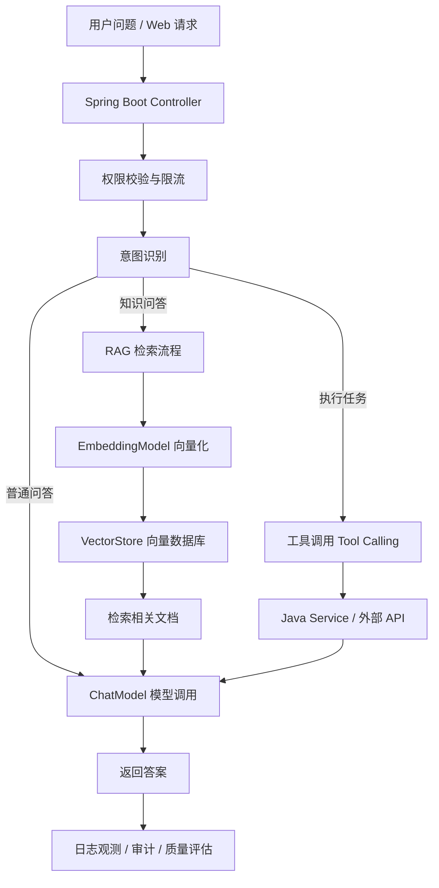

<!-- generated_at: 2026-07-24T08:31:42+08:00 -->

# 2026-07-24 从 Spring AI 看 Java AI 工程化：给大二升大三学生的学习文章

> 生成时间：2026-07-24  
> 读者定位：中北大学软件学院大二升大三学生，已具备 Java、数据库、Web 基础，正在补工程化与 AI 应用开发能力。  
> 今日主题：以 Spring AI 为主线，把模型调用、RAG、工具调用、Agent、招聘能力要求和动手任务串成一条 Java AI 学习路线。

## 目录

| 序号 | 部分 | 你能读到什么 |
|---:|---|---|
| 1 | [一、先用一张图建立整体认识](#一先用一张图建立整体认识) | Java AI 应用从 Web 请求到模型、知识库、工具调用的整体结构 |
| 2 | [二、今日核心项目](#二今日核心项目) | 为什么选择 Spring AI，以及它适合 Java 学生从哪里入手 |
| 3 | [三、最新信息怎么影响学习](#三最新信息怎么影响学习) | AI 新闻、GitHub 项目、招聘和比赛背后的学习信号 |
| 4 | [四、适合当前阶段的知识拆解](#四适合当前阶段的知识拆解) | 用后端同学能理解的话解释 RAG、Embedding、工具调用、Agent 等概念 |
| 5 | [五、今天可以动手做什么](#五今天可以动手做什么) | 3-5 个今天能完成的小任务，每个都有耗时和产出物 |
| 6 | [六、资料来源](#六资料来源) | 本文使用的 GitHub、新闻、招聘、比赛来源链接 |

## 一、先用一张图建立整体认识

对已经学过 Java、数据库、Web 的同学来说，AI 应用不要先理解成“会聊天的神秘系统”，而要理解成一种新的后端能力：用户请求进来后，系统不仅查数据库，还可能调用大模型、检索知识库、执行工具方法，并记录日志和权限。

下面这张图可以作为今天的学习地图：



这张图里的大部分模块，都能对应到你已经学过的内容：

| 你已学过的基础 | AI 应用里的对应模块 | 学习重点 |
|---|---|---|
| Spring Boot Controller | AI 请求入口 | 接收用户问题、组织上下文、返回结果 |
| MySQL / Redis | 业务数据与缓存 | 保存会话、用户配置、任务状态 |
| 数据库索引思想 | 向量检索 VectorStore | 不是按关键词查，而是按语义相似度查 |
| Service 层 | 工具调用 Tool Calling | 让模型选择并调用 Java 方法 |
| 日志与异常处理 | AI 可观测性 | 记录 prompt、模型响应、错误、耗时 |
| 权限系统 | AI 安全边界 | 控制用户能问什么、能调用什么工具 |

## 二、今日核心项目

今天的核心项目选择数据中真实存在的 GitHub 仓库：`spring-projects/spring-ai`。


项目链接：[https://github.com/spring-projects/spring-ai](https://github.com/spring-projects/spring-ai)

`spring-projects/spring-ai` 的描述是：**An Application Framework for AI Engineering**。从数据看，它是 Java 项目，当前记录到的 star 为 9189，fork 为 2751，最近推送时间为 2026-07-22T18:04:11Z。这里不额外编造其他指标，只基于提供的数据和项目定位来分析。

它适合大二升大三 Java 学生学习，原因很直接：你们已经接触过 Spring Boot、Web 接口、数据库和分层开发，而 Spring AI 正好把大模型能力包装成 Java 后端可以理解的组件。也就是说，它不是让你从机器学习数学开始，而是让你用熟悉的工程方式接入模型、向量库和工具调用。

| 学习方向 | Spring AI 相关点 | 和 Java 后端的关系 |
|---|---|---|
| 模型调用 | ChatModel 等抽象 | 类似调用一个外部服务，只是入参是 prompt，返回是模型文本 |
| RAG | EmbeddingModel、VectorStore、文档检索 | 类似“先查资料，再组织答案”，适合知识库问答 |
| 工具调用 | 让模型选择调用某个函数或服务 | 对应 Java Service 方法、第三方 API、数据库操作 |
| Agent | 多步骤规划与执行 | 可以理解成“模型 + 工具 + 状态”的任务执行流程 |
| 工程化 | 配置、日志、异常、限流、权限 | 让 AI 功能能放进真实 Web 项目，而不是只跑 demo |

如果你正在准备从“会写 CRUD”过渡到“能做一个像样的 AI 应用”，Spring AI 的价值在于：它把 AI 能力接进了 Spring 生态。你不用抛开 Java 重新学一套工程体系，而是把 AI 当作后端系统里的一个新模块来设计。

## 三、最新信息怎么影响学习

今天的数据里有几类信息：AI 新闻、GitHub 项目、招聘方向、比赛活动。它们看起来分散，但对学生的提示其实是一致的：**AI 应用正在从“调用模型生成文本”走向“能接工具、能接知识库、能被监管、能交付结果”的工程系统**。

OpenAI Developers 里出现了 `Docs MCP`，说明模型和外部工具、文档、上下文系统之间的连接方式正在标准化。对 Java 学生来说，这不是只属于前沿研究的东西。数据里也有 `modelcontextprotocol/java-sdk`，说明 MCP 这类协议已经有 Java SDK，可以让 Java 服务进入模型工具生态。你现在学习接口设计、参数校验、权限控制，将来都能用在 MCP 工具服务上。

Hugging Face Blog 里有 4-bit Diffusion Inference、Physical AI、机器人数据系统等内容。它们偏模型和基础设施，但对应用开发同学的影响是：模型会越来越多样，不只生成文字，还可能处理语音、图像、机器人任务。Java 后端不一定要训练模型，但要学会把不同模型能力封装成稳定服务。

Planet AI 里提到 Amazon Bedrock Guardrails 在代码生成工作流中的实践。这里的关键词是 `Guardrails`，可以理解为“护栏”：限制模型输出危险内容、控制工具调用范围、减少不符合规范的代码。对企业项目来说，AI 不能只看回答是否流畅，还要看权限、安全、审计和可回滚。

GitHub 项目方面，`alibaba/spring-ai-alibaba` 定位为 Agentic AI Framework for Java Developers，`langchain4j/langchain4j` 覆盖聊天模型、RAG、Embedding、工具调用和 Agent 编排，`MaxKB` 是企业级智能体平台。它们说明一个趋势：Java AI 学习不应只停在“调用一个 chat API”，而要补上 RAG、Agent、工具调用和平台化能力。

招聘动态也指向同一个方向。阿里巴巴、腾讯、字节跳动、百度、美团的关注点都包含 Java 后端、AI 工程化、AI 平台、大模型应用、智能体应用。对你们来说，短期目标不是成为算法研究员，而是成为“懂 Java 后端，也能把 AI 能力接进业务系统”的工程型学生。

比赛活动方面，AI4J Intelligent Java Conference 明确关注 Java AI 应用开发、Spring AI、LangChain4j、RAG、Agent；中国人工智能大赛、WAIC、Google Cloud Next 则更偏产业趋势和云端 AI 应用。参加或跟踪这些活动，可以帮助你判断：自己做的课程项目是否只是在调 API，还是已经具备真实应用的结构。

## 四、适合当前阶段的知识拆解

下面这些概念不需要一次性学到很深，但要知道它们在 Java 后端项目里放在哪里。

| 概念 | 朴素解释 | 和 Java 后端学习的关系 |
|---|---|---|
| 模型调用 | 把用户问题发给大模型，再拿到回答 | 类似调用第三方 REST API，需要处理超时、异常、鉴权、日志 |
| Embedding | 把一段文字变成一组数字向量 | 类似给文本建立“语义索引”，方便后续按意思查资料 |
| RAG | 先从知识库检索相关资料，再把资料交给模型回答 | 适合做校内规章问答、课程资料问答、企业知识库问答 |
| 工具调用 | 模型判断需要执行某个函数，然后调用后端工具 | 工具本质上可以是 Java Service，例如查订单、查天气、生成报表 |
| Agent | 能分步骤完成任务的 AI 程序 | 比普通聊天更复杂，需要状态管理、工具列表、失败重试和日志 |
| MCP | 一种让模型连接外部工具和上下文的协议 | 可以把 Java 服务包装成标准工具，供支持 MCP 的模型或客户端调用 |

这里尤其要注意 RAG 和工具调用的区别。RAG 主要是“查资料再回答”，适合知识问答；工具调用主要是“执行动作”，比如查数据库、调用接口、生成文件。一个真实的 AI 应用经常两者都有：先用 RAG 找到业务规则，再用工具调用执行业务操作。

还有两个工程概念不能忽略：日志观测和限流。AI 应用调用模型通常比普通接口更慢、更贵，也更难复现问题。你需要记录用户问题、检索到的文档、模型响应、耗时、错误原因。限流则是控制用户访问频率，避免接口被刷爆，也避免模型调用失控。

## 五、今天可以动手做什么

今天的小任务建议围绕 Spring AI 和 Java 后端工程能力展开，不追求大而全，重点是做出可展示的产出。

| 任务 | 建议耗时 | 产出物 |
|---|---:|---|
| 对比 LangChain4j 与 Spring AI 的 ChatModel、EmbeddingModel、VectorStore 抽象差异，写 5 条结论 | 45-60 分钟 | 一份 Markdown 对比笔记 |
| 实现一个简单意图识别 prompt，把用户问题分到问答、检索、任务执行、闲聊四类 | 60-90 分钟 | 一个 Java 方法或 Spring Boot 接口，输入问题返回分类 |
| 给 RAG 检索结果加一个最小 rerank 步骤，比较 rerank 前后答案质量 | 90-120 分钟 | 一组测试问题、rerank 前后对比表 |
| 画出一个 AI 应用工程架构图：入口、权限、模型网关、RAG、工具调用、日志审计、成本统计 | 40-60 分钟 | 一张 Mermaid 或 draw.io 架构图 |
| 阅读 Spring AI 项目 README，整理它支持哪些模型、向量库或核心模块 | 45-60 分钟 | 一页项目速读笔记 |

建议今天至少完成前两个任务。第一个任务训练你看框架抽象的能力，第二个任务让你开始把 prompt 当成工程输入来管理，而不是随手写一句话。

一个简单的意图识别输出可以长这样：

```json
{
  "intent": "retrieval",
  "reason": "用户在询问课程资料中的具体内容，需要先检索知识库再回答"
}
```

这个格式的好处是后端容易处理。Controller 收到分类结果后，可以决定走普通 ChatModel、RAG 流程，还是调用 Java Service 工具。

## 六、资料来源

| 类型 | 名称 | 链接 |
|---|---|---|
| GitHub 仓库 | spring-projects/spring-ai | [https://github.com/spring-projects/spring-ai](https://github.com/spring-projects/spring-ai) |
| GitHub 仓库 | langchain4j/langchain4j | [https://github.com/langchain4j/langchain4j](https://github.com/langchain4j/langchain4j) |
| GitHub 仓库 | alibaba/spring-ai-alibaba | [https://github.com/alibaba/spring-ai-alibaba](https://github.com/alibaba/spring-ai-alibaba) |
| GitHub 仓库 | 1Panel-dev/MaxKB | [https://github.com/1Panel-dev/MaxKB](https://github.com/1Panel-dev/MaxKB) |
| GitHub 仓库 | microsoft/semantic-kernel | [https://github.com/microsoft/semantic-kernel](https://github.com/microsoft/semantic-kernel) |
| GitHub 仓库 | modelcontextprotocol/java-sdk | [https://github.com/modelcontextprotocol/java-sdk](https://github.com/modelcontextprotocol/java-sdk) |
| 新闻源 | OpenAI Developers | [https://developers.openai.com/](https://developers.openai.com/) |
| 新闻文章 | Docs MCP | [https://developers.openai.com/learn/docs-mcp/](https://developers.openai.com/learn/docs-mcp/) |
| 新闻源 | Hugging Face Blog | [https://huggingface.co/blog](https://huggingface.co/blog) |
| 新闻文章 | Bringing Nunchaku 4-bit Diffusion Inference to Diffusers | [https://huggingface.co/blog/nunchaku-diffusers](https://huggingface.co/blog/nunchaku-diffusers) |
| 新闻文章 | Best practices for applying Amazon Bedrock Guardrails to code generation workflows | [https://aws.amazon.com/blogs/machine-learning/best-practices-for-applying-amazon-bedrock-guardrails-to-code-generation-workflows/](https://aws.amazon.com/blogs/machine-learning/best-practices-for-applying-amazon-bedrock-guardrails-to-code-generation-workflows/) |
| 招聘官网 | 阿里巴巴招聘 | [https://talent.alibaba.com/](https://talent.alibaba.com/) |
| 招聘官网 | 腾讯招聘 | [https://careers.tencent.com/](https://careers.tencent.com/) |
| 招聘官网 | 字节跳动招聘 | [https://jobs.bytedance.com/](https://jobs.bytedance.com/) |
| 招聘官网 | 百度招聘 | [https://talent.baidu.com/](https://talent.baidu.com/) |
| 招聘官网 | 美团招聘 | [https://zhaopin.meituan.com/](https://zhaopin.meituan.com/) |
| 比赛 / 活动 | AI4J Intelligent Java Conference | [https://ai4j.io/](https://ai4j.io/) |
| 比赛 / 活动 | 中国人工智能大赛 | [https://www.aicomp.cn/](https://www.aicomp.cn/) |
| 比赛 / 活动 | 世界人工智能大会 WAIC | [https://www.worldaic.com.cn/](https://www.worldaic.com.cn/) |
| 比赛 / 活动 | Google Cloud Next | [https://cloud.withgoogle.com/next](https://cloud.withgoogle.com/next) |
