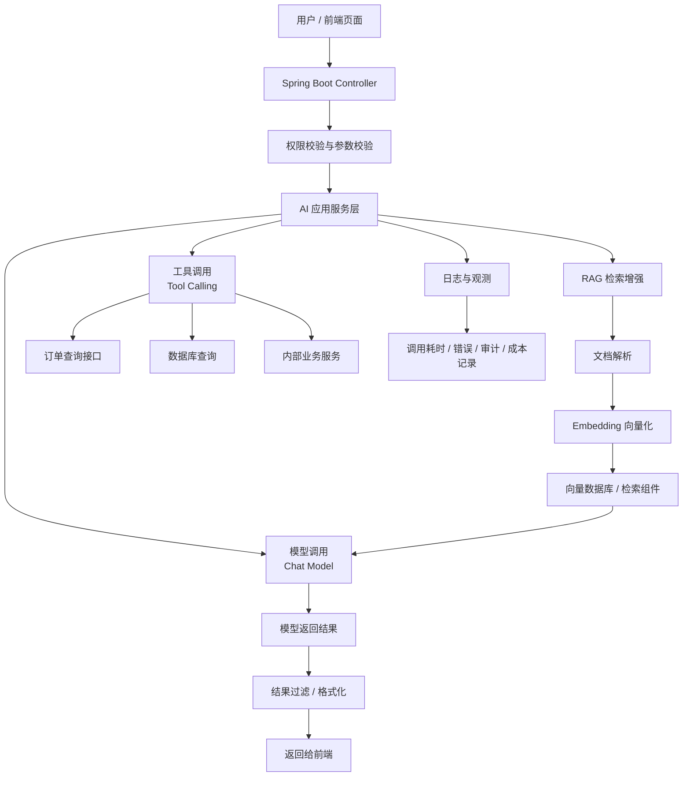

<!-- generated_at: 2026-07-27T08:31:08+08:00 -->

# 2026-07-27 从 Spring AI 看 Java AI 工程化：给大二升大三学生的学习文章

> 生成时间：2026-07-27  
> 读者定位：中北大学软件学院大二升大三学生，已具备 Java、数据库、Web 基础，正在补工程化与 AI 应用开发能力。  
> 今日主题：用 Spring AI 作为主线，把模型调用、RAG、工具调用、岗位能力和动手任务串成一条 Java AI 学习路径。

## 目录

| 序号 | 部分 | 你能读到什么 |
|---:|---|---|
| 1 | [一、先用一张图建立整体认识](#一先用一张图建立整体认识) | Java AI 应用从前端请求到模型、知识库、工具调用的整体结构 |
| 2 | [二、今日核心项目](#二今日核心项目) | 为什么选择 Spring AI，以及它适合怎样的 Java 学习路径 |
| 3 | [三、最新信息怎么影响学习](#三最新信息怎么影响学习) | AI 新闻、GitHub 项目、招聘和比赛对学生学习重点的影响 |
| 4 | [四、适合当前阶段的知识拆解](#四适合当前阶段的知识拆解) | 用 Java 后端视角解释模型调用、RAG、Embedding、工具调用、Agent、MCP |
| 5 | [五、今天可以动手做什么](#五今天可以动手做什么) | 3-5 个能在今天完成的小工程任务 |
| 6 | [六、资料来源](#六资料来源) | 本文使用到的 GitHub、新闻、招聘和比赛来源 |

## 一、先用一张图建立整体认识

如果你已经学过 Java、数据库和 Web，那么不要把“AI 应用”理解成只会调用一个聊天接口。企业里的 AI 应用更像一个后端系统：它有入口、有权限、有配置、有数据库、有日志，也要考虑稳定性、成本和安全。

下面这张图可以先建立一个整体认识：



对 Java 后端学生来说，关键不是“我会不会调大模型 API”，而是能不能把 AI 能力放进一个正常的 Spring Boot 工程里：接口怎么设计、配置怎么管理、异常怎么处理、知识库怎么接入、工具调用怎么限制权限、日志怎么记录。

## 二、今日核心项目

今天的核心项目选择 GitHub 上真实存在的 Java 项目：[spring-projects/spring-ai](https://github.com/spring-projects/spring-ai)。


Spring AI 是 Spring 生态里的 AI 应用抽象层。根据提供的数据，它覆盖模型接入、向量库、工具调用、ETL 与 RAG。对正在从“会写 Java Web”过渡到“能做企业项目”的同学来说，它的价值在于：你不用脱离熟悉的 Spring Boot 思路，就能学习大模型应用开发。

| 项目 | 语言 | 原始链接 | 数据中的描述 | 适合学习的原因 |
|---|---|---|---|---|
| spring-projects/spring-ai | Java | <https://github.com/spring-projects/spring-ai> | Spring 生态的 AI 应用抽象层，覆盖模型接入、向量库、工具调用、ETL 与 RAG | 和 Spring Boot 技术栈贴近，适合把 AI 能力做成标准后端服务 |
| langchain4j/langchain4j | Java | <https://github.com/langchain4j/langchain4j> | Java LLM 应用开发框架，覆盖聊天模型、RAG、Embedding、工具调用和 Agent 编排 | 可作为 Spring AI 的对照项目，理解 Java AI 框架的共同能力 |
| alibaba/spring-ai-alibaba | Java | <https://github.com/alibaba/spring-ai-alibaba> | 面向国内模型服务和云生态的 Spring AI 扩展与应用实践项目 | 有助于理解国内模型服务、云生态和 Spring AI 的结合方式 |
| modelcontextprotocol/java-sdk | Java | <https://github.com/modelcontextprotocol/java-sdk> | Model Context Protocol 的 Java SDK，用于把 Java 服务接入模型工具协议生态 | 适合进一步理解 MCP 和工具生态 |

Spring AI 和你已经学过的内容之间，可以这样对应：

| 你已学过的内容 | 在 Spring AI 学习中的对应点 | 你要补上的能力 |
|---|---|---|
| Spring Boot Controller | 暴露 Chat API、知识库问答 API | 设计面向 AI 的接口参数和返回格式 |
| MySQL / Redis | 存储用户、会话、文档元数据、缓存结果 | 区分业务数据、向量数据、日志数据 |
| Java Service 层 | 编排模型调用、RAG、工具调用 | 把一次 AI 请求拆成多个可维护步骤 |
| 配置文件 | endpoint、api key、模型名称、超时配置 | 不把密钥写死在代码里 |
| 日志与异常处理 | 记录调用失败、耗时、请求链路 | 让 AI 应用能被排查和上线维护 |

它和几个 AI 工程关键词的关系也比较直接：

- Spring Boot：Spring AI 可以放进 Spring Boot 项目，像普通业务模块一样组织 Controller、Service、Config。
- RAG：它覆盖向量库和 RAG，适合做“基于课程资料、项目文档、企业制度的问答系统”。
- Agent：虽然同学初学阶段不用急着做复杂 Agent，但可以先理解“模型根据任务选择工具”的思路。
- 工具调用：把 Java 方法或业务接口暴露给模型调用，例如查课表、查库存、查订单。
- 工程化：配置、限流、日志、权限、安全审计，这些是企业项目中必须考虑的部分。

## 三、最新信息怎么影响学习

今天的数据里有三类信息值得连起来看：AI 新闻在讨论模型能力和透明性，GitHub 项目在快速补齐工程工具，招聘和比赛则在强调“能把 AI 做成应用”的能力。

Hugging Face Blog 中出现了 Nunchaku 4-bit Diffusion Inference、Physical AI simulation、Grabette 机器人操作数据等内容。这说明 AI 技术不只是在文本聊天里发展，还在图像、视频、机器人、仿真和数据采集方向扩展。对 Java 后端同学来说，你不一定现在就去训练多模态模型，但要知道：后端系统会越来越多地承担“连接模型、管理数据、调度任务、记录结果”的工作。

Planet AI 中有关于中国 AI、FLUX 3 多模态模型、OpenAI 安全事件和 Hugging Face CEO 呼吁透明性的新闻。这里对学习的影响很实际：企业不会只问“你会不会调接口”，还会关心你能不能做安全边界、日志审计、权限隔离和异常处理。AI 应用越强，越需要后端工程能力兜底。

GitHub 项目方面，除了今天作为主线的 Spring AI，还能看到几个方向：

| 项目 | 数据中的方向 | 对学生学习的启发 |
|---|---|---|
| QwenLM/qwen-code | 终端里的开源 AI coding agent | 未来开发工具会更智能，但你仍要理解代码结构、接口和测试 |
| jgravelle/jcodemunch-mcp | 面向代码检索的 MCP server | MCP 正在把“工具接入模型”变成一种通用协议 |
| mock-server/mockserver-monorepo | Java MockServer，支持 API mock、代理、故障注入，也提到 AI/LLM APIs | AI 应用也需要测试，不能只靠手动问几句话 |
| ShaftHQ/SHAFT_ENGINE | Java 测试自动化框架 | 工程质量仍然是 Java 后端的重要基本功 |
| modelcontextprotocol/java-sdk | MCP Java SDK | Java 服务未来可以作为模型可调用的工具提供出去 |

招聘来源中，阿里巴巴、腾讯、字节跳动、百度、美团都出现了 Java 后端、AI 工程化、大模型应用、AI 平台、智能体应用等方向。这里传递出的信号很清楚：Java 后端没有过时，但只会 CRUD 已经不够。更有竞争力的路线是“Java 后端 + AI 应用工程化”。

比赛和活动方面，AI4J Intelligent Java Conference 直接聚焦 Java AI、Spring AI、LangChain4j、RAG、Agent；中国人工智能大赛关注大模型应用和智能体；WAIC 关注产业趋势；Google Cloud Next 关注 Gemini、Vertex AI、Agent Builder 和云端 AI 应用开发。对学生来说，比赛和会议不是只用来“看热闹”，而是可以反推出学习目标：你需要能做一个完整 demo，能讲清架构，能说明用了什么模型、什么数据、什么工具调用，以及怎么保证安全和稳定。

## 四、适合当前阶段的知识拆解

下面这些概念不需要一次学到很深，但要先建立正确理解。

| 概念 | 朴素解释 | 和 Java 后端学习的关系 |
|---|---|---|
| 模型调用 | 后端把用户问题发给大模型，再把结果返回给用户 | 类似调用第三方 HTTP API，但要额外处理超时、重试、密钥、模型参数和返回格式 |
| RAG | 先从自己的资料里检索相关内容，再把内容连同问题一起发给模型 | 适合做知识库问答，比如课程资料问答、企业制度问答、项目文档助手 |
| Embedding | 把文本转成一组数字向量，用来计算语义相似度 | 你可以把它理解成“给文本建立可搜索的语义索引”，类似数据库索引，但面向语义 |
| 工具调用 | 模型判断需要调用某个后端函数或接口来完成任务 | Java 方法、REST 接口、数据库查询都可能变成模型可调用的工具 |
| Agent | 不只是回答一句话，而是能分步骤计划、选择工具、执行任务 | 初学阶段先不要迷信 Agent，要先学会限制它能调用什么、记录它做了什么 |
| MCP | Model Context Protocol，让模型客户端和外部工具之间用统一协议连接 | Java 服务可以通过 MCP SDK 接入模型生态，成为“可被 AI 调用的工具服务” |

再具体一点，假设你要做一个“软件学院课程资料问答助手”：

1. 用户在前端输入：“数据库事务隔离级别怎么理解？”
2. Spring Boot 接口接收请求，检查用户身份和参数。
3. RAG 模块从课程资料、PDF、Markdown 笔记中检索相关片段。
4. 后端把“用户问题 + 检索片段”发给模型。
5. 模型生成回答。
6. 后端记录日志，包括用户、耗时、命中文档、是否异常。
7. 前端展示答案，并附上引用来源。

这就是一个比普通 Chat API 更接近企业项目的 AI 应用。

## 五、今天可以动手做什么

今天的小任务不要追求“大而全”，重点是让你从“看概念”进入“能落地”。

| 任务 | 建议耗时 | 具体做法 | 产出物 |
|---|---:|---|---|
| 画一个 AI 应用工程架构图 | 30-45 分钟 | 按照入口、权限、模型网关、RAG、工具调用、日志审计、成本统计来画 | 一张架构图，可以用 Mermaid 或 draw.io |
| 阅读一个大厂 AI / Java 岗位 JD | 30 分钟 | 从阿里、腾讯、字节、百度、美团招聘官网任选一个岗位，提取 5 个高频关键词 | 一张“岗位能力 -> 学习任务”对照表 |
| 设计一个 MCP server 草案 | 45-60 分钟 | 选一个你熟悉的接口，例如“查课程表”或“查图书借阅记录”，写出工具名、入参、出参和安全限制 | 一个 Markdown 设计文档 |
| 写一个最小 Chat API demo | 1.5-2 小时 | 用 Spring AI 或 LangChain4j 写一个 `/chat` 接口，模型 endpoint 和 key 从配置文件读取 | 一个可运行的 Spring Boot demo |
| 给 Chat API 加日志 | 30-45 分钟 | 记录请求时间、用户问题长度、模型名称、耗时、异常信息 | 一段日志样例和改造后的代码 |

建议今天优先做第 4 个任务：最小 Chat API demo。原因很简单，它能把你已经学过的 Spring Boot、配置文件、接口设计和异常处理都用起来。做完以后，再逐步加 RAG、工具调用和权限控制。

一个最小接口可以先这样设计：

```java
@RestController
@RequestMapping("/api/ai")
public class ChatController {

    private final ChatService chatService;

    public ChatController(ChatService chatService) {
        this.chatService = chatService;
    }

    @PostMapping("/chat")
    public ChatResponse chat(@RequestBody ChatRequest request) {
        return chatService.chat(request);
    }
}
```

你要关注的不是这几行代码本身，而是它背后的工程习惯：Controller 不直接堆业务逻辑，模型参数放到配置文件，Service 里处理模型调用，异常和日志统一管理。

## 六、资料来源

| 类型 | 名称 | 链接 | 本文使用方式 |
|---|---|---|---|
| GitHub 仓库 | spring-projects/spring-ai | <https://github.com/spring-projects/spring-ai> | 今日核心项目，用于讲 Spring 生态下的 AI 应用工程化 |
| GitHub 仓库 | langchain4j/langchain4j | <https://github.com/langchain4j/langchain4j> | 作为 Java LLM 应用框架对照，说明 RAG、Embedding、工具调用和 Agent |
| GitHub 仓库 | alibaba/spring-ai-alibaba | <https://github.com/alibaba/spring-ai-alibaba> | 说明国内模型服务和 Spring AI 生态实践 |
| GitHub 仓库 | modelcontextprotocol/java-sdk | <https://github.com/modelcontextprotocol/java-sdk> | 说明 Java 服务接入 MCP 工具协议生态 |
| GitHub 仓库 | QwenLM/qwen-code | <https://github.com/QwenLM/qwen-code> | 说明 AI coding agent 对开发方式的影响 |
| GitHub 仓库 | jgravelle/jcodemunch-mcp | <https://github.com/jgravelle/jcodemunch-mcp> | 说明 MCP 在代码检索和工具接入中的应用 |
| GitHub 仓库 | mock-server/mockserver-monorepo | <https://github.com/mock-server/mockserver-monorepo> | 说明 AI/LLM API 也需要 mock、测试和故障注入 |
| GitHub 仓库 | ShaftHQ/SHAFT_ENGINE | <https://github.com/ShaftHQ/SHAFT_ENGINE> | 说明 Java 自动化测试和工程质量的重要性 |
| 新闻源 | Hugging Face Blog | <https://huggingface.co/blog> | 使用其中关于 Diffusers、Physical AI、机器人数据的条目观察 AI 技术方向 |
| 新闻源 | Planet AI | <https://planet-ai.net/> | 使用其中关于中国 AI、多模态模型、安全透明性的条目观察行业变化 |
| 新闻源 | OpenAI Developers | <https://developers.openai.com/> | 数据源存在，但当前运行环境无法连接远程 RSS，只列为来源背景 |
| 新闻源 | Microsoft AI Blog | <https://blogs.microsoft.com/ai/> | 数据源存在，但远程数据源返回 HTTP 410，只列为来源背景 |
| 招聘官网 | 阿里巴巴招聘 | <https://talent.alibaba.com/> | 参考 Java 后端、AI 工程化、大模型应用方向 |
| 招聘官网 | 腾讯招聘 | <https://careers.tencent.com/> | 参考后台开发、AI 平台、智能体应用方向 |
| 招聘官网 | 字节跳动招聘 | <https://jobs.bytedance.com/> | 参考后端研发、AI 平台、大模型工程方向 |
| 招聘官网 | 百度招聘 | <https://talent.baidu.com/> | 参考 AI 原生应用、智能云、大模型平台方向 |
| 招聘官网 | 美团招聘 | <https://zhaopin.meituan.com/> | 参考 Java 后端、平台工程、AI 应用场景方向 |
| 比赛 / 活动 | AI4J Intelligent Java Conference | <https://ai4j.io/> | 参考 Java AI、Spring AI、LangChain4j、RAG、Agent 学习方向 |
| 比赛 / 活动 | 中国人工智能大赛 | <https://www.aicomp.cn/> | 参考大模型应用、智能体和行业 AI 创新赛事方向 |
| 比赛 / 活动 | 世界人工智能大会 WAIC | <https://www.worldaic.com.cn/> | 参考 AI 产业趋势和企业级 AI 应用 |
| 比赛 / 活动 | Google Cloud Next | <https://cloud.withgoogle.com/next> | 参考 Gemini、Vertex AI、Agent Builder 和云端 AI 应用开发方向 |
