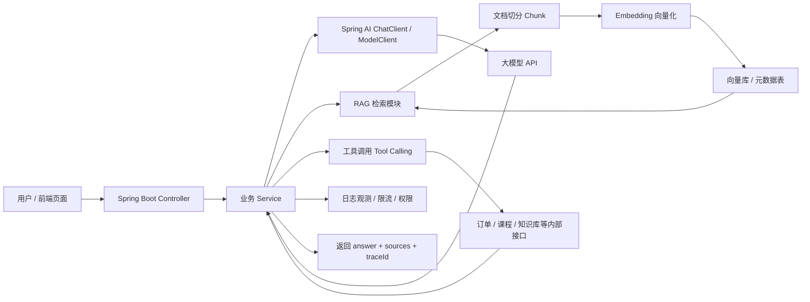

<!-- generated_at: 2026-07-29T08:31:24+08:00 -->

# 2026-07-29 从 Spring AI 看 Java AI 工程化：给大二升大三学生的学习文章

> 生成时间：2026-07-29  
> 读者定位：中北大学软件学院大二升大三学生，已具备 Java、数据库、Web 基础，正在补工程化与 AI 应用开发能力。  
> 今日主题：用 Spring AI 作为主线，把模型调用、RAG、工具调用、Agent 安全和就业实践串成一条可执行的 Java AI 学习路线。

## 目录

| 序号 | 部分 | 你能读到什么 |
|---:|---|---|
| 1 | [先用一张图建立整体认识](#overview) | Java AI 应用从用户请求到模型、知识库、工具调用的整体结构 |
| 2 | [今日核心项目](#project) | 为什么选择 `spring-projects/spring-ai`，它和 Spring Boot、RAG、Agent、工具调用的关系 |
| 3 | [最新信息怎么影响学习](#impact) | AI 新闻、GitHub 项目、招聘方向和比赛活动如何影响你的学习重点 |
| 4 | [适合当前阶段的知识拆解](#concepts) | 用 Java 后端能理解的话解释模型调用、RAG、Embedding、工具调用、Agent、MCP 等概念 |
| 5 | [今天可以动手做什么](#tasks) | 3-5 个偏工程实践的小任务，带建议耗时和产出物 |
| 6 | [资料来源](#sources) | 本文使用的 GitHub、新闻、招聘、比赛来源链接 |

## 一、先用一张图建立整体认识 <a id="overview"></a>

如果你已经学过 Java、数据库和 Web，那么不要把 AI 应用想成“只会调一个大模型接口”。更接近企业项目的形态是：Spring Boot 接收请求，Spring AI 负责屏蔽不同模型和向量库的差异，业务代码决定什么时候查知识库、什么时候调用内部系统、什么时候记录日志和限制权限。



这张图里最值得你关注的不是“大模型有多聪明”，而是 Java 后端仍然要解决的老问题：接口设计、配置管理、数据库建模、异常处理、权限控制、日志追踪、测试和部署。AI 只是把这些问题放到了一个新的业务场景里。

## 二、今日核心项目 <a id="project"></a>

今天选择的核心项目是 GitHub 仓库 [`spring-projects/spring-ai`](https://github.com/spring-projects/spring-ai)。


`Spring AI` 是 Spring 生态里的 AI 应用抽象层。根据数据中的项目描述，它覆盖模型接入、向量库、工具调用、ETL 与 RAG。对 Java 学生来说，这个项目的价值在于：它不是让你换一套完全陌生的技术栈，而是把 AI 能力放进你已经熟悉的 Spring Boot 开发方式里。

| 学习点 | Spring AI 里的对应方向 | 和 Java 后端学习的关系 |
|---|---|---|
| Spring Boot 集成 | 用 Controller、Service、配置文件组织 AI 接口 | 继续使用你熟悉的分层架构，不需要从零学 Web 框架 |
| 模型调用 | 抽象不同模型服务的接入方式 | 类似以前接短信、支付、地图 API，只是返回内容更不稳定 |
| RAG | 文档处理、向量库、检索增强生成 | 把数据库思维扩展到“文本检索 + 语义搜索” |
| Embedding | 把文本转成向量 | 可以理解为给文本生成“可计算的语义特征” |
| 工具调用 | 让模型触发 Java 方法或外部接口 | 和写 Service 方法、接口权限、参数校验直接相关 |
| 工程化 | 配置、日志、异常、限流、测试 | 真正决定 AI Demo 能不能变成项目作业或实习作品 |

为什么它适合大二升大三阶段？因为你还不需要立刻研究模型训练、CUDA、分布式推理这些底层内容。你更需要先把“AI 能力如何进入一个 Java Web 项目”跑通：前端发问题，后端调用模型，必要时查知识库，再把答案和引用来源返回给前端。

原始链接：<https://github.com/spring-projects/spring-ai>

## 三、最新信息怎么影响学习 <a id="impact"></a>

今天的数据里有几类信息，看起来分散，其实都指向同一件事：AI 应用正在从“会聊天”变成“能接系统、能控成本、能审计、能参加真实业务流程”的工程问题。

OpenAI Developers 中出现了 `Docs MCP`，说明模型和外部工具、文档、开发环境之间的连接方式正在标准化。对 Java 学生来说，这意味着你以后写的内部接口，不一定只是给前端调用，也可能要包装成模型可调用的工具。`modelcontextprotocol/java-sdk` 这类项目就和这个趋势有关：Java 服务需要能够进入 MCP 生态。

Hugging Face Blog 里有长上下文 CPU 推理、地理空间推理、手术机器人仿真相关内容。这些不一定是你今天就要实现的方向，但它们提醒你：AI 应用不只是在网页上聊天，行业数据、长文档、实时场景都会进入模型应用。对于 Java 后端学生，最现实的切入点是先学会处理文档、元数据、向量化和检索结果，而不是直接追最新模型参数。

Planet AI 中提到 AI agent 安全、成本控制层、Bot detection 相关动态。这里的关键词是“Agent 变多以后，安全和成本会变成刚需”。你以后做智能体应用，不能只让模型随便调用接口。比如删除数据、查询个人信息、发起支付、修改配置，都必须有权限限制、参数校验和日志记录。

GitHub 最近候选项目里，`QwenLM/qwen-code` 是终端里的 AI coding agent，`Autonoma-AI/autonoma` 是让 AI agent 进行端到端测试的平台。它们说明 AI 不只是在业务系统里回答问题，也正在进入开发流程本身。对你来说，比较务实的做法是：用 AI 辅助写代码，但自己必须能看懂 Spring Boot 项目结构、接口边界和测试结果，否则很容易生成一个“能跑但不可维护”的 Demo。

招聘来源也很一致。阿里巴巴、腾讯、字节跳动、百度、美团的关注点都包含 Java 后端、AI 工程化、大模型应用、AI 平台、智能体应用。企业不是只要“会 prompt 的人”，更需要能把 AI 接进真实系统的人：会写接口、会查数据库、会做权限、会定位线上问题。

比赛活动方面，AI4J Intelligent Java Conference 和 Spring AI、LangChain4j、RAG、Agent 直接相关；中国人工智能大赛、WAIC、Google Cloud Next 更偏产业趋势和应用创新。对学生而言，可以先用比赛题目训练“问题定义能力”：选一个场景，比如校园规章问答、实验室设备报修助手、课程资料问答系统，再用 Java 后端把它做成一个可演示的小系统。

## 四、适合当前阶段的知识拆解 <a id="concepts"></a>

| 概念 | 朴素解释 | 和 Java 后端的关系 |
|---|---|---|
| 模型调用 | 后端把用户问题发给大模型 API，再拿回回答 | 很像调用第三方接口，需要配置 key、endpoint、超时、重试和异常处理 |
| RAG | 先从自己的知识库里找相关资料，再把资料和问题一起交给模型回答 | 解决“模型不知道你学校、公司、项目内部资料”的问题 |
| Embedding | 把一段文本变成一组数字，让程序能比较两段文本语义是否接近 | 类似给文本建立“语义索引”，常和向量库一起用 |
| 工具调用 | 模型判断需要调用某个函数，例如查询课表、查订单、查库存 | 本质上还是调用 Java Service，但要严格限制可调用的方法和参数 |
| Agent | 不只是回答一次，而是能拆任务、调用工具、根据结果继续下一步 | 适合复杂流程，但越复杂越需要日志、权限和失败回滚 |
| MCP | 一种让模型连接外部工具和数据源的协议思路 | 你可以把 Java 服务包装成模型能理解和调用的工具服务 |

这里要特别注意：RAG 不等于“把所有文档塞给模型”。更合理的流程是先切分文档，再生成 Embedding，查询时找最相关的片段，把这些片段作为上下文提供给模型。这样既能降低输入长度，也能让回答带上来源，方便用户判断答案是否可靠。

工具调用也不是“让 AI 拥有系统管理员权限”。在企业项目里，模型能调用什么工具，入参是否合法，用户有没有权限，调用结果是否要脱敏，都要由后端控制。你现在学 Spring Security、拦截器、日志、数据库事务，并不是和 AI 无关，它们正是 AI 应用工程化的底座。

## 五、今天可以动手做什么 <a id="tasks"></a>

| 任务 | 建议耗时 | 具体做法 | 产出物 |
|---|---:|---|---|
| 写一个最小 Chat API Demo | 60-90 分钟 | 用 Spring Boot 建一个 `/api/chat` 接口，把模型 endpoint 和 key 放到配置文件中，预留切换模型的配置项 | 一个可运行的 Controller、Service、配置文件示例 |
| 设计一个 RAG 知识库表结构 | 45-60 分钟 | 选 3 篇课程或实验文档，设计 `document`、`chunk`、`embedding_metadata` 三类字段 | 一份 SQL 表结构或 Markdown 设计文档 |
| 给 RAG 返回增加引用来源 | 60 分钟 | 约定接口返回 `answer`、`source_title`、`source_url`、`chunk_id`，不要只返回一段纯文本 | 一个 JSON 返回格式样例和后端 DTO |
| 写一个 MCP server 设计草案 | 60-90 分钟 | 把一个内部接口包装成工具，列出工具名、入参、出参、安全限制，比如“查询课程资料” | 一份工具接口说明表 |
| 给 AI 接口加日志和限流思路 | 45 分钟 | 记录 `traceId`、用户 id、模型名、耗时、是否命中知识库；设计简单限流规则 | 一份日志字段清单和限流规则说明 |

建议今天优先做第 1 个和第 3 个任务。原因很简单：只会调用模型还不够，你要尽快养成“返回答案时带来源”的习惯。这个习惯会让你的项目更像真实工程，而不是一次性演示。

一个简单返回格式可以这样设计：

```json
{
  "answer": "Spring AI 可以帮助 Spring Boot 项目接入模型、向量库和工具调用。",
  "sources": [
    {
      "source_title": "Spring AI GitHub Repository",
      "source_url": "https://github.com/spring-projects/spring-ai",
      "chunk_id": "spring-ai-readme-001"
    }
  ],
  "trace_id": "20260729-demo-001"
}
```

## 六、资料来源 <a id="sources"></a>

| 类型 | 名称 | 本文使用方式 | 链接 |
|---|---|---|---|
| GitHub 仓库 | spring-projects/spring-ai | 今日核心项目，分析 Spring AI 与 Java AI 工程化关系 | <https://github.com/spring-projects/spring-ai> |
| GitHub 仓库 | langchain4j/langchain4j | 作为 Java LLM 应用框架参考，涉及 RAG、Embedding、工具调用、Agent | <https://github.com/langchain4j/langchain4j> |
| GitHub 仓库 | alibaba/spring-ai-alibaba | 作为国内模型服务和 Spring AI 扩展实践参考 | <https://github.com/alibaba/spring-ai-alibaba> |
| GitHub 仓库 | modelcontextprotocol/java-sdk | 作为 Java 接入 MCP 工具协议生态的参考 | <https://github.com/modelcontextprotocol/java-sdk> |
| GitHub 仓库 | microsoft/semantic-kernel | 作为插件、函数调用和 Agent workflow 的跨语言参考 | <https://github.com/microsoft/semantic-kernel> |
| GitHub 仓库 | QwenLM/qwen-code | 作为 AI coding agent 进入开发流程的趋势参考 | <https://github.com/QwenLM/qwen-code> |
| GitHub 仓库 | Autonoma-AI/autonoma | 作为 AI agent 做端到端测试的趋势参考 | <https://github.com/Autonoma-AI/autonoma> |
| 新闻源 | OpenAI Developers：Docs MCP | 用于说明 MCP 和工具连接标准化趋势 | <https://developers.openai.com/learn/docs-mcp/> |
| 新闻源 | OpenAI Developers：Developers plugin | 用于说明开发者工具和 AI 开发环境结合趋势 | <https://developers.openai.com/learn/developers-codex-plugin/> |
| 新闻源 | Hugging Face Blog：LFM2.5-Encoders | 用于说明长上下文、Embedding 和推理效率趋势 | <https://huggingface.co/blog/LiquidAI/lfm2-5-encoders> |
| 新闻源 | Hugging Face Blog：OlmoEarth Platform | 用于说明 AI 正进入行业数据和大规模推理场景 | <https://huggingface.co/blog/allenai/olmoearth-infrastructure> |
| 新闻源 | Planet AI：AI agents security | 用于说明 Agent 增多后安全治理的重要性 | <https://techcrunch.com/2026/07/28/cyera-agrees-to-acquire-oasis-security-for-1b-to-safeguard-proliferating-ai-agents/> |
| 新闻源 | Planet AI：Fireworks Nexus | 用于说明模型路由和成本控制会影响工程架构 | <https://www.marktechpost.com/2026/07/28/fireworks-ai-releases-fireworks-nexus-a-drop-in-routing-and-cost-control-layer-that-moves-routine-coding-work-to-open-weight-models/> |
| 新闻源 | Planet AI：Bot detection startup Spur | 用于说明自动化流量和安全识别是 AI 应用外部环境的一部分 | <https://techcrunch.com/2026/07/28/bot-detection-startup-spur-nabs-200m-from-insight/> |
| 招聘官网 | 阿里巴巴招聘 | Java 后端、AI 工程化、大模型应用方向参考 | <https://talent.alibaba.com/> |
| 招聘官网 | 腾讯招聘 | 后台开发、AI 平台、智能体应用方向参考 | <https://careers.tencent.com/> |
| 招聘官网 | 字节跳动招聘 | 后端研发、AI 平台、大模型工程方向参考 | <https://jobs.bytedance.com/> |
| 招聘官网 | 百度招聘 | AI 原生应用、智能云、大模型平台方向参考 | <https://talent.baidu.com/> |
| 招聘官网 | 美团招聘 | Java 后端、平台工程、AI 应用场景方向参考 | <https://zhaopin.meituan.com/> |
| 比赛 / 活动 | AI4J Intelligent Java Conference | Java AI、Spring AI、LangChain4j、RAG、Agent 学习参考 | <https://ai4j.io/> |
| 比赛 / 活动 | 中国人工智能大赛 | 大模型应用、智能体、行业 AI 创新赛事参考 | <https://www.aicomp.cn/> |
| 比赛 / 活动 | 世界人工智能大会 WAIC | AI 产业趋势和企业级应用生态参考 | <https://www.worldaic.com.cn/> |
| 比赛 / 活动 | Google Cloud Next | Gemini、Vertex AI、Agent Builder 和云端 AI 应用参考 | <https://cloud.withgoogle.com/next> |
