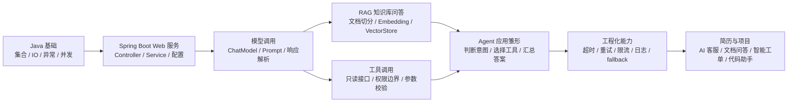
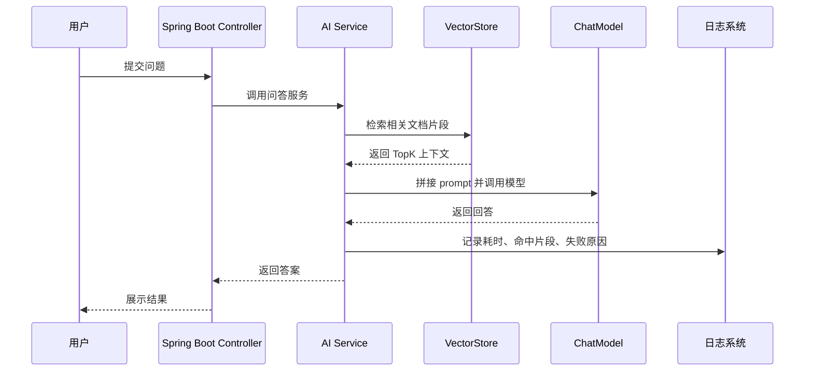

<!-- generated_at: 2026-08-02T08:31:42+08:00 -->

# 2026-08-02 从 Spring AI 看 Java AI 工程化：给大二升大三学生的学习文章

> 生成时间：2026-08-02  
> 读者定位：中北大学软件学院大二升大三学生，已具备 Java、数据库、Web 基础，正在补工程化与 AI 应用开发能力。  
> 今日主题：用 Spring AI 这类 Java 项目理解模型调用、RAG、工具调用和企业级 AI 应用开发的基本路线。

## 目录

| 序号 | 部分 | 你能读到什么 |
|---:|---|---|
| 1 | [一、先用一张图建立整体认识](#一先用一张图建立整体认识) | Java 后端同学学习 AI 应用开发时，应该把哪些模块串起来 |
| 2 | [二、今日核心项目](#二今日核心项目) | 以 Spring AI 为主线，看 Java 项目如何接入模型、向量库、工具调用和 RAG |
| 3 | [三、最新信息怎么影响学习](#三最新信息怎么影响学习) | 把 AI 新闻、GitHub 项目、招聘方向、比赛活动放到同一条学习线里理解 |
| 4 | [四、适合当前阶段的知识拆解](#四适合当前阶段的知识拆解) | 用大二升大三能理解的话解释模型调用、RAG、Embedding、工具调用、Agent、MCP 等概念 |
| 5 | [五、今天可以动手做什么](#五今天可以动手做什么) | 3-5 个偏工程实践的小任务，每个都有耗时和产出物 |
| 6 | [六、资料来源](#六资料来源) | 本文使用到的 GitHub、新闻、招聘和比赛来源链接 |

## 一、先用一张图建立整体认识

如果你已经学过 Java、数据库、Web，那么进入 Java AI 应用开发时，不要先把目标定成“训练一个大模型”。对当前阶段更现实的目标是：**用 Spring Boot 写一个后端服务，稳定地调用大模型，并能接入知识库、业务接口、权限控制和日志观测。**

下面这张图可以作为今天的学习地图：

这条路线和传统 Java 后端并不冲突。你过去写的是“用户请求 -> Controller -> Service -> 数据库 -> 返回 JSON”。AI 应用只是多了几个新环节：模型、向量库、提示词、工具调用和不确定性处理。真正拉开差距的不是会不会调一个 API，而是能不能把它做成一个稳定、可维护、能上线的系统。

## 二、今日核心项目

今天选择的核心项目是 GitHub 上真实存在的 Java 项目：**spring-projects/spring-ai**。

| 项目 | 内容 |
|---|---|
| 项目名称 | spring-projects/spring-ai |
| 原始链接 | https://github.com/spring-projects/spring-ai |
| 主要语言 | Java |
| 项目描述 | Spring 生态的 AI 应用抽象层，覆盖模型接入、向量库、工具调用、ETL 与 RAG |
| 适合人群 | 已学过 Spring Boot，想把 AI 能力接进 Java 后端项目的同学 |
| 注意事项 | 当前数据源无法确认 star、fork、更新时间，因此本文不引用这些数字 |

Spring AI 的价值在于：它把 AI 应用中常见的能力包装成 Java 后端熟悉的抽象。你不需要一开始就陷入不同模型厂商的 SDK 细节，而是先理解几个通用接口：聊天模型、Embedding 模型、向量库、文档处理、工具调用。

对于大二升大三的同学，Spring AI 最适合用来补“AI 工程化”这块能力。因为它和你已经学过的 Spring Boot 很容易连起来：

| AI 能力 | 在 Spring Boot 项目里大概对应什么 | 你需要重点理解什么 |
|---|---|---|
| 模型调用 | 一个 Service 调外部模型 API | 超时、异常、重试、响应格式 |
| RAG | 先查知识库，再让模型组织答案 | 文档切分、向量检索、上下文拼接 |
| Embedding | 把文本转成向量，存入向量数据库 | 为什么“相似问题”能被检索出来 |
| 工具调用 | 模型决定调用哪个后端接口 | 参数校验、只读限制、权限边界 |
| Agent | 模型根据任务选择步骤和工具 | 不要神化，先做简单意图识别和流程编排 |
| 工程化 | 让系统稳定运行 | 日志、限流、fallback、可观测性 |

你可以把 Spring AI 想成 AI 时代的“后端适配层”。以前你用 MyBatis 或 JPA 屏蔽不同数据库的差异，现在 Spring AI 尝试屏蔽不同模型、向量库、工具调用方式的差异。它不会替你解决所有问题，但能让你用熟悉的 Java/Spring 方式组织 AI 应用。

和今日其他项目相比，Spring AI 更适合作为主线：

| 项目 | 和 Java AI 学习的关系 | 更适合作为什么材料 |
|---|---|---|
| langchain4j/langchain4j | Java LLM 应用开发框架，覆盖聊天模型、RAG、Embedding、工具调用和 Agent 编排 | 和 Spring AI 做横向对比 |
| spring-projects/spring-ai | Spring 生态 AI 抽象层，贴近 Spring Boot 后端开发 | 今日核心学习项目 |
| alibaba/spring-ai-alibaba | 面向国内模型服务和云生态的 Spring AI 扩展与实践 | 后续了解国内模型接入 |
| modelcontextprotocol/java-sdk | MCP 的 Java SDK，用于把 Java 服务接入模型工具协议生态 | 学工具协议和 MCP 时再深入 |
| microsoft/semantic-kernel | 包含 Java SDK，关注插件、函数调用和 Agent workflow | 学 Agent 编排时参考 |
| 1Panel-dev/MaxKB | 企业知识库问答与智能体编排项目，语言为 Python | 参考产品形态和业务设计 |

## 三、最新信息怎么影响学习

今天的数据里有几类信息：AI 新闻、GitHub 项目、招聘官网、比赛活动。它们看起来分散，但其实都指向同一个趋势：**企业不只需要会调模型的人，更需要会把模型接进业务系统的人。**

OpenAI Developers 中出现了 Docs MCP、Realtime and audio guide、Developers plugin 这类内容，说明模型正在从“聊天框”走向“能连接文档、工具和实时交互的开发平台”。对 Java 后端同学来说，这意味着以后写的接口不只是给前端调用，也可能给模型调用。接口设计、鉴权、参数校验、幂等性这些后端基本功，会直接影响 AI 应用能不能安全运行。

Hugging Face Blog 里有 GPU 管理、地理空间推理、CPU 长上下文推理等内容。你现在不一定需要立刻学 GPU 调度，但要看懂背后的信号：AI 应用不是只写 prompt，还会遇到成本、资源、部署和性能问题。Java 后端学习里常见的缓存、队列、限流、监控，在 AI 应用中同样重要。

Planet AI 里关于 AI 滥用、法律限制和不健康使用的新闻，也提醒我们：AI 应用不是“能生成就行”。如果你做的是智能客服、智能工单、知识库问答，就必须考虑权限、隐私、内容边界和审计日志。比如模型不能随便调用删除数据的接口，也不能把用户隐私拼进 prompt 里到处传。

招聘方向也很清楚。阿里巴巴、腾讯、字节跳动、百度、美团的招聘入口里，关注点覆盖 Java 后端、AI 平台、大模型应用、智能体应用、平台工程等方向。它们并不是在找只会写一个 Demo 的人，而是在找能把 AI 能力工程化的人。对你来说，简历项目最好不要只写“调用某模型实现聊天”，而要写清楚：

| 招聘关注点 | 你可以准备的能力 | 简历项目里可以体现什么 |
|---|---|---|
| Java 后端 | Spring Boot、接口设计、数据库、缓存 | 有清晰分层结构和业务接口 |
| AI 工程化 | 超时、重试、fallback、日志 | 模型调用失败时系统如何处理 |
| 大模型应用 | Prompt、RAG、工具调用 | 知识库问答或智能工单流转 |
| AI 平台 | 多模型适配、权限、配置化 | 模型供应商可切换，接口有权限边界 |
| 智能体应用 | 意图识别、任务拆解、工具选择 | Agent 不是乱跑，而是受控调用工具 |

比赛和会议也能帮助你选方向。AI4J Intelligent Java Conference 直接覆盖 Java AI 应用、Spring AI、LangChain4j、RAG、Agent，很适合 Java 技术栈同学关注。中国人工智能大赛更偏应用创新和行业场景，适合把课程项目升级成比赛项目。WAIC 可以看产业趋势，Google Cloud Next 可以看云端 AI 应用和 Agent Builder 的方向。你不用每个都深入，但要学会从这些活动里判断：现在企业真正需要的是“AI + 业务系统”的组合能力。

## 四、适合当前阶段的知识拆解

下面这些概念不要死记定义。你可以把它们都放回一个 Spring Boot 项目里理解。

| 概念 | 朴素解释 | 和 Java 后端学习的关系 |
|---|---|---|
| 模型调用 | 后端服务把用户问题发给大模型，再拿到回复 | 类似调用第三方支付、短信、地图 API，但响应更不稳定，需要超时、重试和兜底 |
| RAG | 先从自己的资料库里检索相关内容，再让模型基于这些内容回答 | 类似“先查数据库再组织返回值”，区别是查的是向量库，返回的是文本上下文 |
| Embedding | 把一段文本变成一组数字，方便计算语义相似度 | 它让“意思相近但字不一样”的问题也能被检索到，常用于知识库问答 |
| 工具调用 | 模型不是直接回答，而是决定调用某个后端函数或接口 | 这和写 Service 方法有关，但必须限制可调用范围，尤其不能随便开放写操作 |
| Agent | 能根据目标选择步骤、调用工具、汇总结果的一类应用形态 | 现阶段可以先理解为“模型参与决策的流程编排”，不要一开始就追求全自动 |
| MCP | Model Context Protocol，用协议方式让模型连接外部工具和上下文 | 对 Java 同学来说，它可能让你的 Spring Boot 服务变成模型可调用的工具服务 |

举个小例子：假设你做一个“软件学院课程助手”。

普通聊天模式是：用户问“数据库怎么复习”，模型直接回答。

RAG 模式是：系统先从课程资料、实验指导书、考试范围中检索相关片段，再让模型回答。

工具调用模式是：用户问“我这周有哪些实验要交”，模型调用你的课程系统只读接口，查到任务列表后再回答。

Agent 模式是：系统先判断用户意图，再决定是走知识库问答、课程查询、任务提醒，还是普通闲聊。

MCP 模式是：你把课程系统、资料检索、日程查询包装成模型可以按协议发现和调用的工具。

这几层不是一次性全部做完的。学习顺序建议是：先模型调用，再 RAG，再工具调用，最后再看 Agent 和 MCP。

## 五、今天可以动手做什么

下面任务都偏工程实践，不要求一次做成完整大项目。重点是留下可展示的产出物。

| 任务 | 建议耗时 | 具体做法 | 产出物 |
|---|---:|---|---|
| 给一次模型调用加工程保护 | 60-90 分钟 | 在 Java Service 中为模型调用增加超时、重试、错误分类和 fallback 文案，并记录失败原因 | 一个 `AiChatService` 示例类或伪代码，加一份异常分类说明 |
| 设计工具调用白名单 | 45-60 分钟 | 假设模型只能调用 2-3 个只读业务接口，例如查询课程、查询实验、查询公告，写清楚不能调用删除、修改、导出隐私数据接口 | 一张工具白名单表和权限边界说明 |
| 对比 Spring AI 与 LangChain4j 抽象 | 60 分钟 | 阅读两个仓库 README 或文档，重点看 ChatModel、EmbeddingModel、VectorStore、工具调用相关概念 | 5 条对比结论，写进学习笔记 |
| 写一个简单意图识别 prompt | 30-45 分钟 | 把用户问题分成问答、检索、任务执行、闲聊四类，并设计 8-10 个测试问题 | 一份 prompt 和测试样例表 |
| 画一个 RAG 小系统结构图 | 30 分钟 | 用 Mermaid 画出用户提问、文档切分、Embedding、向量检索、模型回答、日志记录的流程 | 一张可以放进项目 README 的架构图 |

一个适合今天完成的小型结构图如下，你可以直接放到自己的学习笔记里再改：

今天不要追求“大而全”。如果你能把一次模型调用做得可控，把一个只读工具调用设计清楚，就已经比只会写聊天 Demo 更接近企业项目。

## 六、资料来源

| 类型 | 名称 | 链接 |
|---|---|---|
| GitHub 仓库 | spring-projects/spring-ai | https://github.com/spring-projects/spring-ai |
| GitHub 仓库 | langchain4j/langchain4j | https://github.com/langchain4j/langchain4j |
| GitHub 仓库 | alibaba/spring-ai-alibaba | https://github.com/alibaba/spring-ai-alibaba |
| GitHub 仓库 | modelcontextprotocol/java-sdk | https://github.com/modelcontextprotocol/java-sdk |
| GitHub 仓库 | microsoft/semantic-kernel | https://github.com/microsoft/semantic-kernel |
| GitHub 仓库 | 1Panel-dev/MaxKB | https://github.com/1Panel-dev/MaxKB |
| GitHub 候选项目 | block/trailblaze | https://github.com/block/trailblaze |
| GitHub 候选项目 | ai-boost/awesome-harness-engineering | https://github.com/ai-boost/awesome-harness-engineering |
| 新闻源 | OpenAI Developers | https://developers.openai.com/ |
| 新闻条目 | Docs MCP | https://developers.openai.com/learn/docs-mcp/ |
| 新闻条目 | OpenAI Developers plugin | https://developers.openai.com/learn/developers-codex-plugin/ |
| 新闻条目 | Realtime and audio guide | https://platform.openai.com/docs/guides/realtime |
| 新闻源 | Hugging Face Blog | https://huggingface.co/blog |
| 新闻条目 | GPU Management: Why Idle GPUs Are the New Grounded Aircraft | https://huggingface.co/blog/Dharma-AI/gpu-management |
| 新闻条目 | LFM2.5-Encoders for Fast Long-Context Inference on CPU | https://huggingface.co/blog/LiquidAI/lfm2-5-encoders |
| 新闻源 | Planet AI | https://planet-ai.net/ |
| 新闻条目 | Judge denies xAI’s request to block Minnesota ban on ‘nudify’ apps | https://techcrunch.com/2026/08/01/judge-denies-xais-request-to-block-minnesota-ban-on-nudify-apps/ |
| 招聘官网 | 阿里巴巴招聘 | https://talent.alibaba.com/ |
| 招聘官网 | 腾讯招聘 | https://careers.tencent.com/ |
| 招聘官网 | 字节跳动招聘 | https://jobs.bytedance.com/ |
| 招聘官网 | 百度招聘 | https://talent.baidu.com/ |
| 招聘官网 | 美团招聘 | https://zhaopin.meituan.com/ |
| 比赛/活动 | AI4J Intelligent Java Conference | https://ai4j.io/ |
| 比赛/活动 | 中国人工智能大赛 | https://www.aicomp.cn/ |
| 比赛/活动 | 世界人工智能大会 WAIC | https://www.worldaic.com.cn/ |
| 比赛/活动 | Google Cloud Next | https://cloud.withgoogle.com/next |
