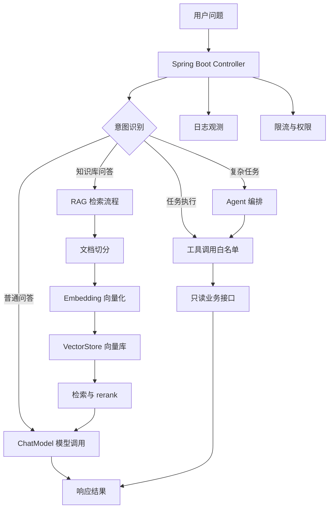
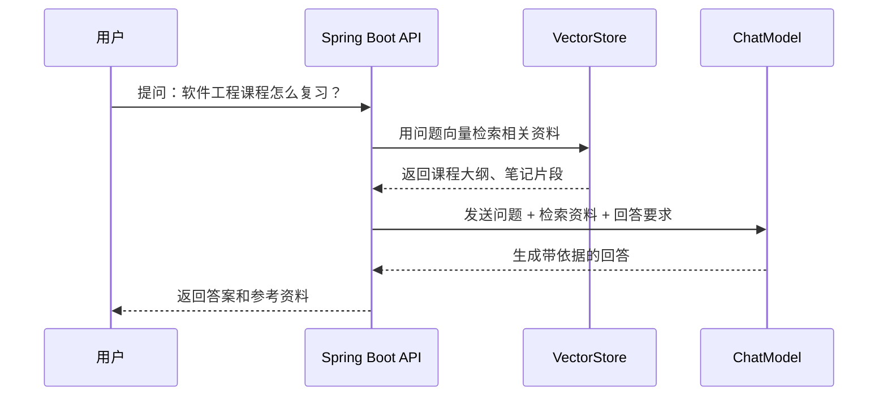

<!-- generated_at: 2026-08-03T08:31:38+08:00 -->

# 2026-08-03 从 Spring AI 看 Java AI 工程化：给大二升大三学生的学习文章

> 生成时间：2026-08-03  
> 读者定位：中北大学软件学院大二升大三学生，已具备 Java、数据库、Web 基础，正在补工程化与 AI 应用开发能力。  
> 今日主题：用 Spring AI 理解 Java 后端如何把模型调用、RAG、工具调用和工程化能力接到真实业务系统里。

## 目录

| 序号 | 部分 | 你能读到什么 |
|---:|---|---|
| 1 | [先用一张图建立整体认识](#一先用一张图建立整体认识) | AI 应用在 Java 后端里的基本结构，以及为什么不能只学“调接口” |
| 2 | [今日核心项目](#二今日核心项目) | 以 Spring AI 为主线，理解 Java AI 项目的工程入口 |
| 3 | [最新信息怎么影响学习](#三最新信息怎么影响学习) | 把 AI 新闻、GitHub 项目、招聘和比赛放到同一条学习线上看 |
| 4 | [适合当前阶段的知识拆解](#四适合当前阶段的知识拆解) | 用 Java 后端视角解释模型调用、RAG、Embedding、工具调用、Agent、MCP |
| 5 | [今天可以动手做什么](#五今天可以动手做什么) | 3-5 个适合今天完成的小工程任务 |
| 6 | [资料来源](#六资料来源) | 本文使用到的 GitHub、新闻、招聘和活动链接 |

## 一、先用一张图建立整体认识

如果你已经学过 Java、数据库和 Web，那么理解 AI 应用时不要只盯着“怎么调用大模型 API”。企业里的 AI 应用更像一个加强版后端系统：它要接收请求、判断意图、查数据库或知识库、调用模型、控制权限、记录日志，最后把结果返回给用户。

下面这张图可以先建立整体认识：



对大二升大三的同学来说，可以把它类比成你熟悉的 Web 项目：

| 传统 Java Web 项目 | Java AI 应用中的对应能力 | 你需要补的能力 |
|---|---|---|
| Controller 接收 HTTP 请求 | 接收用户自然语言问题 | 会设计 AI 接口入参和返回结构 |
| Service 写业务逻辑 | 组织模型、检索、工具调用流程 | 会拆分 AI 应用流程 |
| Mapper / Repository 查数据库 | VectorStore 查向量库或知识库 | 理解 RAG 和 Embedding |
| 权限拦截器 | 控制模型能调用哪些工具 | 会做工具白名单和权限边界 |
| 日志、异常、限流 | 观测 AI 调用质量和稳定性 | 会记录 prompt、响应、耗时和错误 |

这也是为什么今天选 Spring AI 作为核心项目：它不是一个“聊天页面项目”，而是帮助 Java 后端把 AI 能力工程化接进 Spring 生态的项目。

## 二、今日核心项目


今日核心项目选择：**spring-projects/spring-ai**

- GitHub 仓库：https://github.com/spring-projects/spring-ai
- 项目描述：Spring 生态的 AI 应用抽象层，覆盖模型接入、向量库、工具调用、ETL 与 RAG。
- 语言：Java
- 注意：数据源中 star、fork、更新时间无法确认，本文不编造这些指标，只基于项目描述和公开链接进行学习分析。

Spring AI 适合 Java AI 学习，原因很直接：你已经学过 Spring Boot，那么继续用 Spring 的方式理解 AI，比一上来换一套完全陌生的技术栈更容易建立工程感。

它关心的不是“模型有多聪明”，而是这些问题：

| 学习点 | Spring AI 中的意义 | 和 Java 后端的关系 |
|---|---|---|
| Spring Boot | 用熟悉的配置、Bean、Starter 接入 AI 能力 | 延续你已有的 Web 开发基础 |
| ChatModel | 把不同模型服务抽象成统一聊天接口 | 类似把不同数据库封装到统一访问层 |
| RAG | 让模型回答时参考你的业务资料 | 对应企业知识库、客服、文档问答 |
| VectorStore | 保存和检索向量化后的文档片段 | 类似数据库，但查询方式是语义相似度 |
| 工具调用 | 让模型在受控范围内调用 Java 方法或接口 | 对应后端 Service 能力开放 |
| Agent | 让模型分步骤完成复杂任务 | 对应“会决策的业务流程编排” |
| 工程化 | 配置、日志、限流、错误处理、权限边界 | 决定项目能不能真正上线 |

你可以这样理解 Spring AI 的学习价值：它把“AI 能力”变成 Spring 应用中的一种基础设施。就像你以前学 MyBatis、Redis、消息队列时，不只是学 API，而是学它们怎么进入业务系统，Spring AI 也是同样的定位。

和今天数据中的其他项目相比：

| 项目 | 主要方向 | 适合怎么参考 |
|---|---|---|
| `spring-projects/spring-ai` | Spring 生态 AI 抽象层 | Java 后端主线学习项目 |
| `langchain4j/langchain4j` | Java LLM 应用开发框架 | 对比学习 ChatModel、Embedding、RAG、工具调用 |
| `alibaba/spring-ai-alibaba` | 国内模型服务和云生态的 Spring AI 扩展 | 关注国内模型接入和实际落地 |
| `modelcontextprotocol/java-sdk` | MCP Java SDK | 理解模型如何通过协议调用外部工具 |
| `microsoft/semantic-kernel` | AI 编排 SDK，含 Java SDK | 学插件、函数调用、Agent workflow 思路 |
| `1Panel-dev/MaxKB` | 企业知识库问答与智能体编排 | 参考 AI 应用平台的产品形态和功能边界 |

## 三、最新信息怎么影响学习

今天的数据里有几类信息：AI 新闻、GitHub 项目、招聘官网、比赛活动。它们看起来分散，其实指向同一件事：**AI 应用开发正在从“写 prompt 调接口”转向“可管理、可观测、可控制的工程系统”**。

OpenAI Developers 中出现了 Docs MCP、Realtime and audio guide、Developers plugin 等内容。对 Java 学生来说，最值得注意的是 MCP 和 plugin 思路。它们说明模型不再只是回答文本，而是要连接文档、工具、插件和外部系统。换成 Java 后端语言，就是：你写的接口、服务、业务方法，未来可能会被模型以“工具”的形式调用。

Hugging Face Blog 中有 GPU 管理、长上下文 CPU 推理、地理空间推理等文章。这些内容不一定要求你现在就掌握底层训练和推理优化，但它提醒你：AI 应用背后有成本、性能和部署问题。Java 后端同学不一定要训练模型，但要知道一次模型调用可能很慢、很贵、容易失败，所以需要缓存、限流、日志、降级和异步处理。

Planet AI 中提到恶意使用 AI、GeoAI 教程、AI 发展争论等内容。这里对工程学习的影响是：AI 应用不能只考虑“能不能做”，还要考虑“能不能控”。比如工具调用如果没有权限边界，模型就可能调用不该调用的接口；知识库问答如果没有来源和日志，错误答案就难以追踪。

招聘动态也和这条线一致。阿里巴巴、腾讯、字节跳动、百度、美团的招聘方向里都出现了 Java 后端、AI 工程化、大模型应用、AI 平台、智能体应用等关键词。这说明对本科阶段的同学来说，比较现实的路线不是一开始就冲“训练大模型算法岗”，而是先把 Java 后端能力和 AI 应用工程能力结合起来。

比赛和活动则给了练习场景。AI4J Intelligent Java Conference 关注 Java AI 应用、Spring AI、LangChain4j、RAG、Agent；中国人工智能大赛关注大模型应用和智能体；WAIC 更偏产业趋势；Google Cloud Next 关注云端 AI 应用和 Agent Builder。你可以把这些活动当作选题来源：知识库问答、校园助手、课程资料检索、简历问答、实验室文档助手，都是适合学生练手的方向。

一句话总结今天的学习判断：

| 信息来源 | 看到的趋势 | 对你的学习要求 |
|---|---|---|
| AI 新闻 | 模型正在连接文档、工具、实时交互和插件 | 不能只会 prompt，要理解工具和协议 |
| GitHub 项目 | Java AI 框架开始覆盖 RAG、Agent、VectorStore | 要用 Spring Boot 思维学习 AI 应用 |
| 招聘官网 | 企业需要 AI 工程化和大模型应用开发 | Java 后端基础仍然有价值，但要叠加 AI 能力 |
| 比赛活动 | 题目越来越偏应用落地和智能体 | 需要做出可演示、可部署的小项目 |

## 四、适合当前阶段的知识拆解

下面这些概念不需要一次学成专家，但要先知道它们在 Java 后端项目里放在哪里。

| 概念 | 朴素解释 | 和 Java 后端学习的关系 |
|---|---|---|
| 模型调用 | 后端把用户问题发给大模型，再拿到回答 | 类似调用第三方 API，但要处理超时、错误、重试和日志 |
| RAG | 先从资料库里找相关内容，再让模型结合资料回答 | 适合做课程资料问答、企业文档助手、客服系统 |
| Embedding | 把文本变成一组数字，用来比较语义相似度 | 类似给文本建立“语义索引”，不是用 SQL 的等值查询 |
| 工具调用 | 模型决定调用某个后端方法，例如查订单、查课表 | Java Service 方法可以变成模型可用的工具，但必须限制权限 |
| Agent | 模型不只回答一次，而是能分步骤计划、调用工具、继续判断 | 类似一个会调度多个 Service 的流程控制器 |
| MCP | 一种让模型和外部工具、文档、服务连接的协议思路 | Java 服务可以通过 SDK 接入模型工具生态 |

这里要特别强调“工具调用”。很多同学容易把它想成“让 AI 操作系统”。在企业项目里不能这么粗放。更合理的做法是：

1. 只开放少量明确的只读接口。
2. 每个工具写清楚输入、输出和权限。
3. 对每次调用记录日志。
4. 对危险操作加入人工确认或完全禁止。
5. 不让模型直接拼 SQL、直接操作数据库。

例如你可以开放一个 `CourseQueryService`，允许模型查询课程介绍；但不要让模型直接执行任意 SQL。这样才符合 Java 后端的安全边界。

RAG 也不是“把文件丢给模型”这么简单。一个最小 RAG 流程通常包括：



对你当前阶段来说，RAG 最重要的不是向量算法细节，而是先把工程链路跑通：文档怎么导入、怎么切分、怎么检索、怎么拼 prompt、怎么返回来源、怎么记录日志。

## 五、今天可以动手做什么

今天的任务不要追求大而全，重点是补“工程感”。下面 4 个任务可以任选 2 个完成，如果时间充足再做完整组合。

| 任务 | 建议耗时 | 具体做法 | 产出物 |
|---|---:|---|---|
| 设计工具调用白名单 | 40 分钟 | 只允许模型调用 2-3 个只读业务接口，例如查询课程、查询公告、查询实验室信息，并写清禁止事项 | 一份 `tool-whitelist.md` 权限说明 |
| 对比 Spring AI 与 LangChain4j 抽象 | 60 分钟 | 查阅两个仓库文档或示例，围绕 ChatModel、EmbeddingModel、VectorStore、工具调用、Agent 写对比 | 5 条对比结论 |
| 实现意图识别 prompt | 45 分钟 | 把用户问题分成问答、检索、任务执行、闲聊四类，并设计 JSON 返回格式 | 一个 prompt 和 10 条测试样例 |
| 给 RAG 增加最小 rerank | 90 分钟 | 先取 Top 5 检索结果，再用简单规则按关键词命中数或标题相关度重排 | rerank 前后答案对比表 |

一个适合今天完成的小项目结构可以这样设计：

```text
java-ai-practice/
  docs/
    tool-whitelist.md
    rag-rerank-report.md
  src/main/java/
    controller/
      AiChatController.java
    service/
      IntentDetectService.java
      RagSearchService.java
      ToolCallGuardService.java
    model/
      IntentType.java
      ChatRequest.java
      ChatResponse.java
```

如果你只做一个最小版本，可以先不接真实大模型，先把接口、分类、工具白名单、日志字段设计出来。因为企业项目里，接口设计和边界设计往往比“能跑一个 demo”更重要。

建议今天的学习顺序：

| 顺序 | 做什么 | 判断是否完成 |
|---:|---|---|
| 1 | 读 Spring AI 仓库介绍，理解它覆盖哪些能力 | 能说出 ChatModel、VectorStore、RAG 的位置 |
| 2 | 写一个工具白名单文档 | 能明确哪些接口允许模型调用，哪些不允许 |
| 3 | 写意图识别 prompt | 能把 10 个问题稳定分成 4 类 |
| 4 | 设计 RAG rerank 对比表 | 能解释为什么重排后答案更可靠或没有变好 |

## 六、资料来源

| 类型 | 名称 | 链接 | 本文使用方式 |
|---|---|---|---|
| GitHub 仓库 | spring-projects/spring-ai | https://github.com/spring-projects/spring-ai | 今日核心项目，分析 Spring 生态 AI 工程化 |
| GitHub 仓库 | langchain4j/langchain4j | https://github.com/langchain4j/langchain4j | 作为 Java LLM 框架对比对象 |
| GitHub 仓库 | alibaba/spring-ai-alibaba | https://github.com/alibaba/spring-ai-alibaba | 参考国内模型服务和 Spring AI 扩展 |
| GitHub 仓库 | modelcontextprotocol/java-sdk | https://github.com/modelcontextprotocol/java-sdk | 解释 MCP 与 Java 工具接入关系 |
| GitHub 仓库 | microsoft/semantic-kernel | https://github.com/microsoft/semantic-kernel | 参考插件、函数调用和 Agent workflow |
| GitHub 仓库 | 1Panel-dev/MaxKB | https://github.com/1Panel-dev/MaxKB | 参考企业知识库问答和智能体平台形态 |
| 新闻源 | OpenAI Developers | https://developers.openai.com/ | 参考 Docs MCP、plugin、Realtime 等开发者内容 |
| 新闻源 | Hugging Face Blog | https://huggingface.co/blog | 参考 GPU 管理、长上下文推理等工程趋势 |
| 新闻源 | Planet AI | https://planet-ai.net/ | 参考 AI 安全、GeoAI、产业讨论等信息 |
| 招聘官网 | 阿里巴巴招聘 | https://talent.alibaba.com/ | 参考 Java 后端、AI 工程化、大模型应用方向 |
| 招聘官网 | 腾讯招聘 | https://careers.tencent.com/ | 参考后台开发、AI 平台、智能体应用方向 |
| 招聘官网 | 字节跳动招聘 | https://jobs.bytedance.com/ | 参考后端研发、AI 平台、大模型工程方向 |
| 招聘官网 | 百度招聘 | https://talent.baidu.com/ | 参考 AI 原生应用、智能云、大模型平台方向 |
| 招聘官网 | 美团招聘 | https://zhaopin.meituan.com/ | 参考 Java 后端、平台工程、AI 应用场景方向 |
| 比赛活动 | AI4J Intelligent Java Conference | https://ai4j.io/ | 参考 Java AI、Spring AI、LangChain4j、RAG、Agent 方向 |
| 比赛活动 | 中国人工智能大赛 | https://www.aicomp.cn/ | 参考大模型应用、智能体和行业 AI 创新赛事 |
| 比赛活动 | 世界人工智能大会 WAIC | https://www.worldaic.com.cn/ | 参考 AI 产业趋势和企业级应用生态 |
| 比赛活动 | Google Cloud Next | https://cloud.withgoogle.com/next | 参考 Gemini、Vertex AI、Agent Builder 和云端 AI 应用开发 |
