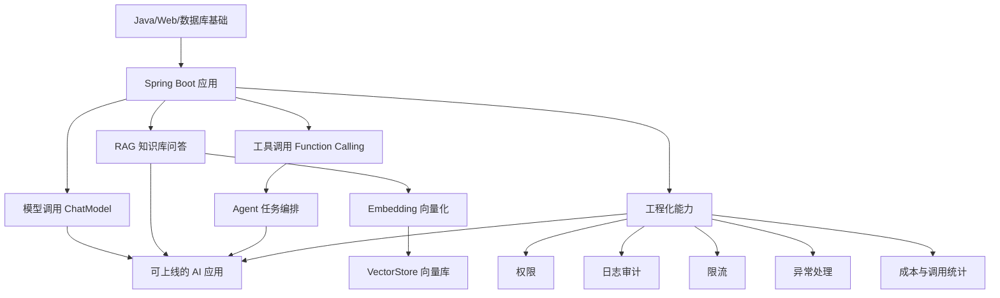
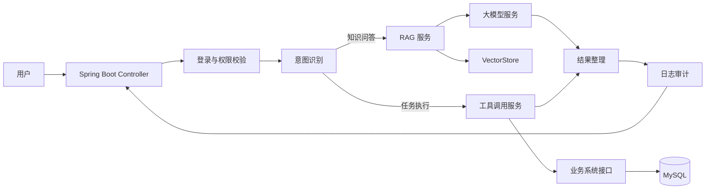

<!-- generated_at: 2026-08-04T08:31:40+08:00 -->

# 2026-08-04 从 Spring AI 看 Java AI 工程化：给大二升大三学生的学习文章

> 生成时间：2026-08-04  
> 读者定位：中北大学软件学院大二升大三学生，已具备 Java、数据库、Web 基础，正在补工程化与 AI 应用开发能力。  
> 今日主题：用 Spring AI 这类 Java 项目理解“大模型应用不是调接口，而是后端工程能力的延伸”。

## 目录

| 序号 | 部分 | 你能读到什么 |
|---:|---|---|
| 1 | [一、先用一张图建立整体认识](#一先用一张图建立整体认识) | 把新闻、项目、招聘、比赛和今天的小任务放到同一条学习主线上 |
| 2 | [二、今日核心项目](#二今日核心项目) | 认识 Spring AI，并理解它为什么适合作为 Java AI 入门项目 |
| 3 | [三、最新信息怎么影响学习](#三最新信息怎么影响学习) | 从 AI 安全新闻、GitHub 项目、招聘方向、比赛活动看学习重点 |
| 4 | [四、适合当前阶段的知识拆解](#四适合当前阶段的知识拆解) | 用 Java 后端同学能理解的话解释模型调用、RAG、Embedding、工具调用、Agent、日志观测 |
| 5 | [五、今天可以动手做什么](#五今天可以动手做什么) | 3-5 个可以当天完成的小工程任务 |
| 6 | [六、资料来源](#六资料来源) | 本文使用到的 GitHub、招聘、比赛和新闻来源 |

## 一、先用一张图建立整体认识

很多同学第一次接触 AI 应用开发，会以为重点是“会不会写 Prompt”。Prompt 很重要，但如果你未来想做 Java 后端、AI 平台、大模型应用工程，真正要补的是：怎么把模型接入到一个可靠的 Web 系统里。

今天的数据里有几类信息：AI 新闻、Java AI 框架、AI 工程项目、招聘方向、比赛活动。它们共同指向一个结论：AI 应用正在从“演示 Demo”进入“工程系统”，需要权限、日志、检索、工具调用、限流、审计这些后端能力。

你可以把 AI 应用理解成一个增强版后端系统：以前你的 Controller 调 Service，Service 查 MySQL；现在你的 Service 可能还会调用大模型、查向量库、调用外部工具，并把整个过程记录下来，方便排查问题。

## 二、今日核心项目

今天选择的核心项目是 **spring-projects/spring-ai**。

| 项目 | 内容 |
|---|---|
| GitHub 仓库 | [spring-projects/spring-ai](https://github.com/spring-projects/spring-ai) |
| 项目描述 | Spring 生态的 AI 应用抽象层，覆盖模型接入、向量库、工具调用、ETL 与 RAG |
| 主要语言 | Java |
| 适合人群 | 已经学过 Spring Boot，想把 AI 能力接入 Java Web 项目的同学 |
| 注意 | 当前数据无法确认 star、fork、更新时间，所以本文不引用这些指标 |

为什么它适合中北大学软件学院大二升大三学生？

因为你们已经学过 Java、数据库、Web 基础，Spring AI 正好能把这些知识串起来。它不是让你脱离 Java 去学一个全新的技术栈，而是把大模型能力放进 Spring 生态里，让你用熟悉的方式理解 AI 应用开发。

可以这样对应：

| Spring AI 相关点 | 和 Java 后端学习的关系 | 你应该重点理解什么 |
|---|---|---|
| ChatModel | 类似 Service 调用外部 API | 如何封装模型调用，如何处理超时、异常、返回格式 |
| EmbeddingModel | 把文本转成向量 | 为什么知识库检索不能只靠 SQL `LIKE` |
| VectorStore | 类似一种特殊的数据存储 | 如何存、查、过滤向量数据 |
| RAG | 检索增强生成 | 先查资料，再让模型回答，减少胡编 |
| 工具调用 | 模型决定是否调用函数或接口 | 如何让模型触发 Java 方法，例如查订单、查课表、查天气 |
| ETL | 数据清洗、切分、入库 | 文档进入知识库前，需要先处理成适合检索的片段 |
| 工程化 | 上线需要的配套能力 | 权限、日志、限流、审计、监控都不能省 |

如果你做过普通 Spring Boot 项目，比如学生管理系统、图书管理系统、博客系统，那么 Spring AI 可以让这些项目升级成“可问答、可检索、可执行任务”的应用。例如：

- 学生管理系统：从“按条件查询学生”升级为“自然语言查询学生信息”。
- 课程资料系统：从“手动搜索文档”升级为“基于课程资料的问答助手”。
- 实验平台：从“展示实验说明”升级为“根据报错信息给出排查建议”。

它和 Spring Boot / RAG / Agent / 工具调用 / 工程化的关系可以概括为一句话：**Spring Boot 负责应用骨架，Spring AI 负责把模型、向量库、工具调用这些 AI 能力接进来，工程化能力负责让它能稳定运行。**

## 三、最新信息怎么影响学习

今天的 AI 新闻里，Planet AI 收录了 OpenAI 关于打击恶意使用 AI 诈骗活动的文章：[Disrupting a Criminal Scam Operation](https://openai.com/index/disrupting-malicious-uses-of-ai-criminal-scam-operation)。这类新闻对学生的启发不是“AI 很危险”这么简单，而是提醒我们：AI 应用上线以后，必须考虑身份、权限、审计、内容安全和调用记录。

如果一个 AI 系统可以帮用户发消息、调用接口、生成内容，那么它就不能只是一个简单聊天框。后端需要知道：

- 谁在调用模型？
- 用户有没有权限调用某个工具？
- 模型调用了哪些函数？
- 检索到了哪些资料？
- 输出内容是否可能有风险？
- 出问题后能不能通过日志还原过程？

这和 Java 后端非常相关。你学过登录、权限、日志、数据库事务、接口设计，这些不是过时知识，而是 AI 工程化里的基础能力。

GitHub 项目方面，今天跟踪到的 Java AI 相关仓库包括 LangChain4j、Spring AI、spring-ai-alibaba、modelcontextprotocol/java-sdk，以及包含 Java SDK 的 semantic-kernel。它们说明 Java 生态正在补齐 AI 应用开发的几块关键能力：模型调用、RAG、工具调用、Agent 编排、MCP 协议接入。

同时，近期候选项目里有 `rocketride-org/rocketride-server`，描述中提到 AI pipeline、模型提供商、向量数据库、Agent orchestration、Docker 部署。虽然它不是 Java 项目，但它体现了一个趋势：企业不会只要一个“能聊天”的应用，而是需要能构建、调试、部署、扩展的 AI 工作流系统。对 Java 同学来说，这意味着你不能只会写 Controller，还要理解任务编排、部署、日志和接口边界。

招聘动态也在强化这个方向。阿里巴巴、腾讯、字节跳动、百度、美团的招聘方向里，都出现了 Java 后端、AI 平台、大模型应用、智能体应用、平台工程等关键词。对大二升大三学生来说，这不是要求你现在就会训练大模型，而是要求你尽早建立“AI + 后端工程”的能力组合。

比赛活动同样值得关注。AI4J Intelligent Java Conference 聚焦 Java AI 应用开发、Spring AI、LangChain4j、RAG、Agent；中国人工智能大赛关注大模型应用和智能体；WAIC 更偏产业趋势；Google Cloud Next 偏云端 AI 应用开发。比赛和会议可以帮你判断行业在关心什么：不是单纯写算法题，而是做出能解决具体问题、能运行、能展示、能解释的 AI 应用。

## 四、适合当前阶段的知识拆解

下面这些概念，建议你按“能不能放进 Spring Boot 项目”来理解，而不是只背定义。

| 概念 | 朴素解释 | 和 Java 后端的关系 |
|---|---|---|
| 模型调用 | 后端把用户问题发给大模型，再拿到回答 | 类似调用第三方接口，需要封装 Client、处理异常、设置超时 |
| Embedding | 把一段文本变成一组数字，方便计算语义相似度 | 类似给文本建立“语义索引”，用于知识库检索 |
| RAG | 先从资料库检索相关内容，再让模型基于资料回答 | 可以减少模型胡编，适合课程资料问答、企业文档问答 |
| 工具调用 | 模型判断需要调用某个函数或接口完成任务 | 本质上是让模型触发后端方法，但必须做权限和参数校验 |
| Agent | 能拆解任务、调用工具、根据结果继续决策的 AI 流程 | 像一个会调多个 Service 的任务编排器，但稳定性更难控制 |
| 日志观测 | 记录请求、检索内容、模型输入输出、工具调用结果 | 方便排查问题，也方便做审计、安全分析和质量优化 |

以 RAG 为例，你可以这样理解它的流程：

1. 用户问：“数据库事务隔离级别怎么理解？”
2. 系统把问题转成向量。
3. 系统去向量库里找和这个问题最相关的课程资料片段。
4. 系统把这些片段和用户问题一起发给大模型。
5. 大模型基于资料生成回答。
6. 后端记录本次问题、检索片段、模型响应和耗时。

这里每一步都能对应到 Java 后端能力：接口设计、数据存储、服务封装、异常处理、日志记录、权限控制。

再看工具调用。假设你做一个“校园服务助手”，用户问：“帮我查一下本周 Java Web 实验安排。”模型本身不知道你的课表系统数据，它需要调用一个后端接口，比如 `getLabSchedule(studentId, week)`。这时候真正重要的是：模型不能随便调用所有接口，后端必须控制权限、检查参数、记录调用日志。这就是 AI 应用和普通后端系统结合的地方。

## 五、今天可以动手做什么

下面的任务都不要求你训练模型，重点是把 AI 能力接进工程结构里。建议选择 1-2 个认真完成，不要只停留在收藏链接。

| 任务 | 建议耗时 | 产出物 | 练到的能力 |
|---|---:|---|---|
| 对比 LangChain4j 与 Spring AI 的 `ChatModel`、`EmbeddingModel`、`VectorStore` 抽象差异，写 5 条结论 | 60-90 分钟 | 一篇 Markdown 对比笔记 | 阅读开源项目、抽象能力、技术选型 |
| 实现一个简单的意图识别 Prompt，把用户问题分到问答、检索、任务执行、闲聊四类 | 60 分钟 | 一个 Java 方法或接口 Demo | Prompt 设计、结果解析、后端分类逻辑 |
| 给 RAG 检索结果加一个最小 rerank 步骤，比较 rerank 前后答案质量 | 90-120 分钟 | 一组测试问题和对比结果 | 检索质量评估、排序思维、实验记录 |
| 画出一个 AI 应用工程架构图：入口、权限、模型网关、RAG、工具调用、日志审计、成本统计 | 45-60 分钟 | 一张 Mermaid 或 draw.io 架构图 | 系统设计、工程化思维、表达能力 |

如果你今天只做一个任务，建议做第 4 个架构图。因为大二升大三这个阶段，最容易只盯着代码细节，却忽略系统整体结构。先画清楚架构，再写 Demo，会更接近真实企业项目的思考方式。

可以参考这个最小结构：

这个图里，模型不是系统的全部。模型只是一个能力节点，真正让系统可用的是 Controller、权限、业务接口、数据库、日志和异常处理。

## 六、资料来源

| 类型 | 名称 | 链接 | 本文使用方式 |
|---|---|---|---|
| GitHub 仓库 | spring-projects/spring-ai | https://github.com/spring-projects/spring-ai | 作为今日核心项目，分析 Java AI 工程化学习路径 |
| GitHub 仓库 | langchain4j/langchain4j | https://github.com/langchain4j/langchain4j | 用于对比 Java LLM 应用开发框架的抽象能力 |
| GitHub 仓库 | alibaba/spring-ai-alibaba | https://github.com/alibaba/spring-ai-alibaba | 说明国内模型服务与 Spring AI 生态结合方向 |
| GitHub 仓库 | microsoft/semantic-kernel | https://github.com/microsoft/semantic-kernel | 作为 AI 编排、插件、函数调用和 Agent workflow 的参考 |
| GitHub 仓库 | modelcontextprotocol/java-sdk | https://github.com/modelcontextprotocol/java-sdk | 说明 Java 服务接入 MCP 工具协议生态的方向 |
| GitHub 仓库 | 1Panel-dev/MaxKB | https://github.com/1Panel-dev/MaxKB | 作为企业知识库问答与智能体平台设计参考 |
| GitHub 候选项目 | rocketride-org/rocketride-server | https://github.com/rocketride-org/rocketride-server | 用于观察 AI pipeline、向量数据库、Agent 编排、Docker 部署趋势 |
| 新闻源 | Planet AI | https://planet-ai.net/ | 使用其收录的 AI 新闻条目 |
| 新闻文章 | Disrupting a Criminal Scam Operation | https://openai.com/index/disrupting-malicious-uses-of-ai-criminal-scam-operation | 用于说明 AI 应用需要安全、审计和权限意识 |
| 新闻文章 | Palantir CEO Alex Karp calls AI industry ‘Marxist’ | https://techcrunch.com/2026/08/03/after-killer-quarter-palantir-ceo-alex-karp-calls-ai-industry-marxist/ | 用于观察 AI 行业和企业应用讨论 |
| 新闻文章 | AI Music App Treblo | https://www.wired.com/story/ai-music-app-treblo-just-snitched-on-rubberz-song-of-the-summer/ | 用于观察 AI 应用与数据、内容、平台边界的关系 |
| 招聘官网 | 阿里巴巴 | https://talent.alibaba.com/ | 参考 Java 后端、AI 工程化、大模型应用方向 |
| 招聘官网 | 腾讯 | https://careers.tencent.com/ | 参考后台开发、AI 平台、智能体应用方向 |
| 招聘官网 | 字节跳动 | https://jobs.bytedance.com/ | 参考后端研发、AI 平台、大模型工程方向 |
| 招聘官网 | 百度 | https://talent.baidu.com/ | 参考 AI 原生应用、智能云、大模型平台方向 |
| 招聘官网 | 美团 | https://zhaopin.meituan.com/ | 参考 Java 后端、平台工程、AI 应用场景方向 |
| 比赛/会议 | AI4J Intelligent Java Conference | https://ai4j.io/ | 参考 Java AI、Spring AI、LangChain4j、RAG、Agent 学习主题 |
| 比赛/会议 | 中国人工智能大赛 | https://www.aicomp.cn/ | 参考大模型应用、智能体、行业 AI 创新赛事方向 |
| 比赛/会议 | 世界人工智能大会 WAIC | https://www.worldaic.com.cn/ | 参考 AI 产业趋势和企业级 AI 应用方向 |
| 比赛/会议 | Google Cloud Next | https://cloud.withgoogle.com/next | 参考 Gemini、Vertex AI、Agent Builder、云端 AI 应用开发方向 |

今天的学习重点可以收束成一句话：**不要把 Java AI 学习理解成“换一个接口调用模型”，而要把它理解成“在 Spring Boot 后端系统里接入模型、知识库、工具调用和工程治理能力”。**
