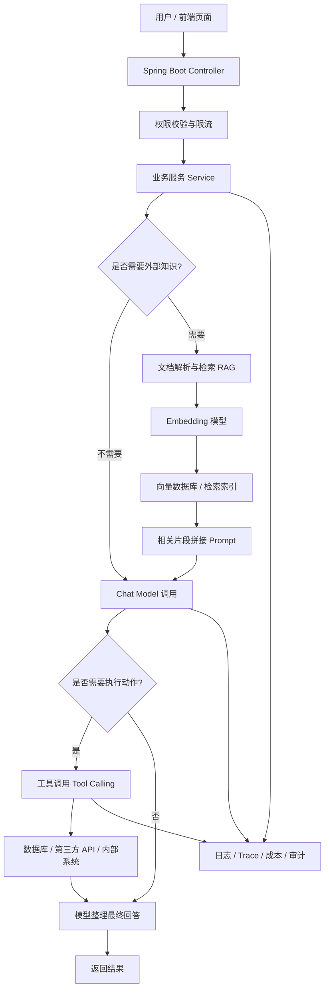
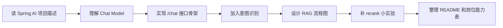

<!-- generated_at: 2026-08-05T08:31:46+08:00 -->

# 2026-08-05 从 Spring AI 看 Java AI 工程化：给大二升大三学生的学习文章

> 生成时间：2026-08-05  
> 读者定位：中北大学软件学院大二升大三学生，已具备 Java、数据库、Web 基础，正在补工程化与 AI 应用开发能力。  
> 今日主题：用 Spring AI 作为主线，把模型调用、RAG、工具调用、Agent、安全与岗位能力串成一条 Java AI 学习路线。

## 目录

| 序号 | 部分 | 你能读到什么 |
|---:|---|---|
| 1 | [一、先用一张图建立整体认识](#一先用一张图建立整体认识) | Java 后端同学应该怎样理解 AI 应用的整体结构 |
| 2 | [二、今日核心项目](#二今日核心项目) | 为什么选择 Spring AI，它和 Spring Boot、RAG、工具调用有什么关系 |
| 3 | [三、最新信息怎么影响学习](#三最新信息怎么影响学习) | 把 AI 新闻、GitHub 项目、招聘和比赛放到同一条学习线里看 |
| 4 | [四、适合当前阶段的知识拆解](#四适合当前阶段的知识拆解) | 用 Java 后端视角解释模型调用、RAG、Embedding、Agent、MCP、日志观测 |
| 5 | [五、今天可以动手做什么](#五今天可以动手做什么) | 4 个可完成的小任务，每个都有耗时和产出物 |
| 6 | [六、资料来源](#六资料来源) | 本文用到的仓库、新闻、招聘官网和比赛活动来源 |

## 一、先用一张图建立整体认识

对已经学过 Java、数据库、Web 的同学来说，AI 应用不要先想得太玄。它本质上仍然是一个后端系统：有接口、有权限、有数据库、有日志、有外部服务调用，只是其中多了一个“模型服务”，以及围绕模型服务的一整套上下文管理能力。

你可以先把 Java AI 应用理解成下面这张结构图：

这张图里，Spring Boot 仍然是入口和业务组织方式；AI 框架负责把“调用模型、检索知识、调用工具、编排流程”变成更容易维护的 Java 代码。今天的核心项目 Spring AI 正好位于这条线上。

## 二、今日核心项目

今天选择的核心项目是 **spring-projects/spring-ai**。

| 项目 | 内容 |
|---|---|
| GitHub 仓库 | https://github.com/spring-projects/spring-ai |
| 主要语言 | Java |
| 项目描述 | Spring 生态的 AI 应用抽象层，覆盖模型接入、向量库、工具调用、ETL 与 RAG |
| 适合人群 | 已经学过 Spring Boot，想把 AI 能力接入 Java 后端项目的同学 |
| 注意 | 数据中 GitHub stars、forks、更新时间无法确认，本文不使用这些指标做判断 |

Spring AI 的价值在于：它不是教你“训练大模型”，而是教你如何在 Java 企业应用里使用大模型。对于大二升大三学生，这个方向更现实，因为大多数 Java AI 岗位不是让你从零训练 GPT，而是让你把模型能力接入业务系统，比如智能客服、知识库问答、合同分析、代码助手、数据查询助手、运维助手等。

它和你已有基础的关系可以这样理解：

| 你已经学过的内容 | 在 Spring AI 项目里的对应关系 | 学习重点 |
|---|---|---|
| Spring Boot Controller / Service | 对外提供 AI 问答接口、封装模型调用逻辑 | 不要把模型调用代码直接堆在 Controller 里 |
| MySQL / Redis | 存用户、会话、权限、配置、调用记录 | AI 应用仍然需要普通业务数据 |
| Web 接口开发 | 给前端、小程序或其他系统提供聊天、检索接口 | 接口返回结构要稳定，不能只返回一段字符串 |
| 文件上传 | 上传 PDF、Markdown、Word 等知识文件 | 文件需要解析、切片、入库 |
| 数据库索引思想 | 向量数据库里的相似度检索 | RAG 不是简单 SQL 查询，但思路类似“先找相关数据” |
| 日志与异常处理 | 记录 prompt、模型响应、工具调用、耗时 | 方便排查模型答错、超时、越权等问题 |

Spring AI 重点关联这些 Java AI 工程能力：

1. **Spring Boot**：Spring AI 很适合放进 Spring Boot 项目里，继续使用熟悉的分层结构、配置文件、依赖注入和接口开发方式。
2. **RAG**：它支持把文档转成可检索知识，让模型回答时参考你自己的资料，而不是只依赖模型原有知识。
3. **Embedding**：把文本转成向量，用于相似度检索。你可以把它理解成“让机器判断两段话语义是否接近”。
4. **工具调用**：模型不仅回答问题，还可以调用 Java 方法，比如查询订单、查数据库、发通知。
5. **Agent**：当一个任务需要多步判断、检索、调用工具、整理答案时，就会接近 Agent 编排。
6. **工程化**：包括配置管理、异常兜底、日志观测、权限控制、限流、成本统计等，这些是企业项目特别看重的部分。

## 三、最新信息怎么影响学习

今天的数据里有四类信息：AI 新闻、GitHub 项目、招聘动态、比赛活动。单独看，它们像很多链接；放到一起看，其实指向同一个结论：**Java 后端同学要补的不是“会问 AI”，而是“会做可上线的 AI 应用”。**

先看新闻。

OpenAI Developers 里出现了 **Docs MCP** 和开发者插件相关内容，说明模型正在越来越多地和外部工具、文档、开发环境连接。Hugging Face Blog 里有 **Deploy local agents everywhere with LFM2.5-2.6B**，重点是本地 Agent 部署；Planet AI 里出现了 AI Agent 安全事件、视觉文档 RAG、AI 网络安全框架等内容。这些信息说明 Agent 和 RAG 正在从“概念演示”走向“工程系统”，同时安全风险也在变大。

对 Java 后端学习的影响是：你不能只写一个 `/chat` 接口，然后把用户问题丢给模型。你需要考虑：

| 最新信息 | 对 Java AI 学习的影响 |
|---|---|
| OpenAI Docs MCP | 工具协议和上下文接入会越来越重要，Java 服务可能要作为工具被模型调用 |
| 本地 Agent 部署 | 未来部分 AI 能力可能运行在本地或私有环境，后端要理解模型服务部署方式 |
| AI Agent 安全事件 | Agent 能调用工具，就必须有权限、审计、限流和操作边界 |
| Pixel-Native RAG | RAG 不只处理纯文本，文档、图片、扫描件也会进入知识库场景 |
| GPU 管理话题 | 企业落地 AI 时关心资源利用率，后端同学至少要理解调用成本和服务稳定性 |

再看 GitHub 项目。除了 Spring AI，数据里还有几个值得观察的项目：

| 项目 | 语言 | 和 Java AI 学习的关系 |
|---|---|---|
| langchain4j/langchain4j | Java | Java LLM 应用开发框架，覆盖聊天模型、RAG、Embedding、工具调用和 Agent 编排 |
| alibaba/spring-ai-alibaba | Java | 面向国内模型服务和云生态的 Spring AI 扩展与应用实践项目 |
| modelcontextprotocol/java-sdk | Java | MCP 的 Java SDK，用于把 Java 服务接入模型工具协议生态 |
| microsoft/semantic-kernel | C# / Java / Python | 可学习插件、函数调用和 Agent workflow 的设计思路 |
| 1Panel-dev/MaxKB | Python | 虽然不是 Java，但可参考企业知识库问答和智能体编排产品形态 |
| monoscope-tech/monoscope | Haskell | 自然语言查询日志、Trace、指标，提示 AI 与可观测性正在结合 |
| apache/texera | Scala | Human-AI Collaborative Data Science，说明 AI 正在进入数据工作流 |

招聘动态也能印证这一点。阿里巴巴、腾讯、字节跳动、百度、美团这些招聘官网的方向都出现了 Java 后端、AI 工程化、大模型应用、AI 平台、智能体应用等关键词。它们真正需要的是能把后端基础和 AI 能力连接起来的人。

比赛活动也是类似信号。AI4J Intelligent Java Conference 直接关注 Java AI 应用开发、Spring AI、LangChain4j、RAG、Agent；中国人工智能大赛关注大模型应用和智能体；WAIC 关注产业趋势和企业级应用；Google Cloud Next 关注 Gemini、Vertex AI、Agent Builder 和云端 AI 应用开发。比赛和会议不是只看论文，也越来越关注“能跑起来、能演示、能解决业务问题”的系统。

所以，今天的学习重点可以归纳成一句话：**用 Spring Boot 做底座，用 Spring AI 或 LangChain4j 接模型，用 RAG 接知识，用工具调用接业务系统，再用日志、权限、限流把它做成可靠工程。**

## 四、适合当前阶段的知识拆解

下面这些概念不需要一次学到论文级深度，但要知道它们在 Java 后端项目里分别放在哪一层、解决什么问题。

| 概念 | 朴素解释 | 和 Java 后端的关系 |
|---|---|---|
| 模型调用 | 后端通过 API 把用户问题发给大模型，再拿到回答 | 类似调用第三方支付、短信、地图接口，只是返回内容更不稳定 |
| RAG | 先从自己的资料库里找相关内容，再让模型基于这些内容回答 | 适合做校内规章问答、课程资料问答、企业知识库 |
| Embedding | 把文本变成一组数字向量，用来判断语义相似度 | 类似“语义索引”，和数据库索引目标相似，都是为了更快找到相关内容 |
| 工具调用 | 模型判断需要执行某个动作时，调用后端预先开放的方法 | 比如查课表、查订单、查库存，本质是模型触发 Java Service |
| Agent | 能分步骤完成任务的 AI 程序，可能会检索、思考、调用工具、再整理结果 | Agent 不是魔法，落到代码里就是流程编排、状态管理和工具权限 |
| MCP | Model Context Protocol，用于把外部工具和上下文规范化地提供给模型 | Java 服务可以通过 MCP SDK 变成模型可调用的工具服务 |
| 日志观测 | 记录每次请求、检索结果、模型输入输出、工具调用和异常 | AI 应用答错时，必须靠日志定位是检索错、prompt 错还是工具错 |
| 限流与权限 | 控制谁能用、能用多少、能调用哪些工具 | Agent 如果能操作数据库或外部系统，权限控制比普通聊天更重要 |

重点说一下 RAG。很多同学会把 RAG 理解成“把文档发给模型”，这不准确。真实流程通常是：

1. 上传文档。
2. 文档解析成文本。
3. 文本切成小块。
4. 每个小块生成 Embedding。
5. 存入向量库或检索系统。
6. 用户提问时，把问题也生成 Embedding。
7. 找到最相关的几个文本块。
8. 把这些文本块和用户问题一起发给模型。
9. 模型基于检索内容生成回答。

这和 Java Web 项目结合非常紧：上传接口、文件解析任务、数据库表设计、异步处理、检索接口、异常处理、日志记录，每一步都需要后端能力。

## 五、今天可以动手做什么

今天的小任务不要追求“大而全”，建议用 2 到 4 小时做出能提交到 GitHub 的小成果。哪怕只是一个 Demo，也要有 README、接口说明和运行截图。

| 任务 | 建议耗时 | 具体做法 | 产出物 |
|---|---:|---|---|
| 1. 实现一个意图识别 prompt | 30-45 分钟 | 写一个简单 Java 方法，把用户问题分成问答、检索、任务执行、闲聊四类 | `IntentType` 枚举、测试样例、README 说明 |
| 2. 给 RAG 检索结果加最小 rerank | 60-90 分钟 | 先取 Top 5 检索结果，再按关键词命中数或简单规则重排，比较前后回答差异 | rerank 前后对比表、3 个测试问题 |
| 3. 画 AI 应用工程架构图 | 30-45 分钟 | 画出入口、权限、模型网关、RAG、工具调用、日志审计、成本统计 | 一张 Mermaid 架构图，放进 README |
| 4. 阅读一个大厂 AI / Java 岗位 JD | 45-60 分钟 | 从阿里、腾讯、字节、百度、美团招聘官网任选一个岗位，提取 5 个高频能力词 | 能力关键词表，映射到你的学习任务 |
| 5. 写一个 Spring Boot `/chat` 接口骨架 | 60-120 分钟 | 不急着接真实模型，先设计请求体、响应体、错误码、日志字段 | Controller、Service、DTO、接口文档 |

可以按下面的路线安排今天的学习：

一个比较适合学生项目的 README 结构可以这样写：

| README 小节 | 应该写什么 |
|---|---|
| 项目目标 | 例如“基于 Spring Boot 的知识库问答 Demo” |
| 技术栈 | Java、Spring Boot、Spring AI 或预留模型调用接口 |
| 核心流程 | 用户提问、意图识别、检索、模型回答、日志记录 |
| 接口说明 | 请求 URL、请求体、响应体、错误码 |
| 实验记录 | rerank 前后对比、失败案例、改进方向 |
| 学习映射 | 对应招聘 JD 中的哪些能力关键词 |

## 六、资料来源

| 类型 | 名称 | 链接 |
|---|---|---|
| GitHub 仓库 | spring-projects/spring-ai | https://github.com/spring-projects/spring-ai |
| GitHub 仓库 | langchain4j/langchain4j | https://github.com/langchain4j/langchain4j |
| GitHub 仓库 | alibaba/spring-ai-alibaba | https://github.com/alibaba/spring-ai-alibaba |
| GitHub 仓库 | modelcontextprotocol/java-sdk | https://github.com/modelcontextprotocol/java-sdk |
| GitHub 仓库 | microsoft/semantic-kernel | https://github.com/microsoft/semantic-kernel |
| GitHub 仓库 | 1Panel-dev/MaxKB | https://github.com/1Panel-dev/MaxKB |
| GitHub 仓库 | monoscope-tech/monoscope | https://github.com/monoscope-tech/monoscope |
| GitHub 仓库 | apache/texera | https://github.com/apache/texera |
| 新闻源 | OpenAI Developers | https://developers.openai.com/ |
| 新闻文章 | OpenAI Developers plugin | https://developers.openai.com/learn/developers-codex-plugin/ |
| 新闻文章 | Docs MCP | https://developers.openai.com/learn/docs-mcp/ |
| 新闻文章 | Realtime and audio guide | https://platform.openai.com/docs/guides/realtime |
| 新闻源 | Hugging Face Blog | https://huggingface.co/blog |
| 新闻文章 | Deploy local agents everywhere with LFM2.5-2.6B | https://huggingface.co/blog/LiquidAI/lfm2-5-2-6b |
| 新闻文章 | GPU Management: Why Idle GPUs Are the New Grounded Aircraft | https://huggingface.co/blog/Dharma-AI/gpu-management |
| 新闻文章 | The OlmoEarth Platform: Geospatial inference at planetary scale | https://huggingface.co/blog/allenai/olmoearth-infrastructure |
| 新闻源 | Planet AI | https://planet-ai.net/ |
| 新闻文章 | OK, Well, Rogue AI Agents Are Hacking Again | https://www.wired.com/story/ok-well-there-are-even-more-ai-agent-hacking-incidents/ |
| 新闻文章 | Pixel-Native RAG: A Practical Guide to Visual Document Indexing | https://www.marktechpost.com/2026/08/04/pixel-native-rag-a-practical-guide-to-visual-document-indexing/ |
| 新闻文章 | The White House Is Keeping Its AI Cybersecurity Framework Secret | https://www.wired.com/story/the-white-house-is-keeping-its-ai-cybersecurity-framework-secret/ |
| 招聘官网 | 阿里巴巴招聘 | https://talent.alibaba.com/ |
| 招聘官网 | 腾讯招聘 | https://careers.tencent.com/ |
| 招聘官网 | 字节跳动招聘 | https://jobs.bytedance.com/ |
| 招聘官网 | 百度招聘 | https://talent.baidu.com/ |
| 招聘官网 | 美团招聘 | https://zhaopin.meituan.com/ |
| 比赛 / 活动 | AI4J Intelligent Java Conference | https://ai4j.io/ |
| 比赛 / 活动 | 中国人工智能大赛 | https://www.aicomp.cn/ |
| 比赛 / 活动 | 世界人工智能大会 WAIC | https://www.worldaic.com.cn/ |
| 比赛 / 活动 | Google Cloud Next | https://cloud.withgoogle.com/next |
