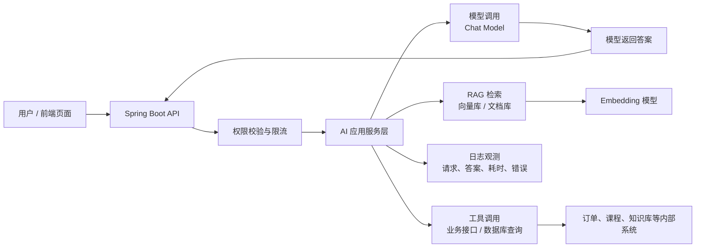
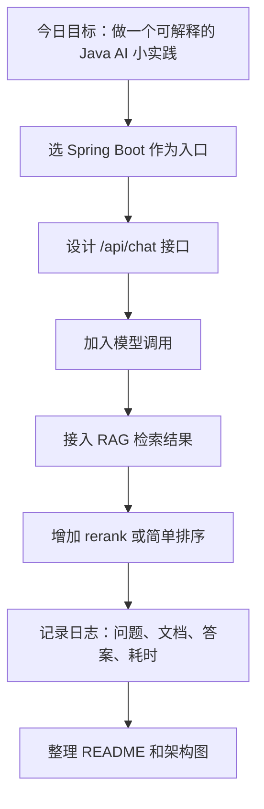

<!-- generated_at: 2026-08-06T08:31:40+08:00 -->

# 2026-08-06 从 Spring AI 看 Java AI 工程化：给大二升大三学生的学习文章

> 生成时间：2026-08-06  
> 读者定位：中北大学软件学院大二升大三学生，已具备 Java、数据库、Web 基础，正在补工程化与 AI 应用开发能力。  
> 今日主题：用 Spring AI 理解 Java 后端如何把大模型、RAG、工具调用和企业工程规范连接起来。

## 目录

| 序号 | 部分 | 你能读到什么 |
|---:|---|---|
| 1 | [一、先用一张图建立整体认识](#一先用一张图建立整体认识) | 从 Java 后端视角看一个 AI 应用的基本结构 |
| 2 | [二、今日核心项目](#二今日核心项目) | 认识 Spring AI，以及它为什么适合 Java AI 入门 |
| 3 | [三、最新信息怎么影响学习](#三最新信息怎么影响学习) | 把 AI 新闻、GitHub 项目、招聘和比赛放到同一条学习主线上 |
| 4 | [四、适合当前阶段的知识拆解](#四适合当前阶段的知识拆解) | 用大二升大三能理解的话解释 RAG、Embedding、工具调用、Agent 等概念 |
| 5 | [五、今天可以动手做什么](#五今天可以动手做什么) | 3-5 个可以今天完成的小工程任务 |
| 6 | [六、资料来源](#六资料来源) | 本文使用到的新闻、仓库、招聘和比赛来源 |

## 一、先用一张图建立整体认识

先不要把“Java AI”理解成“Java 写一个聊天机器人”。更准确地说，它是：用 Java 后端工程能力，把大模型接入真实业务系统，并让它能查资料、调接口、做权限控制、记录日志、稳定运行。

对于已经学过 Java、数据库、Web 的同学，可以把 AI 应用看成一个增强版 Spring Boot 系统：以前你的 Controller 调 Service、Service 查 MySQL；现在 Service 还可能调用大模型、向量数据库、搜索系统、内部业务接口，并且要处理模型输出不稳定、响应慢、成本高、权限边界不清楚等问题。



这张图里，Java 同学最应该关注的是中间层：`Spring Boot API`、权限、AI 应用服务层、RAG、工具调用、日志观测。模型本身不一定由你训练，但怎么把模型安全、稳定、可维护地放进系统，正是 Java 后端的优势区。

## 二、今日核心项目

今天选的核心项目是 GitHub 上真实存在的 Java 项目：[spring-projects/spring-ai](https://github.com/spring-projects/spring-ai)。


| 项目 | 信息 |
|---|---|
| 仓库名 | `spring-projects/spring-ai` |
| 原始链接 | <https://github.com/spring-projects/spring-ai> |
| 主要语言 | Java |
| 项目描述 | Spring 生态的 AI 应用抽象层，覆盖模型接入、向量库、工具调用、ETL 与 RAG |
| star / fork / 更新时间 | 当前数据源无法确认，本文不编造具体数值 |

Spring AI 适合 Java AI 学习，不是因为它“听起来新”，而是因为它站在 Spring 生态里。你已经学过 Spring Boot、Controller、Service、配置文件、依赖注入，那么继续学习 Spring AI 时，可以把它理解成：Spring 为大模型应用提供的一套标准化接口。

例如，以前你可能这样理解后端：

```text
Controller -> Service -> Mapper -> MySQL
```

到了 AI 应用里，结构会变成：

```text
Controller -> AI Service -> Chat Model / Vector Store / Tool Function / Database
```

Spring AI 关心的不是“把提示词写得多漂亮”，而是这些工程问题：

| 方向 | 和 Spring AI 的关系 | 和 Java 后端学习的关系 |
|---|---|---|
| Spring Boot | 可以把 AI 能力封装成普通后端接口 | 继续使用 Controller、Service、配置管理等已有知识 |
| RAG | 支持模型接入向量库和文档检索流程 | 把数据库思维扩展到“语义检索”和“知识库问答” |
| Agent | 可作为智能体应用的底层能力之一 | 让程序不只是回答，还能分步骤执行任务 |
| 工具调用 | 让模型调用 Java 方法或业务接口 | 重点是入参、出参、权限、异常处理 |
| 工程化 | 涉及日志、配置、限流、错误处理、可测试性 | 这是从课程 Demo 走向企业项目的关键 |

这也是为什么今天的主线选 Spring AI：它可以把你已经掌握的 Java Web 基础，平滑连接到大模型应用开发，而不是要求你一下子跳到模型训练、GPU 调优或复杂算法。

## 三、最新信息怎么影响学习

今天的数据里有几类信息：AI 新闻、GitHub 项目、招聘动态、比赛活动。它们表面上很分散，但放到 Java AI 学习上，其实指向同一件事：企业现在更需要“能把 AI 接进业务系统的人”，而不只是会调用一次模型 API 的人。

OpenAI Developers 里的 `Docs MCP` 和 OpenAI Developers plugin，说明开发者生态正在向“模型可以读取文档、调用工具、融入开发流程”发展。对 Java 同学来说，这意味着未来写后端接口时，要考虑接口能不能被模型安全调用，文档是否清楚，参数是否规范，错误信息是否可理解。

Hugging Face Blog 中 `Deploy local agents everywhere with LFM2.5-2.6B` 提到本地 Agent 部署趋势，说明智能体不一定永远只跑在云端大模型上。将来企业可能会把部分模型能力放到本地或私有环境里，尤其是涉及内部文档、代码、业务数据时。Java 后端需要学会对接不同模型服务，而不是绑定某一个平台。

Planet AI 里关于浏览器被劫持、AI Agent 操作外部应用产生风险的新闻，提醒我们：Agent 和工具调用不是越自由越好。模型一旦能调用接口、访问网页、发送消息，就必须有权限控制、操作确认、日志审计和异常回滚。这个部分非常接近 Java 后端的传统工程能力。

GitHub 项目方面，除了 Spring AI，数据里还包括 `langchain4j/langchain4j`、`alibaba/spring-ai-alibaba`、`modelcontextprotocol/java-sdk`、`microsoft/semantic-kernel`。它们共同说明 Java AI 生态正在围绕几个关键词展开：模型抽象、RAG、工具调用、Agent 编排、MCP 协议和企业集成。

招聘来源里，阿里巴巴、腾讯、字节跳动、百度、美团都把 Java 后端、AI 工程化、大模型应用、AI 平台、智能体应用放在关注方向中。对大二升大三的学生来说，不需要现在就达到校招工程师水平，但可以提前把学习路径调整成“Java 后端 + AI 应用工程”的组合。

比赛和活动方面，AI4J Intelligent Java Conference 更贴近 Java AI 应用开发；中国人工智能大赛、WAIC、Google Cloud Next 更偏行业趋势和云端 AI 应用。它们适合作为选题来源：你可以用 Spring Boot 做一个知识库问答、校园服务 Agent、课程资料检索系统或实习岗位分析助手。

| 信息来源 | 今天看到的信号 | 对你学习的影响 |
|---|---|---|
| OpenAI Developers | MCP、开发者插件、实时与音频能力 | 学接口设计、工具调用、文档规范 |
| Hugging Face Blog | 本地 Agent、GPU 管理、规模化推理 | 理解模型部署不只是 API Key |
| Planet AI | AI Agent 安全风险、大代码库 Agent | 学权限、审计、最小授权 |
| GitHub 项目 | Spring AI、LangChain4j、MCP Java SDK 等 | 选择 Java 生态项目做实践 |
| 招聘官网 | Java 后端与 AI 平台、大模型应用结合 | 简历项目要体现工程能力 |
| 比赛活动 | RAG、Agent、行业 AI 创新 | 用比赛题目倒逼项目完整度 |

## 四、适合当前阶段的知识拆解

下面这些概念不需要一次性学到很深，但要先知道它们和 Java 后端的关系。你可以把它们当成接下来两三个月的学习地图。

| 概念 | 朴素解释 | 和 Java 后端的关系 |
|---|---|---|
| 模型调用 | 后端通过 API 或 SDK 把用户问题发给大模型，再拿到回答 | 类似调用第三方支付、短信、地图接口，只是返回内容更不稳定，需要做好超时、重试、异常处理 |
| RAG | 先从自己的资料库里查出相关内容，再把这些内容交给模型回答 | 类似“先查数据库再组织回复”，只是检索方式从关键词扩展到了语义向量 |
| Embedding | 把一段文字变成一组数字，用来比较两段文字语义上是否接近 | 可以理解为给文档建立“语义索引”，常和向量数据库一起使用 |
| 工具调用 | 让模型在需要时调用后端提供的函数或接口，比如查订单、查课表、创建工单 | Java 方法不能随便暴露给模型，要设计入参、出参、权限和错误返回 |
| Agent | 能根据目标分步骤思考，并决定是否调用工具的 AI 程序 | 比普通聊天机器人更像“自动办事的后端流程”，但必须限制操作范围 |
| MCP | Model Context Protocol，用统一协议把工具、数据源、文档能力接给模型 | 对 Java 同学来说，可以理解为“给 AI 用的标准化接口协议” |
| 日志观测 | 记录用户问题、检索结果、模型响应、工具调用、耗时和错误 | 没有日志就无法排查为什么答错、为什么慢、为什么调用失败 |
| 限流与权限 | 控制谁能用、能用多少、能调用哪些工具 | AI 接口通常有成本和安全风险，比普通接口更需要限制 |

一个常见误区是：以为学 Java AI 就要先学深度学习公式。对当前阶段的你来说，更现实的路径是先掌握“应用层 AI 工程”。也就是：会用 Spring Boot 暴露接口，会接模型，会做 RAG，会加权限，会记录日志，会把项目部署起来。这些能力和你已经学过的 Java、数据库、Web 是连续的。

## 五、今天可以动手做什么

今天的小任务不追求大而全，重点是让你把“看新闻”变成“能写进项目经历的动作”。

| 任务 | 建议耗时 | 具体做法 | 产出物 |
|---|---:|---|---|
| 给 RAG 检索结果加一个最小 rerank 步骤 | 60-90 分钟 | 先用关键词或向量检索取出 5 条文档，再手动设计一个简单排序规则，例如标题命中加分、正文命中加分、更新时间加分 | 一段 rerank 代码或伪代码，以及 rerank 前后结果对比表 |
| 画一个 AI 应用工程架构图 | 30-45 分钟 | 按“入口、权限、模型网关、RAG、工具调用、日志审计、成本统计”画图 | 一张 Mermaid 架构图，可放进 README |
| 阅读一个大厂 AI / Java 岗位 JD | 40-60 分钟 | 从阿里、腾讯、字节、百度、美团官网任选一个方向，提取 5 个高频能力词 | 一张“岗位能力 -> 学习任务”映射表 |
| 设计一个 MCP server 草案 | 60-90 分钟 | 假设你要把“课程查询接口”暴露给 AI，列出工具名、入参、出参、权限限制、异常情况 | 一个 Markdown 接口设计文档 |
| 用 Spring Boot 包一层模型调用接口 | 90-120 分钟 | 写一个 `/api/chat` 接口，Service 层负责调用模型，先不追求复杂功能 | 一个最小可运行的 Controller + Service 结构 |

如果你今天只能做一个任务，建议优先做“画一个 AI 应用工程架构图”。因为它能帮助你把零散概念放到同一个系统里，也适合后面扩展成课程项目、比赛作品或简历项目。

下面是一个可以直接改的任务拆解图：



## 六、资料来源

| 类型 | 名称 | 链接 |
|---|---|---|
| GitHub 仓库 | spring-projects/spring-ai | <https://github.com/spring-projects/spring-ai> |
| GitHub 仓库 | langchain4j/langchain4j | <https://github.com/langchain4j/langchain4j> |
| GitHub 仓库 | 1Panel-dev/MaxKB | <https://github.com/1Panel-dev/MaxKB> |
| GitHub 仓库 | alibaba/spring-ai-alibaba | <https://github.com/alibaba/spring-ai-alibaba> |
| GitHub 仓库 | microsoft/semantic-kernel | <https://github.com/microsoft/semantic-kernel> |
| GitHub 仓库 | modelcontextprotocol/java-sdk | <https://github.com/modelcontextprotocol/java-sdk> |
| GitHub 候选项目 | castorini/rank_llm | <https://github.com/castorini/rank_llm> |
| GitHub 候选项目 | livekit/agents-js | <https://github.com/livekit/agents-js> |
| 新闻源 | OpenAI Developers | <https://developers.openai.com/> |
| 新闻文章 | OpenAI Developers plugin | <https://developers.openai.com/learn/developers-codex-plugin/> |
| 新闻文章 | Docs MCP | <https://developers.openai.com/learn/docs-mcp/> |
| 新闻文章 | Realtime and audio guide | <https://platform.openai.com/docs/guides/realtime> |
| 新闻源 | Hugging Face Blog | <https://huggingface.co/blog> |
| 新闻文章 | Deploy local agents everywhere with LFM2.5-2.6B | <https://huggingface.co/blog/LiquidAI/lfm2-5-2-6b> |
| 新闻文章 | GPU Management: Why Idle GPUs Are the New Grounded Aircraft | <https://huggingface.co/blog/Dharma-AI/gpu-management> |
| 新闻文章 | The OlmoEarth Platform: Geospatial inference at planetary scale | <https://huggingface.co/blog/allenai/olmoearth-infrastructure> |
| 新闻源 | Planet AI | <https://planet-ai.net/> |
| 新闻文章 | OpenAI’s Browser Could Be Hijacked to Spam Your WhatsApp Contacts | <https://www.wired.com/story/openais-browser-could-be-hijacked-to-spam-your-whatsapp-contacts/> |
| 新闻文章 | Meta launches Muse Code, an AI agent for large code bases | <https://techcrunch.com/2026/08/05/meta-launches-muse-code-an-ai-agent-for-large-code-bases/> |
| 招聘官网 | 阿里巴巴招聘 | <https://talent.alibaba.com/> |
| 招聘官网 | 腾讯招聘 | <https://careers.tencent.com/> |
| 招聘官网 | 字节跳动招聘 | <https://jobs.bytedance.com/> |
| 招聘官网 | 百度招聘 | <https://talent.baidu.com/> |
| 招聘官网 | 美团招聘 | <https://zhaopin.meituan.com/> |
| 比赛 / 活动 | AI4J Intelligent Java Conference | <https://ai4j.io/> |
| 比赛 / 活动 | 中国人工智能大赛 | <https://www.aicomp.cn/> |
| 比赛 / 活动 | 世界人工智能大会 WAIC | <https://www.worldaic.com.cn/> |
| 比赛 / 活动 | Google Cloud Next | <https://cloud.withgoogle.com/next> |
