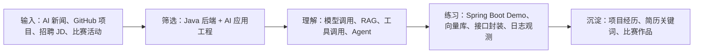

<!-- generated_at: 2026-08-23T08:31:50+08:00 -->

# 2026-08-23 从 alibaba/spring-ai-alibaba 看 Java AI 工程化：给大二升大三学生的学习文章

> 生成时间：2026-08-23 08:31 CST
> 读者定位：中北大学软件学院大二升大三学生，已具备 Java、数据库、Web 基础，正在补工程化与 AI 应用开发能力。
> 今日主题：从 `alibaba/spring-ai-alibaba` 延伸理解 Java AI 应用、RAG、Agent、招聘能力要求和比赛实践。

## 目录

| 序号 | 部分 | 你能读到什么 |
| --- | --- | --- |
| 1 | [先用一张图建立整体认识](#map) | 今天的信息如何连成一条学习路线 |
| 2 | [今日核心项目](#project) | 选一个项目看懂 Java AI 工程化重点 |
| 3 | [最新信息怎么影响学习](#news) | 新闻、开源、岗位和比赛分别说明什么 |
| 4 | [适合当前阶段的知识拆解](#student) | 把复杂概念翻译成大二升大三能消化的内容 |
| 5 | [今天可以动手做什么](#tasks) | 3-5 个小任务和预期产出 |
| 6 | [资料来源](#sources) | 原始链接和数据状态 |

## 一、先用一张图建立整体认识

这张图的意思是：每天的定时任务不只是列新闻，而是帮你把外部信息翻译成一条学习路线。你现在处在大二升大三阶段，不需要一上来追求复杂的企业级平台，先把 `Java 后端基础 + 一个能跑通的 AI 小项目 + 清楚的工程记录` 做扎实。

## 二、今日核心项目

今天可以重点看 `alibaba/spring-ai-alibaba`。

- **项目一句话理解**：面向国内模型服务和云生态的 Spring AI 扩展与应用实践项目。
- **语言与热度**：Java；Star：unknown；最近更新：unknown。
- **原始链接**：https://github.com/alibaba/spring-ai-alibaba

如果你已经学过 Java、MySQL、Spring Boot 或正在学这些内容，可以这样理解它：传统后端系统负责接口、数据、权限和业务流程；AI 应用在此基础上多了模型调用、提示词、知识库检索、工具调用和结果审计。Java 的优势不是“训练大模型”，而是把模型能力稳定地接进真实业务系统。

### 这个项目值得你关注的原因

| 观察点 | 对你的意义 | 可以补的能力 |
| --- | --- | --- |
| 是否贴近 Java/Spring 生态 | 决定你能不能用已有 Java 基础快速上手 | Spring Boot、REST API、配置管理 |
| 是否支持 RAG 或向量库 | 决定能不能做知识库问答类作品 | 文档切分、Embedding、向量检索 |
| 是否支持工具调用或 Agent | 决定能不能把 AI 和业务接口连接起来 | 接口设计、权限边界、异常处理 |
| 是否有工程化能力 | 决定作品能不能从 demo 走向可维护项目 | 日志、重试、限流、监控、测试 |

## 三、最新信息怎么影响学习

### 1. AI 新闻观察

| 来源 | 最近条目 | 你该怎么读 |
| --- | --- | --- |
| OpenAI Developers | [OpenAI Developers plugin](https://developers.openai.com/learn/developers-codex-plugin/) [Docs MCP](https://developers.openai.com/learn/docs-mcp/) | 先看标题和摘要，判断它和模型调用、RAG、Agent、开发工具哪一类能力有关。 |
| Hugging Face Blog | [Measuring benchmark optimization in speech recognition](https://huggingface.co/blog/asr-benchmark-optimization) [Up to 3.2x Faster Inference with LFM2.5-DSpark](https://huggingface.co/blog/LiquidAI/lfm25-dspark) | 先看标题和摘要，判断它和模型调用、RAG、Agent、开发工具哪一类能力有关。 |
| Planet AI | [The Developer’s Guide to NeMo Guardrails for Enterprise AI Safety](https://www.marktechpost.com/2026/08/22/the-developers-guide-to-nemo-guardrails-for-enterprise-ai-safety/) [b10588](https://github.com/ggml-org/llama.cpp/releases/tag/b10588) | 先看标题和摘要，判断它和模型调用、RAG、Agent、开发工具哪一类能力有关。 |
| Microsoft AI Blog | 当前运行环境无法连接远程数据源 | 先看标题和摘要，判断它和模型调用、RAG、Agent、开发工具哪一类能力有关。 |

### 2. 近期值得扫一眼的 GitHub 项目

| 项目 | 描述 | 链接 |
| --- | --- | --- |
| `1Panel-dev/MaxKB` | 面向企业知识库问答与智能体编排的开源项目，可作为 Java 团队设计 AI 应用平台的参考样本。 | https://github.com/1Panel-dev/MaxKB |
| `alibaba/spring-ai-alibaba` | 面向国内模型服务和云生态的 Spring AI 扩展与应用实践项目。 | https://github.com/alibaba/spring-ai-alibaba |
| `microsoft/semantic-kernel` | Microsoft 的 AI 编排 SDK，包含 Java SDK，可用于插件、函数调用和 Agent workflow。 | https://github.com/microsoft/semantic-kernel |
| `modelcontextprotocol/java-sdk` | Model Context Protocol 的 Java SDK，用于把 Java 服务接入模型工具协议生态。 | https://github.com/modelcontextprotocol/java-sdk |
| `JetBrains/compose-hot-reload` | Compose Hot Reload: Make changes to your UI code in a Compose Multiplatform application, and see the results in real time. No restarts required. Compose Hot Reload runs your application on the JetBrains Runtime and intelligently reloads your code whenever it is changed. | https://github.com/JetBrains/compose-hot-reload |
| `pollinations/pollinations` | Your Friendly Open-Source Gen-AI Platform | https://github.com/pollinations/pollinations |

### 3. 招聘动态里透露的能力要求

- **1. 阿里巴巴**：重点方向是 Java 后端 / AI 工程化 / 大模型应用。你可以在招聘官网搜索 Java、后端、AI 平台、大模型应用、RAG、MLOps 等关键词，记录岗位反复出现的能力要求。链接：https://talent.alibaba.com/
- **2. 腾讯**：重点方向是 后台开发 / AI 平台 / 智能体应用。你可以在招聘官网搜索 Java、后端、AI 平台、大模型应用、RAG、MLOps 等关键词，记录岗位反复出现的能力要求。链接：https://careers.tencent.com/
- **3. 字节跳动**：重点方向是 后端研发 / AI 平台 / 大模型工程。你可以在招聘官网搜索 Java、后端、AI 平台、大模型应用、RAG、MLOps 等关键词，记录岗位反复出现的能力要求。链接：https://jobs.bytedance.com/
- **4. 百度**：重点方向是 AI 原生应用 / 智能云 / 大模型平台。你可以在招聘官网搜索 Java、后端、AI 平台、大模型应用、RAG、MLOps 等关键词，记录岗位反复出现的能力要求。链接：https://talent.baidu.com/
- **5. 美团**：重点方向是 Java 后端 / 平台工程 / AI 应用场景。你可以在招聘官网搜索 Java、后端、AI 平台、大模型应用、RAG、MLOps 等关键词，记录岗位反复出现的能力要求。链接：https://zhaopin.meituan.com/

### 4. 比赛和活动可以怎么用

- **1. AI4J Intelligent Java Conference**：关注 Java AI 应用开发 / Spring AI / LangChain4j / RAG / Agent。对你来说，比赛不是只为了拿奖，更适合拿来倒逼自己做出一个可演示、可写进简历的 AI 应用作品。链接：https://ai4j.io/
- **2. 中国人工智能大赛**：关注 大模型应用 / 智能体 / 行业 AI 创新赛事。对你来说，比赛不是只为了拿奖，更适合拿来倒逼自己做出一个可演示、可写进简历的 AI 应用作品。链接：https://www.aicomp.cn/
- **3. 世界人工智能大会 WAIC**：关注 AI 产业趋势 / 企业级 AI 应用 / 开发者生态。对你来说，比赛不是只为了拿奖，更适合拿来倒逼自己做出一个可演示、可写进简历的 AI 应用作品。链接：https://www.worldaic.com.cn/
- **4. Google Cloud Next**：关注 Gemini / Vertex AI / Agent Builder / 云端 AI 应用开发。对你来说，比赛不是只为了拿奖，更适合拿来倒逼自己做出一个可演示、可写进简历的 AI 应用作品。链接：https://cloud.withgoogle.com/next

## 四、适合当前阶段的知识拆解

你现在的理解重点可以放在“会用”和“会解释”上，而不是一开始就研究模型训练细节。下面这张表把今天的信息拆成更容易落地的学习单元。

| 概念 | 大二升大三可以怎么理解 | 最小练习 |
| --- | --- | --- |
| 模型调用 | 像调用一个远程智能接口，只是入参里有 prompt，出参里有自然语言 | 用 Spring Boot 写一个 `/chat` 接口 |
| RAG | 先从自己的资料里检索相关片段，再让模型基于片段回答 | 上传 3 篇课程笔记，做一个问答 demo |
| Embedding | 把文本变成向量，方便计算“语义相似” | 比较两个句子的相似度 |
| 工具调用 | 让模型在需要时调用你写好的后端接口 | 只开放一个查询天气或课程表的只读接口 |
| 工程化 | 让 demo 有日志、错误处理、配置、权限和可维护结构 | 给模型调用加超时、重试和失败提示 |

建议你每天只抓一个主线：今天如果看 RAG，就不要同时深挖 Agent、多模态和模型训练。学习 AI 应用工程最容易的问题是概念太多，但真正能沉淀成能力的，通常是一个个能运行、能复盘、能解释的小项目。

## 五、今天可以动手做什么

| 任务 | 建议耗时 | 产出物 |
| --- | --- | --- |
| 给一个 RAG demo 增加引用来源返回，输出 answer、source_title、source_url 和 chunk_id。 | 30-90 分钟 | 一段代码、一个接口截图或一页笔记 |
| 为一次模型调用增加超时、重试、错误分类和 fallback 文案，记录失败原因。 | 30-90 分钟 | 一段代码、一个接口截图或一页笔记 |
| 设计一个工具调用白名单，只允许模型调用 2-3 个只读业务接口，并写清权限边界。 | 30-90 分钟 | 一段代码、一个接口截图或一页笔记 |
| 对比 LangChain4j 与 Spring AI 的 ChatModel、EmbeddingModel、VectorStore 抽象差异，写 5 条结论。 | 30-90 分钟 | 一段代码、一个接口截图或一页笔记 |

完成后用三句话复盘：我今天接触了哪个概念；它和 Java 后端有什么关系；如果写进简历，我能把它描述成什么项目能力。

## 六、资料来源

### GitHub 仓库

- `1Panel-dev/MaxKB`：https://github.com/1Panel-dev/MaxKB
- 数据状态：实时 GitHub API 获取失败，使用内置兜底描述；原因：远程数据源返回 HTTP 403
- `alibaba/spring-ai-alibaba`：https://github.com/alibaba/spring-ai-alibaba
- 数据状态：实时 GitHub API 获取失败，使用内置兜底描述；原因：远程数据源返回 HTTP 403
- `microsoft/semantic-kernel`：https://github.com/microsoft/semantic-kernel
- 数据状态：实时 GitHub API 获取失败，使用内置兜底描述；原因：远程数据源返回 HTTP 403
- `modelcontextprotocol/java-sdk`：https://github.com/modelcontextprotocol/java-sdk
- 数据状态：实时 GitHub API 获取失败，使用内置兜底描述；原因：远程数据源返回 HTTP 403
- `JetBrains/compose-hot-reload`：https://github.com/JetBrains/compose-hot-reload
- `pollinations/pollinations`：https://github.com/pollinations/pollinations

### 招聘官网

- 1. 阿里巴巴：https://talent.alibaba.com/
- 2. 腾讯：https://careers.tencent.com/
- 3. 字节跳动：https://jobs.bytedance.com/
- 4. 百度：https://talent.baidu.com/
- 5. 美团：https://zhaopin.meituan.com/

### 比赛与活动

- 1. AI4J Intelligent Java Conference：https://ai4j.io/
- 2. 中国人工智能大赛：https://www.aicomp.cn/
- 3. 世界人工智能大会 WAIC：https://www.worldaic.com.cn/
- 4. Google Cloud Next：https://cloud.withgoogle.com/next

### 生成说明

- 生成模式：本地模板 fallback。原因：模型 API 调用失败，已切换为本地模板 fallback
