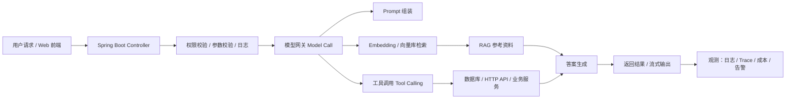

<!-- generated_at: 2026-08-26T08:31:41+08:00 -->

# 2026-08-26 从 Spring AI 看 Java AI 工程化：面向中北大学软件学院大二升大三学生的学习文章
> 生成时间：2026-08-26
> 读者定位：中北大学软件学院大二升大三学生，已具备 Java、数据库、Web 基础，正在补工程化与 AI 应用开发能力。
> 今日主题：用 Spring AI 串起 Java AI 的核心能力，把“会调用模型”进阶到“会做可落地的 AI 应用”。

## 目录
| 序号 | 部分 | 你能读到什么 |
|---|---|---|
| 1 | [一、先用一张图建立整体认识](#一先用一张图建立整体认识) | 先看 Java AI 应用从入口到模型、检索、工具调用、监控的完整链路 |
| 2 | [二、今日核心项目](#二今日核心项目) | 认识 Spring AI，理解它为什么适合 Java 后端学习 |
| 3 | [三、最新信息怎么影响学习](#三最新信息怎么影响学习) | 把今天的 AI 新闻、招聘、比赛和项目趋势串起来看 |
| 4 | [四、适合当前阶段的知识拆解](#四适合当前阶段的知识拆解) | 用大二升大三能懂的话拆开 RAG、Embedding、Agent 等概念 |
| 5 | [五、今天可以动手做什么](#五今天可以动手做什么) | 3-5 个能立刻开工的小任务，带耗时和产出物 |
| 6 | [六、资料来源](#六资料来源) | 本文用到的项目、新闻、招聘和比赛官网 |

## 一、先用一张图建立整体认识

先不要把 AI 应用想得太神秘。对 Java 后端学生来说，它本质上还是一套“Web 服务 + 数据 + 业务编排”的系统，只是多了模型调用、向量检索和工具执行。

这张图的意义是：
- **Spring Boot** 负责“接请求、管流程、做治理”；
- **RAG** 负责“让模型先查资料再回答”；
- **工具调用** 负责“让模型去调用你的 Java 服务、数据库或第三方接口”；
- **日志与观测** 负责“出问题时能定位、能回放、能优化”。

## 二、今日核心项目

今天选的核心项目是 **Spring AI**，因为它和 Java 后端的学习路径非常贴近，尤其适合已经会 Spring Boot 的同学。

### 1）项目基本信息
| 项目 | 说明 |
|---|---|
| 名称 | `spring-projects/spring-ai` |
| 原始链接 | https://github.com/spring-projects/spring-ai |
| 项目描述 | Spring 生态的 AI 应用抽象层，覆盖模型接入、向量库、工具调用、ETL 与 RAG。 |
| 语言 | Java |

### 2）为什么它适合 Java AI 学习
Spring AI 的价值，不只是“能调用大模型”，而是它把很多 AI 开发里容易混乱的部分整理成了更像 Java 工程的写法。对大二升大三学生来说，它特别适合作为从课程项目过渡到小型企业项目的桥梁。

| 学习点 | 对 Java 后端学习的帮助 |
|---|---|
| Spring Boot 集成 | 直接沿用你已经熟悉的 Controller、Service、Configuration 写法，不需要换技术栈思维 |
| RAG | 学会把文档、FAQ、业务手册接入问答系统，理解“先检索再生成” |
| Embedding | 理解文本如何变成向量，为什么相似语义能被“算出来” |
| Tool Calling | 让模型调用 Java 方法、数据库查询、HTTP 接口，像一个会用工具的业务助手 |
| 工程化 | 让你开始关注异常处理、超时、重试、日志、权限、限流和观测 |

### 3）它和哪些 Spring / AI 能力有关
- **Spring Boot**：最容易把 AI 能力包装成 REST API、WebSocket 或 SSE 流式接口；
- **RAG**：适合做课程问答、校内知识库、实验指导助手；
- **Agent**：适合做多步骤任务，比如“先查资料，再调用接口，再生成结果”；
- **工具调用**：适合把数据库查询、天气查询、成绩分析、实验预约等功能接入模型；
- **工程化**：适合练习配置化、异常处理、审计日志、可观测性。

### 4）如果你只学一个项目，建议先看什么
1. 先看它如何接入聊天模型；
2. 再看如何接入 Embedding 和向量库；
3. 然后看工具调用和函数映射；
4. 最后再看 Agent 和多步骤工作流。

## 三、最新信息怎么影响学习

今天的数据里，真正值得学生关注的不是“谁又发了新闻”，而是这些信息分别在提醒你：**Java AI 学习已经从“单纯接模型”转向“工程化、部署化、平台化”**。

### 1）AI 新闻给你的信号
| 来源 | 新闻/文章 | 对学习的启发 |
|---|---|---|
| Hugging Face Blog | `Granite 4.2 LLMs: How They're Built` | 说明现在模型不只是“能跑”，还要关注构建方式、推理效率和工程选择；学生要理解模型背后的系统设计，而不是只会调 API |
| Hugging Face Blog | `Quantization-Aware Healing: a compressed, 4-bit model that outperforms its full-precision original` | 说明量化不是“为了省显存的妥协”，而是工程优化的一部分；Java AI 后端也要学会理解模型服务成本和延迟 |
| Hugging Face Blog | `Wire It, Run It, Deploy It: AI Workflows in Gradio` | 说明 AI 应用越来越像“工作流系统”，不是一个孤立 prompt；这和 Java 后端里的流程编排、状态管理很像 |
| Planet AI | `OpenAI loses a top data center exec...` | 说明 AI 基础设施、算力、部署和组织稳定性都很重要；对开发者来说，要提前培养“系统可靠性”意识 |

### 2）GitHub 项目趋势给你的信号
今天跟踪到的仓库里，和 Java AI 学习最相关的有：
- `spring-projects/spring-ai`
- `langchain4j/langchain4j`
- `modelcontextprotocol/java-sdk`
- `alibaba/spring-ai-alibaba`
- `microsoft/semantic-kernel`

这说明 Java AI 的主流路线大概分成三层：
1. **应用抽象层**：Spring AI、LangChain4j，负责把模型接入写得像 Java 项目；
2. **协议和生态层**：MCP Java SDK，负责把 Java 服务接入模型工具生态；
3. **编排层**：Semantic Kernel、Agent workflow，负责把多个步骤串起来完成任务。

### 3）招聘动态给你的信号
从阿里、腾讯、字节、百度、美团的招聘方向看，关键词不是“会不会调用一次大模型”，而是：
- **Java 后端 / AI 工程化**
- **大模型应用 / AI 平台**
- **智能体应用 / RAG / 工具链**
- **平台工程 / 观测 / 安全 / 成本控制**

这对学生意味着：
- 只会写一个 demo 不够；
- 要把 AI 功能放进一个像样的后端系统；
- 要能解释“为什么这样设计”，而不是只会贴 prompt。

### 4）比赛和活动给你的信号
| 活动 | 关注点 | 适合学生怎么参与 |
|---|---|---|
| AI4J Intelligent Java Conference | Java AI 应用开发、Spring AI、LangChain4j、RAG、Agent | 适合跟踪 Java AI 的真实工程实践，顺便找项目灵感 |
| 中国人工智能大赛 | 大模型应用、智能体、行业 AI 创新 | 适合练“题目理解 + 数据处理 + 系统实现” |
| 世界人工智能大会 WAIC | AI 产业趋势、企业级 AI 应用、开发者生态 | 适合观察企业现在到底在做什么样的 AI 产品 |
| Google Cloud Next | Gemini、Vertex AI、Agent Builder | 适合了解云上 AI 平台化开发思路 |

### 5）一句话总结今天的趋势
**Java AI 的重点已经不是“能不能连上模型”，而是“能不能把模型变成一个稳定、可维护、可扩展的后端系统”。**

## 四、适合当前阶段的知识拆解

下面这几个概念，建议你用“Java 后端项目”的思维去理解，而不是当成纯 AI 名词背诵。

| 概念 | 大白话理解 | 和 Java 后端的关系 |
|---|---|---|
| 模型调用 | 就像调用一个远程服务，只不过返回的是自然语言或结构化结果 | 类似你调用第三方支付、短信、地图 API，只是输入输出更复杂 |
| Embedding | 把文字变成数字向量，让“意思相近”的文本更容易被找到 | 类似给文章、问题、知识点做可比较的特征编码 |
| RAG | 先去知识库查资料，再把资料交给模型回答 | 很像“先查数据库，再拼装业务响应” |
| 工具调用 | 模型不直接瞎猜，而是去调用 Java 方法、数据库或 HTTP 接口 | 这就是把 AI 变成一个会用业务工具的服务 |
| Agent | 模型自己决定下一步做什么，可能要查资料、调工具、再总结 | 类似一个有流程控制能力的自动化业务编排器 |
| MCP | 一种让模型更标准地发现和调用工具的协议 | 类似“统一接口规范”，方便 Java 服务接入 AI 生态 |

### 再补一层：你为什么现在就该懂这些
- **Embedding / RAG**：这是 AI 问答系统最常见的起点；
- **工具调用 / Agent**：这是从“聊天”走向“能办事”的关键；
- **MCP**：这是未来把 Java 系统接入 AI 生态的接口思维；
- **日志、限流、权限**：这是把 demo 变成课程设计、项目作品、甚至实习作品的门槛。

## 五、今天可以动手做什么

下面这些任务尽量都能在一天内开始，适合你边学边做。

| 任务 | 建议耗时 | 产出物 |
|---|---:|---|
| 1. 用 Spring Boot 写一个 `/ai/chat` 接口，先做最简单的模型调用 | 1-2 小时 | 一个可返回文本的 REST 接口 |
| 2. 选 3 篇课程资料或实验手册，做一个最小 RAG 问答 | 2-3 小时 | 一个“能根据资料回答问题”的小 demo |
| 3. 给模型加一个工具调用：比如查询课程表、实验室预约或天气 | 2-4 小时 | 一个能调用 Java 方法的 AI 接口 |
| 4. 画出你自己的 AI 后端架构图，标出权限、日志、限流、向量库 | 40-60 分钟 | 一张适合放进简历或作业报告的架构图 |
| 5. 对比 Spring AI 和 LangChain4j 的入口写法，整理 5 条差异 | 1-2 小时 | 一页对比笔记，方便你后面选型 |

### 你今天最值得优先做的顺序
1. **先做模型调用接口**，建立信心；
2. **再做 RAG**，体会知识库问答；
3. **最后加工具调用**，体验“AI 真的会办事”。

## 六、资料来源

### GitHub 仓库
| 仓库 | 链接 |
|---|---|
| spring-projects/spring-ai | https://github.com/spring-projects/spring-ai |
| langchain4j/langchain4j | https://github.com/langchain4j/langchain4j |
| modelcontextprotocol/java-sdk | https://github.com/modelcontextprotocol/java-sdk |
| alibaba/spring-ai-alibaba | https://github.com/alibaba/spring-ai-alibaba |
| microsoft/semantic-kernel | https://github.com/microsoft/semantic-kernel |

### 新闻源
| 来源 | 链接 |
|---|---|
| Hugging Face Blog | https://huggingface.co/blog/feed.xml |
| Granite 4.2 LLMs: How They're Built | https://huggingface.co/blog/ibm-granite/granite-4-2 |
| Quantization-Aware Healing | https://huggingface.co/blog/MultiverseComputingCAI/quantization-aware-healing |
| Wire It, Run It, Deploy It: AI Workflows in Gradio | https://huggingface.co/blog/gradio-workflow-guide |
| Planet AI | https://planet-ai.net/rss.xml |
| OpenAI loses a top data center exec... | https://techcrunch.com/2026/08/25/openai-loses-a-top-data-center-exec-as-stream-of-high-profile-departures-continues/ |

### 招聘官网
| 公司 | 方向 | 链接 |
|---|---|---|
| 阿里巴巴 | Java 后端 / AI 工程化 / 大模型应用 | https://talent.alibaba.com/ |
| 腾讯 | 后台开发 / AI 平台 / 智能体应用 | https://careers.tencent.com/ |
| 字节跳动 | 后端研发 / AI 平台 / 大模型工程 | https://jobs.bytedance.com/ |
| 百度 | AI 原生应用 / 智能云 / 大模型平台 | https://talent.baidu.com/ |
| 美团 | Java 后端 / 平台工程 / AI 应用场景 | https://zhaopin.meituan.com/ |

### 比赛与活动官网
| 活动 | 链接 |
|---|---|
| AI4J Intelligent Java Conference | https://ai4j.io/ |
| 中国人工智能大赛 | https://www.aicomp.cn/ |
| 世界人工智能大会 WAIC | https://www.worldaic.com.cn/ |
| Google Cloud Next | https://cloud.withgoogle.com/next |

如果你是中北大学软件学院的同学，今天最好的学习目标不是“看懂所有 AI 名词”，而是**把 Spring Boot、数据库和 Web 基础，真正接到一个能跑的 AI 后端项目上**。只要你从模型调用、RAG、工具调用这三步走，就已经比大多数只停留在概念层的人更接近实战了。
