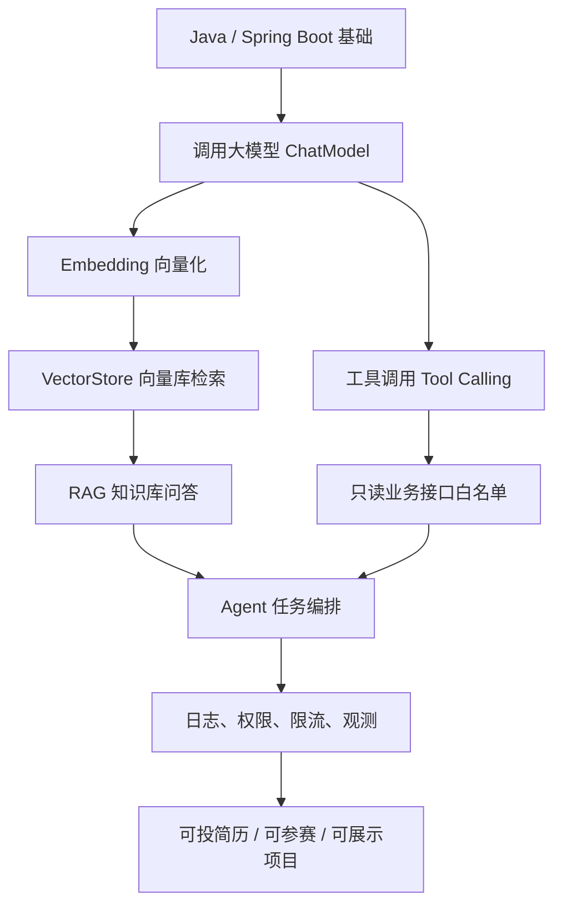

<!-- generated_at: 2026-09-16T08:31:07+08:00 -->

# 2026-09-16 从 Spring AI 看 Java AI 工程化：给大二升大三学生的学习文章

> 生成时间：2026-09-16  
> 读者定位：中北大学软件学院大二升大三学生，已具备 Java、数据库、Web 基础，正在补工程化与 AI 应用开发能力。  
> 今日主题：用 Spring AI 理解“Java 后端如何把大模型接进真实业务系统”，并把新闻、项目、招聘和比赛转化成今天能做的小练习。

## 目录

| 序号 | 部分 | 你能读到什么 |
|---:|---|---|
| 1 | [一、先用一张图建立整体认识](#section-1) | Java AI 学习路线：从 Spring Boot 到 RAG、工具调用和 Agent |
| 2 | [二、今日核心项目](#section-2) | 以 `spring-projects/spring-ai` 为核心，理解 Java AI 工程化 |
| 3 | [三、最新信息怎么影响学习](#section-3) | AI 新闻、GitHub 项目、招聘方向和比赛活动如何连成一条学习线 |
| 4 | [四、适合当前阶段的知识拆解](#section-4) | 用后端同学能理解的话解释模型调用、RAG、Embedding、工具调用等概念 |
| 5 | [五、今天可以动手做什么](#section-5) | 4 个工程小任务：每个都有建议耗时和产出物 |
| 6 | [六、资料来源](#section-6) | 本文使用到的 GitHub、招聘官网、比赛官网和新闻源链接 |

## 一、先用一张图建立整体认识 <a id="section-1"></a>

如果你已经学过 Java、数据库和 Web，那么学习 Java AI 不应该从“背模型名”开始，而应该从一个后端系统怎么接入 AI 开始。今天的主线可以理解成：**Spring Boot 负责业务系统，Spring AI / LangChain4j 负责连接模型、向量库和工具，RAG 与 Agent 负责让系统更像一个可执行任务的应用。**



这张图的重点不是让你今天全部学完，而是帮你建立顺序：**先会调模型，再会让模型查资料，最后再让模型安全地调用业务工具。**

| 学习层级 | 对应 Java 后端能力 | AI 应用里的表现 | 你现在应该做到什么 |
|---|---|---|---|
| 模型调用 | Controller / Service / DTO | 用户输入问题，后端调用模型返回回答 | 写一个 `/chat` 接口 |
| RAG 检索 | MySQL / Redis / 搜索思维 | 先查资料，再让模型回答 | 做一个“课程资料问答”Demo |
| 工具调用 | 接口设计 / 权限控制 | 模型根据意图调用业务接口 | 只允许调用 2-3 个只读接口 |
| Agent 编排 | 流程控制 / 状态管理 | 多步完成任务，如查询、判断、总结 | 先画流程图，不急着写复杂框架 |
| 工程化 | 日志 / 限流 / 异常处理 | 能上线、能排查、能控制风险 | 给每次模型调用记录日志 |

## 二、今日核心项目 <a id="section-2"></a>

今天选择的核心项目是 **`spring-projects/spring-ai`**。


| 项目 | 语言 | 数据中的描述 | 原始链接 |
|---|---|---|---|
| `spring-projects/spring-ai` | Java | Spring 生态的 AI 应用抽象层，覆盖模型接入、向量库、工具调用、ETL 与 RAG | [https://github.com/spring-projects/spring-ai](https://github.com/spring-projects/spring-ai) |

**为什么它适合 Java AI 学习？**

对大二升大三的 Java 学生来说，Spring AI 的优势是它离你已经学过的东西很近。你不需要一上来就理解所有模型原理，而是可以把它当成 Spring Boot 项目里的一个新能力层：

- **和 Spring Boot 有关**：Spring AI 可以放进熟悉的 Controller、Service、配置类结构中，适合用 Maven / Gradle 管理依赖。
- **和 RAG 有关**：它的数据描述中明确提到向量库、ETL 与 RAG，可以帮助你把“文档问答”做成后端应用，而不是只停留在 ChatGPT 式聊天。
- **和工具调用有关**：工具调用可以理解为“模型决定是否调用某个 Java 方法或接口”，但后端必须控制权限边界。
- **和 Agent 有关**：Agent 不是神秘概念，本质上是把“判断意图 → 调工具 → 整理结果 → 返回答案”组织成流程。
- **和工程化有关**：真实项目不能只看模型回答，还要考虑日志、异常、限流、权限、接口超时和数据安全。

你可以把 Spring AI 当成“Java 后端进入 AI 应用开发的桥”。如果你已经会 Spring Boot，那么今天最应该练的是：**用普通后端项目的方式，把一次模型调用包装成稳定、可观察、可限制的接口。**

## 三、最新信息怎么影响学习 <a id="section-3"></a>

今天的数据里有四类信息：AI 新闻、GitHub 项目、招聘官网、比赛活动。它们看起来分散，但其实都指向同一件事：**企业需要的不是只会调用模型 API 的同学，而是能把 AI 能力放进工程系统里的后端开发者。**

先看 AI 新闻。Planet AI 中出现了 `llama.cpp` 的两个 release 条目：`b10991` 和 `b10990`，发布时间都在 2026-09-15 晚间；还出现了 “Gemini Live audio” 相关文章。这说明两个趋势仍然值得关注：一是本地模型和推理工具在持续更新，二是多模态、语音交互正在变得更常见。对 Java 学生来说，不需要今天就深入 C++ 推理引擎或音频模型，但要知道：未来后端系统可能不只是处理文字请求，还会处理文档、语音、图片和业务操作。

再看 GitHub 项目。数据里跟 Java AI 直接相关的项目包括：

| 项目 | 适合关注的原因 | 和 Java AI 学习的关系 |
|---|---|---|
| `spring-projects/spring-ai` | Spring 生态 AI 抽象层 | 适合 Spring Boot 同学入门模型调用、RAG、工具调用 |
| `langchain4j/langchain4j` | Java LLM 应用开发框架 | 可以对比 Spring AI 的 ChatModel、EmbeddingModel、VectorStore 抽象 |
| `alibaba/spring-ai-alibaba` | 面向国内模型服务和云生态的 Spring AI 扩展 | 适合理解国内大模型服务接入方式 |
| `modelcontextprotocol/java-sdk` | MCP 的 Java SDK | 适合理解模型如何通过协议连接外部工具 |
| `microsoft/semantic-kernel` | AI 编排 SDK，包含 Java SDK | 适合理解插件、函数调用和 Agent workflow |
| `1Panel-dev/MaxKB` | 企业知识库问答与智能体编排参考 | 虽然是 Python，但能参考产品形态和企业知识库思路 |

招聘动态也能反推学习重点。阿里巴巴、腾讯、字节跳动、百度、美团这些官网方向里反复出现 Java 后端、AI 平台、大模型应用、智能体、平台工程等关键词。它们不是在找“只会问模型问题”的人，而是在找能把 AI 接进业务系统的人：接口怎么设计、数据怎么查、权限怎么控、调用失败怎么办、日志怎么追踪，这些都属于 Java 后端的基本功。

比赛活动也很类似。AI4J Intelligent Java Conference 明确聚焦 Java AI 应用开发、Spring AI、LangChain4j、RAG、Agent；中国人工智能大赛关注大模型应用、智能体和行业 AI 创新；WAIC 更偏产业趋势；Google Cloud Next 关注 Gemini、Vertex AI、Agent Builder 和云端 AI 应用开发。对学生来说，比赛和会议不是只用来“看热闹”，而是可以帮你确定作品方向：**做一个能演示、能部署、能解释架构的 Java AI 小项目。**

所以今天的学习建议是：不要把 AI 学习切成“新闻归新闻、GitHub 归 GitHub、招聘归招聘”。你应该把它们合并成一个行动目标：**用 Spring Boot + Spring AI 做一个小型 RAG / 工具调用项目，并写清楚工程边界。**

## 四、适合当前阶段的知识拆解 <a id="section-4"></a>

下面这些概念你会经常看到。先不要被名词吓住，可以用 Java 后端的视角理解它们。

| 概念 | 朴素解释 | 和 Java 后端学习的关系 |
|---|---|---|
| 模型调用 | 后端把用户问题发给大模型，再拿回回答 | 类似调用第三方接口，只是返回内容更不稳定，需要加超时、日志和异常处理 |
| RAG | 先检索自己的资料，再让模型基于资料回答 | 类似“查数据库后再组织回答”，适合做课程资料、实验文档、企业知识库问答 |
| Embedding | 把文本变成向量，方便计算相似度 | 可以理解成搜索系统的一种底层表示，和数据库索引、全文检索有相似目标 |
| VectorStore | 存放向量并支持相似度检索的组件 | 类似专门服务 RAG 的数据存储层，不是替代 MySQL，而是补充检索能力 |
| 工具调用 | 模型判断需要调用某个函数或接口来完成任务 | 对 Java 来说就是暴露受控 Service 方法，必须限制能调什么、传什么参数 |
| Agent | 能按步骤完成任务的 AI 流程 | 类似一个会做决策的业务流程编排，但每一步都要有日志、权限和失败兜底 |

这里最容易误解的是 Agent。很多同学会觉得 Agent 等于“智能机器人”，其实在工程里可以先把它理解成一个流程：

1. 用户提出问题；
2. 系统判断问题类型；
3. 如果需要查知识库，就走 RAG；
4. 如果需要查业务数据，就调用只读工具；
5. 最后把检索结果和工具结果交给模型总结；
6. 全程记录日志，避免模型乱调用接口。

这就回到了你熟悉的后端能力：Controller 接请求，Service 编排逻辑，Repository 查数据，配置类管理外部服务，日志系统记录过程。AI 只是多了一层“不确定的模型输出”，所以工程约束更重要。

## 五、今天可以动手做什么 <a id="section-5"></a>

今天不要贪多，建议选 2 个任务完成。如果时间充足，再做第 3、4 个。

| 任务 | 建议耗时 | 具体做法 | 产出物 |
|---|---:|---|---|
| 设计工具调用白名单 | 40 分钟 | 只允许模型调用 2-3 个只读业务接口，例如查询课程、查询成绩说明、查询实验提交状态，并写清楚禁止修改数据 | 一份 `tool-whitelist.md` 权限边界说明 |
| 对比 Spring AI 与 LangChain4j 抽象 | 60 分钟 | 围绕 ChatModel、EmbeddingModel、VectorStore、工具调用、Agent 编排写 5 条差异观察，不需要编造 star 或更新时间 | 一份 `spring-ai-vs-langchain4j.md` 对比笔记 |
| 实现意图识别 Prompt | 45 分钟 | 把用户问题分成“问答、检索、任务执行、闲聊”四类，并准备 8-12 个测试问题 | 一个 Prompt 文件和测试样例表 |
| 给 RAG 加最小 rerank 步骤 | 90 分钟 | 先取 Top 5 检索结果，再按关键词命中数或标题匹配度重新排序，比较 rerank 前后答案 | 一个可运行 Demo 或实验记录截图 |

推荐你今天从第一个任务开始，因为它最像真实企业项目里的安全设计。比如：

```text
允许调用：
1. getCourseInfo(courseId)：只读，返回课程名称、教师、学分
2. getExperimentStatus(studentId)：只读，返回实验提交状态
3. searchKnowledgeBase(query)：只读，返回知识库片段

禁止调用：
1. 修改成绩
2. 删除提交记录
3. 查询他人隐私信息
4. 绕过登录态直接访问敏感接口
```

这类练习看起来不炫，但非常重要。因为企业真正关心的是：模型接进系统之后，会不会乱调接口、泄露数据、修改业务状态。你能把这个边界讲清楚，就已经比“只会调 API”更接近工程岗位要求。

## 六、资料来源 <a id="section-6"></a>

| 类型 | 名称 | 本文使用方式 | 链接 |
|---|---|---|---|
| GitHub 仓库 | `spring-projects/spring-ai` | 今日核心项目，分析 Spring 生态 AI 工程化 | [https://github.com/spring-projects/spring-ai](https://github.com/spring-projects/spring-ai) |
| GitHub 仓库 | `langchain4j/langchain4j` | 用于对比 Java LLM 应用开发框架 | [https://github.com/langchain4j/langchain4j](https://github.com/langchain4j/langchain4j) |
| GitHub 仓库 | `alibaba/spring-ai-alibaba` | 作为国内模型服务与 Spring AI 扩展参考 | [https://github.com/alibaba/spring-ai-alibaba](https://github.com/alibaba/spring-ai-alibaba) |
| GitHub 仓库 | `modelcontextprotocol/java-sdk` | 作为 MCP 与 Java 工具协议学习参考 | [https://github.com/modelcontextprotocol/java-sdk](https://github.com/modelcontextprotocol/java-sdk) |
| GitHub 仓库 | `microsoft/semantic-kernel` | 作为插件、函数调用和 Agent workflow 参考 | [https://github.com/microsoft/semantic-kernel](https://github.com/microsoft/semantic-kernel) |
| GitHub 仓库 | `1Panel-dev/MaxKB` | 作为企业知识库问答与智能体平台形态参考 | [https://github.com/1Panel-dev/MaxKB](https://github.com/1Panel-dev/MaxKB) |
| 新闻源 | Planet AI | 使用其中 `llama.cpp` release 与 Gemini Live audio 条目观察趋势 | [https://planet-ai.net/](https://planet-ai.net/) |
| 新闻条目 | `llama.cpp` release `b10991` | 用于说明本地模型推理生态持续更新 | [https://github.com/ggml-org/llama.cpp/releases/tag/b10991](https://github.com/ggml-org/llama.cpp/releases/tag/b10991) |
| 新闻条目 | `llama.cpp` release `b10990` | 用于说明本地模型推理生态持续更新 | [https://github.com/ggml-org/llama.cpp/releases/tag/b10990](https://github.com/ggml-org/llama.cpp/releases/tag/b10990) |
| 新闻条目 | Gemini Live audio | 用于说明语音与多模态交互趋势 | [https://simonwillison.net/2026/Sep/15/gemini-live/](https://simonwillison.net/2026/Sep/15/gemini-live/) |
| 招聘官网 | 阿里巴巴 | Java 后端 / AI 工程化 / 大模型应用方向参考 | [https://talent.alibaba.com/](https://talent.alibaba.com/) |
| 招聘官网 | 腾讯 | 后台开发 / AI 平台 / 智能体应用方向参考 | [https://careers.tencent.com/](https://careers.tencent.com/) |
| 招聘官网 | 字节跳动 | 后端研发 / AI 平台 / 大模型工程方向参考 | [https://jobs.bytedance.com/](https://jobs.bytedance.com/) |
| 招聘官网 | 百度 | AI 原生应用 / 智能云 / 大模型平台方向参考 | [https://talent.baidu.com/](https://talent.baidu.com/) |
| 招聘官网 | 美团 | Java 后端 / 平台工程 / AI 应用场景方向参考 | [https://zhaopin.meituan.com/](https://zhaopin.meituan.com/) |
| 比赛 / 活动 | AI4J Intelligent Java Conference | Java AI、Spring AI、LangChain4j、RAG、Agent 学习方向参考 | [https://ai4j.io/](https://ai4j.io/) |
| 比赛 / 活动 | 中国人工智能大赛 | 大模型应用、智能体、行业 AI 创新赛事参考 | [https://www.aicomp.cn/](https://www.aicomp.cn/) |
| 比赛 / 活动 | 世界人工智能大会 WAIC | AI 产业趋势与企业级 AI 应用参考 | [https://www.worldaic.com.cn/](https://www.worldaic.com.cn/) |
| 比赛 / 活动 | Google Cloud Next | Gemini、Vertex AI、Agent Builder、云端 AI 应用开发参考 | [https://cloud.withgoogle.com/next](https://cloud.withgoogle.com/next) |

今天的重点可以总结成一句话：**把 Spring AI 当作 Java 后端进入 AI 工程化的入口，从一个可控、可记录、可限制的模型调用接口开始做起。**
