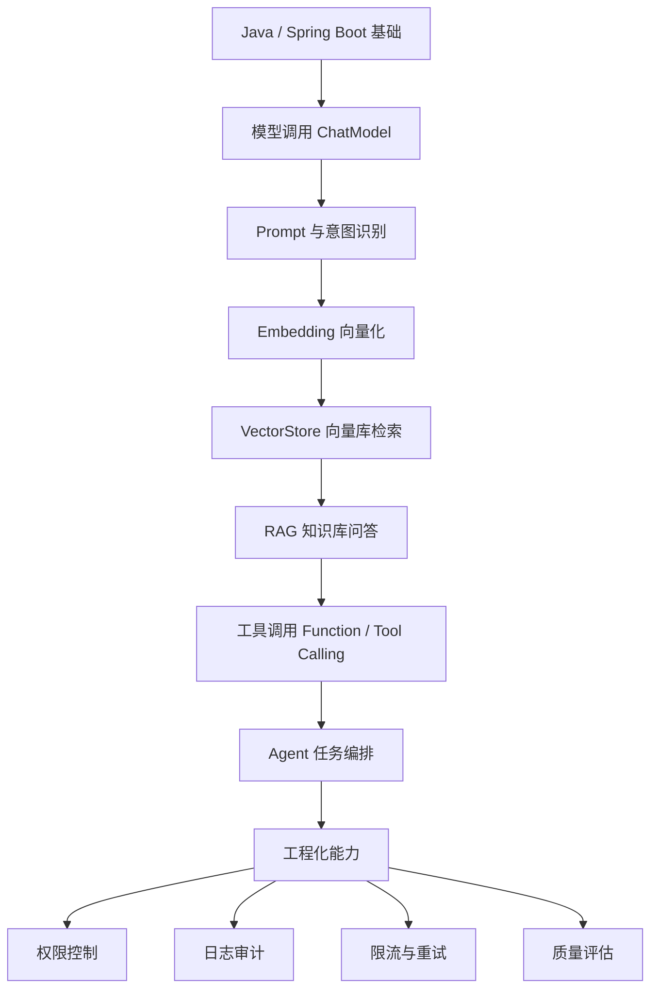
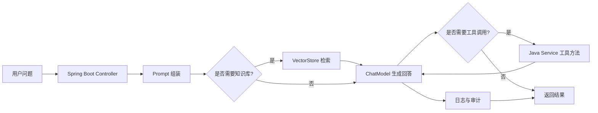

<!-- generated_at: 2026-09-17T08:31:14+08:00 -->

# 2026-09-17 从 Spring AI 看 Java AI 工程化：给大二升大三学生的学习文章

> 生成时间：2026-09-17 08:30:28（UTC+08:00）  
> 读者定位：中北大学软件学院大二升大三学生，已具备 Java、数据库、Web 基础，正在补工程化与 AI 应用开发能力。  
> 今日主题：从 Spring AI 入手，把模型调用、RAG、工具调用、Agent 和企业工程化串成一条可实践的 Java AI 学习路线。

## 目录

| 序号 | 部分 | 你能读到什么 |
|---:|---|---|
| 1 | [一、先用一张图建立整体认识](#一先用一张图建立整体认识) | Java 后端同学学习 AI 应用开发的整体路线 |
| 2 | [二、今日核心项目](#二今日核心项目) | 用 Spring AI 理解 Java AI 工程化项目该怎么拆 |
| 3 | [三、最新信息怎么影响学习](#三最新信息怎么影响学习) | 新闻、GitHub、招聘和比赛背后的学习信号 |
| 4 | [四、适合当前阶段的知识拆解](#四适合当前阶段的知识拆解) | 用后端视角解释 RAG、Embedding、工具调用、Agent 等概念 |
| 5 | [五、今天可以动手做什么](#五今天可以动手做什么) | 3-5 个今天就能完成的小型工程任务 |
| 6 | [六、资料来源](#六资料来源) | 本文使用到的项目、新闻、招聘和活动链接 |

## 一、先用一张图建立整体认识

如果你已经学过 Java、数据库和 Web，那么学习 AI 应用开发时，不要一开始就陷入“训练大模型”。对大多数 Java 后端同学来说，更现实的路线是：**会调用模型 → 会接入业务数据 → 会让模型使用工具 → 会把它做成稳定的后端服务**。



这条路线和传统 Java 后端并不冲突。你可以把 AI 模型理解成一个“能力很强但不稳定的外部服务”：它需要接口封装、异常处理、权限控制、日志记录、结果校验，也需要和数据库、缓存、搜索、文件解析等后端组件配合。

| 学习阶段 | 你已经会的内容 | AI 应用里对应的新能力 |
|---|---|---|
| Java 基础 | 类、接口、异常、集合 | 封装模型客户端、处理响应结构 |
| 数据库 | MySQL 表设计、SQL 查询 | 文档元数据、知识库记录、检索结果保存 |
| Web 基础 | Controller、Service、DTO | 对外提供 AI 问答接口 |
| Spring Boot | 依赖注入、配置文件 | 接入模型、向量库、工具服务 |
| 项目实践 | 登录、权限、日志 | AI 请求鉴权、调用审计、质量追踪 |

## 二、今日核心项目

今天的核心项目选择：**spring-projects/spring-ai**  
原始链接：[https://github.com/spring-projects/spring-ai](https://github.com/spring-projects/spring-ai)


Spring AI 是 Spring 生态里的 AI 应用抽象层，数据描述中提到它覆盖了**模型接入、向量库、工具调用、ETL 与 RAG**。这对 Java 同学很关键：你不需要抛开 Spring Boot 重新学一套完全陌生的开发方式，而是可以继续用 Controller、Service、配置类、依赖注入这些熟悉的后端工程习惯，把 AI 能力接进项目里。

| 维度 | Spring AI 对 Java AI 学习的价值 |
|---|---|
| 项目类型 | Spring 生态 AI 应用抽象层 |
| 主要语言 | Java |
| 适合人群 | 已学过 Java、Web、Spring Boot，想做 AI 应用后端的学生 |
| 可以练什么 | ChatModel、EmbeddingModel、VectorStore、RAG、工具调用、ETL |
| 工程化意义 | 把 AI 能力做成可维护、可测试、可接入业务系统的后端模块 |
| 注意事项 | 数据中未确认 star、fork、更新时间，因此本文不编造这些指标 |

它和你熟悉的 Java 后端关系非常直接：

- **Spring Boot**：Spring AI 可以放进 Spring Boot 项目中，用配置和 Bean 管理模型客户端、向量库、工具服务。
- **RAG**：你可以把课程资料、PDF、项目文档切分成文本块，转成向量，存到向量库，再让模型基于检索结果回答。
- **Agent**：当模型不仅回答问题，还能判断下一步该调用哪个工具时，就接近 Agent 的雏形。
- **工具调用**：例如让模型调用“查数据库”“查询天气”“生成报表”“读取文件”等 Java 方法。
- **工程化**：真正上线时要处理超时、重试、日志、权限、敏感信息过滤、调用记录和质量评估。

如果你现在只能做一个小项目，可以做一个“校园课程知识库问答系统”：后端用 Spring Boot，AI 抽象层参考 Spring AI，数据来源可以是课程大纲、实验指导书、Markdown 笔记或 PDF 文档。

## 三、最新信息怎么影响学习

今天的数据里有四类信号：AI 新闻、GitHub 项目、招聘动态、比赛活动。把它们连起来看，会发现一个很明确的趋势：**企业和开发者不只是关心模型有多强，更关心 AI 应用能否稳定接入真实业务。**

Hugging Face Blog 在 2026-09-15 发布了关于 Agent 一致性的文章《Your Agent Aced the Task. Will It Do It Again?》。这提醒我们：Agent 不是“跑通一次就算成功”，而是要看同样任务能不能多次稳定完成。对 Java 后端同学来说，这就对应测试、日志、评估、异常恢复这些工程能力。

OpenAI Developers 数据中出现了 Docs MCP、Realtime and audio guide、Developers plugin 等内容。这里的重点不是让你立刻追所有新概念，而是看到一个方向：模型正在从“聊天接口”走向“能连接工具、文档、插件和实时交互”的开发平台。这和 Java 后端很像，核心都是接口、协议、服务编排。

GitHub 项目里，Spring AI、LangChain4j、modelcontextprotocol/java-sdk、spring-ai-alibaba 都和 Java AI 工程化有关；ExtractPDF4J 这样的 PDF 表格提取和 OCR 项目，则提醒我们：RAG 项目不只是“调模型”，还要先把业务文档处理干净。

招聘源里，阿里巴巴、腾讯、字节跳动、百度、美团都把 Java 后端、AI 平台、大模型应用、智能体应用、平台工程放在关注方向里。这说明对学生来说，“Java 后端 + AI 应用工程”比单纯写 prompt 更有长期价值。

比赛活动方面，AI4J Intelligent Java Conference 聚焦 Java AI 应用开发、Spring AI、LangChain4j、RAG、Agent；中国人工智能大赛、WAIC、Google Cloud Next 则覆盖大模型应用、智能体、云端 AI 应用开发。这些活动可以当作选题来源：你不一定马上参赛，但可以从题目和议程里反推自己该补哪些能力。

| 信息来源 | 今日信号 | 对大二升大三学生的启发 |
|---|---|---|
| Hugging Face Blog | Agent 一致性成为关注点 | 做 AI 项目要加测试、日志和评估，不要只看一次演示 |
| OpenAI Developers | MCP、插件、实时能力持续出现 | 学会把模型接入工具和业务系统 |
| Spring AI / LangChain4j | Java AI 框架覆盖 RAG、Embedding、工具调用 | Java 后端路线仍然适合进入 AI 应用开发 |
| ExtractPDF4J | PDF 表格提取和 OCR 仍是实际需求 | RAG 的前置能力是文档解析和数据清洗 |
| 招聘官网 | Java 后端与 AI 平台、大模型应用结合 | 简历项目应体现工程能力，而不是只写“调用了大模型 API” |
| 比赛活动 | RAG、Agent、企业级 AI 应用频繁出现 | 可以围绕校园、政务、企业知识库做作品 |

## 四、适合当前阶段的知识拆解

下面这些概念不需要一次性学得很深，但要知道它们和 Java 后端开发怎么连接。

| 概念 | 朴素解释 | 和 Java 后端的关系 |
|---|---|---|
| 模型调用 | 后端向大模型发送问题，拿到回答 | 类似调用第三方 HTTP API，需要封装 Client、DTO、异常处理 |
| Prompt | 给模型的指令和上下文 | 类似接口参数设计，写得越清楚，返回结果越稳定 |
| Embedding | 把文本转成一串数字向量 | 类似给文本生成“语义坐标”，方便后续相似度检索 |
| RAG | 先检索资料，再让模型基于资料回答 | 类似“搜索 + 问答”，适合做课程资料、企业文档、知识库系统 |
| VectorStore | 存储和检索向量的组件 | 类似数据库，但查的是语义相似度，不是普通 SQL 条件 |
| 工具调用 | 让模型决定是否调用某个后端方法 | Java 方法可以变成模型可用的工具，例如查订单、查课表、查库存 |
| Agent | 能规划步骤、调用工具、完成任务的 AI 程序 | 本质是“模型 + 工具 + 状态 + 控制流程”，需要后端工程保护 |
| MCP | 一种让模型连接外部工具和上下文的协议思路 | 对 Java 同学来说，可以理解为 AI 时代的工具接入协议 |
| 日志观测 | 记录模型请求、检索结果、工具调用和错误 | 方便排查“为什么回答错了”，也方便做质量评估 |
| 限流与权限 | 控制谁能用、用多少、能调用什么工具 | 防止接口滥用、越权访问和资源浪费 |

你现在最该形成的认识是：**AI 应用不是一个 Controller 里写一段 prompt 就结束了**。真正的 AI 后端项目至少包括入口接口、模型调用、知识检索、工具执行、权限判断、日志记录和错误处理。

一个简单的 Java AI 应用可以拆成这样：



## 五、今天可以动手做什么

今天不建议只收藏链接。你可以选下面 3-5 个小任务，做出能放进 GitHub 或简历项目里的产出。

| 任务 | 建议耗时 | 具体做法 | 产出物 |
|---|---:|---|---|
| 对比 Spring AI 与 LangChain4j 抽象 | 60 分钟 | 阅读两个项目描述，重点比较 ChatModel、EmbeddingModel、VectorStore、工具调用 | 一份 5 条结论的 Markdown 笔记 |
| 实现意图识别 Prompt | 45 分钟 | 把用户问题分成“问答、检索、任务执行、闲聊”四类，并设计 JSON 输出格式 | 一个可复用的 prompt.md |
| 设计 RAG 最小流程 | 90 分钟 | 画出“文档上传 → 切分 → Embedding → 检索 → 回答”的流程 | 一张 Mermaid 架构图 |
| 给检索结果加 rerank 思路 | 60 分钟 | 先按相似度取 Top 5，再设计一个二次排序规则，例如关键词命中数 | 一段伪代码或 Java Service 草稿 |
| 画 AI 应用工程架构图 | 45 分钟 | 包含入口、权限、模型网关、RAG、工具调用、日志审计、成本统计 | 一张系统结构图，可放入项目 README |

建议你今天优先完成第 1 和第 5 个任务。原因很简单：第 1 个任务帮你建立框架认知，第 5 个任务帮你把“AI 项目”讲成“后端工程项目”。这比只写“我会调用大模型 API”更有含金量。

你可以把今天的 README 写成下面这种结构：

```markdown
# Java AI RAG Demo 学习记录

## 1. 项目目标
用 Spring Boot 构建一个课程资料问答系统。

## 2. 核心模块
- 用户入口：REST API
- 模型调用：ChatModel
- 知识检索：Embedding + VectorStore
- 工具调用：Java Service 方法
- 工程化：权限、日志、限流、异常处理

## 3. 今日结论
1. Spring AI 更贴近 Spring Boot 开发习惯。
2. RAG 的难点不只是问答，而是文档处理和检索质量。
3. Agent 必须关注稳定性，不能只看单次运行成功。
```

## 六、资料来源

| 类型 | 名称 | 本文使用方式 | 链接 |
|---|---|---|---|
| GitHub 仓库 | spring-projects/spring-ai | 今日核心项目，分析 Java AI 工程化主线 | [https://github.com/spring-projects/spring-ai](https://github.com/spring-projects/spring-ai) |
| GitHub 仓库 | langchain4j/langchain4j | 用于对比 Java LLM 应用框架抽象 | [https://github.com/langchain4j/langchain4j](https://github.com/langchain4j/langchain4j) |
| GitHub 仓库 | alibaba/spring-ai-alibaba | 作为 Spring AI 国内生态扩展参考 | [https://github.com/alibaba/spring-ai-alibaba](https://github.com/alibaba/spring-ai-alibaba) |
| GitHub 仓库 | modelcontextprotocol/java-sdk | 用于理解 Java 与 MCP 工具协议生态 | [https://github.com/modelcontextprotocol/java-sdk](https://github.com/modelcontextprotocol/java-sdk) |
| GitHub 仓库 | microsoft/semantic-kernel | 用于理解插件、函数调用和 Agent workflow | [https://github.com/microsoft/semantic-kernel](https://github.com/microsoft/semantic-kernel) |
| GitHub 仓库 | ExtractPDF4J/ExtractPDF4J | 用于说明 RAG 前置的文档解析能力 | [https://github.com/ExtractPDF4J/ExtractPDF4J](https://github.com/ExtractPDF4J/ExtractPDF4J) |
| 新闻源 | Hugging Face Blog - Your Agent Aced the Task. Will It Do It Again? | 用于说明 Agent 稳定性和一致性的重要性 | [https://huggingface.co/blog/ibm-research/altk-evolve-consistency](https://huggingface.co/blog/ibm-research/altk-evolve-consistency) |
| 新闻源 | OpenAI Developers - Docs MCP | 用于说明模型连接文档和工具协议的趋势 | [https://developers.openai.com/learn/docs-mcp/](https://developers.openai.com/learn/docs-mcp/) |
| 新闻源 | OpenAI Developers - Realtime and audio guide | 用于说明实时交互能力的发展方向 | [https://platform.openai.com/docs/guides/realtime](https://platform.openai.com/docs/guides/realtime) |
| 招聘官网 | 阿里巴巴招聘 | 观察 Java 后端 / AI 工程化 / 大模型应用岗位方向 | [https://talent.alibaba.com/](https://talent.alibaba.com/) |
| 招聘官网 | 腾讯招聘 | 观察后台开发 / AI 平台 / 智能体应用岗位方向 | [https://careers.tencent.com/](https://careers.tencent.com/) |
| 招聘官网 | 字节跳动招聘 | 观察后端研发 / AI 平台 / 大模型工程岗位方向 | [https://jobs.bytedance.com/](https://jobs.bytedance.com/) |
| 招聘官网 | 百度招聘 | 观察 AI 原生应用 / 智能云 / 大模型平台方向 | [https://talent.baidu.com/](https://talent.baidu.com/) |
| 招聘官网 | 美团招聘 | 观察 Java 后端 / 平台工程 / AI 应用场景方向 | [https://zhaopin.meituan.com/](https://zhaopin.meituan.com/) |
| 比赛 / 活动 | AI4J Intelligent Java Conference | 观察 Java AI、Spring AI、LangChain4j、RAG、Agent 方向 | [https://ai4j.io/](https://ai4j.io/) |
| 比赛 / 活动 | 中国人工智能大赛 | 观察大模型应用、智能体和行业 AI 创新赛事 | [https://www.aicomp.cn/](https://www.aicomp.cn/) |
| 比赛 / 活动 | 世界人工智能大会 WAIC | 观察 AI 产业趋势与企业级 AI 应用 | [https://www.worldaic.com.cn/](https://www.worldaic.com.cn/) |
| 比赛 / 活动 | Google Cloud Next | 观察 Gemini、Vertex AI、Agent Builder 和云端 AI 应用开发 | [https://cloud.withgoogle.com/next](https://cloud.withgoogle.com/next) |
