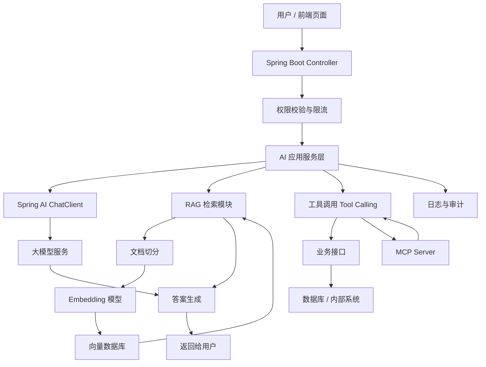

<!-- generated_at: 2026-09-19T08:31:34+08:00 -->

# 2026-09-19 从 Spring AI 看 Java AI 工程化：给大二升大三学生的学习文章

> 生成时间：2026-09-19  
> 读者定位：中北大学软件学院大二升大三学生，已具备 Java、数据库、Web 基础，正在补工程化与 AI 应用开发能力。  
> 今日主题：用 Spring AI 作为主线，把模型调用、RAG、工具调用、MCP、岗位能力和动手任务串成一条 Java AI 学习路线。

## 目录

| 序号 | 部分 | 你能读到什么 |
|---:|---|---|
| 1 | [一、先用一张图建立整体认识](#一先用一张图建立整体认识) | Java AI 应用从用户请求到模型、知识库、工具调用的整体链路 |
| 2 | [二、今日核心项目](#二今日核心项目) | 为什么选择 Spring AI，它适合你从 Spring Boot 过渡到 AI 应用开发 |
| 3 | [三、最新信息怎么影响学习](#三最新信息怎么影响学习) | AI 新闻、GitHub 项目、招聘和比赛背后共同指向的能力 |
| 4 | [四、适合当前阶段的知识拆解](#四适合当前阶段的知识拆解) | 用大二升大三能理解的话解释 RAG、Embedding、Agent、MCP 等概念 |
| 5 | [五、今天可以动手做什么](#五今天可以动手做什么) | 4 个偏工程实践的小任务，配建议耗时和产出物 |
| 6 | [六、资料来源](#六资料来源) | 本文用到的 GitHub、新闻、招聘和比赛官网链接 |

## 一、先用一张图建立整体认识

很多同学刚接触 Java AI 开发时，容易把它理解成“在 Java 里调一下大模型 API”。这只是第一步。真正的企业级 AI 应用，通常要处理用户身份、业务数据、知识库检索、模型网关、工具调用、日志审计、成本控制和安全限制。

你可以先把它想成一个“增强版 Spring Boot 后端”：以前 Controller 调 Service、Service 查数据库；现在 Service 还可能调用大模型、查向量库、调用内部工具，并把全过程记录下来。



这张图里，Spring AI 更像是 Java 后端同学进入 AI 应用开发的一座桥：它不是替代 Spring Boot，而是把模型、向量库、RAG、工具调用这些 AI 能力，放进你已经熟悉的 Spring 工程结构里。

## 二、今日核心项目


今天的核心项目选择：**spring-projects/spring-ai**

原始链接：<https://github.com/spring-projects/spring-ai>

项目描述：Spring AI 是 Spring 生态里的 AI 应用抽象层，覆盖模型接入、向量库、工具调用、ETL 与 RAG。也就是说，它希望用 Spring 开发者熟悉的方式，帮助你把大模型能力接进 Java 后端项目。

| 维度 | 对大二升大三学生的意义 |
|---|---|
| 项目语言 | Java，和你已经学过的 Java 基础、Spring Boot 学习路线衔接自然 |
| 适合场景 | 智能问答、知识库助手、业务数据查询助手、带工具调用的 AI 后端 |
| 相关技术点 | Spring Boot、模型调用、RAG、Embedding、向量库、工具调用、ETL、工程化配置 |
| 学习价值 | 能把“会调 API”提升到“会设计一个可维护的 AI 应用后端” |
| 注意事项 | 数据中未能确认 star、fork 和最近更新时间，因此本文不使用这些数字做判断 |

如果你已经写过普通的 Spring Boot CRUD 项目，可以这样理解 Spring AI：

| 传统 Spring Boot 项目 | 加入 Spring AI 后 |
|---|---|
| Controller 接收请求 | Controller 接收用户问题或业务指令 |
| Service 写业务逻辑 | Service 组织模型调用、检索、工具调用 |
| MyBatis / JPA 查数据库 | 向量数据库检索相关文档，或调用业务库 |
| 返回 JSON | 返回模型生成的答案、引用来源和结构化结果 |
| 日志记录接口耗时 | 还要记录模型调用、检索命中、工具调用、失败原因 |

它和几个关键词的关系可以这样看：

- **Spring Boot**：Spring AI 适合放在 Spring Boot 项目里使用，你原来写 Controller、Service、配置文件的经验仍然有用。
- **RAG**：Spring AI 覆盖向量库和 RAG，适合做“基于课程资料、项目文档、企业知识库回答问题”的应用。
- **Agent**：Agent 可以理解为“能规划步骤、调用工具、再组织答案”的模型应用形态。Spring AI 的工具调用能力是学习 Agent 的基础。
- **工具调用**：模型不只是聊天，还可以调用 Java 方法，例如查订单、查课表、查库存、调用内部接口。
- **工程化**：企业项目不只看 Demo，还要看配置管理、错误处理、日志、权限、限流、可测试性和可部署性。

## 三、最新信息怎么影响学习

今天的数据里，新闻、GitHub 项目、招聘和比赛看起来很分散，但它们其实都在指向同一件事：**AI 应用开发正在从“写 Prompt”变成“做工程系统”**。

OpenAI Developers 里出现了 Docs MCP、Realtime and audio guide、Developers plugin 相关内容。对 Java 学生来说，重点不是马上追每一个新接口，而是理解：模型正在变成一个可以连接文档、工具、插件和实时交互的系统入口。以后后端工程师要做的，不只是写 REST API，还要考虑“模型能不能安全地调用这些 API”。

Hugging Face Blog 中的 “Your Agent Aced the Task. Will It Do It Again?” 关注 Agent 执行任务的一致性。这个问题很重要：一次回答对了，不代表系统稳定。企业项目需要关注可重复性、评测、日志和失败兜底。你写 Java 后端时学过单元测试、接口测试，这些思想在 AI 应用里仍然有用，只是测试对象从普通方法扩展到了“模型输出是否稳定、检索是否命中、工具调用是否越权”。

Planet AI 里出现 llama.cpp 发布信息，以及关于 Gemini 被用于攻击公司的安全新闻。它提醒我们：本地模型、开源推理、AI 安全都会影响真实应用。你不一定现在就训练模型，但要知道模型接入后，权限、审计、输入过滤、工具调用边界会变得更重要。

GitHub 项目方面，除了 Spring AI，数据中还有 LangChain4j、spring-ai-alibaba、modelcontextprotocol/java-sdk、semantic-kernel 等项目。它们说明 Java AI 生态不是空白的：有框架负责模型调用和 RAG，有 SDK 负责 MCP 协议，有项目探索插件和 Agent workflow。对于学生来说，最好的策略不是一次学完所有框架，而是选一个主线，比如 Spring AI，再横向了解 LangChain4j 和 MCP。

招聘动态也能印证这个方向。阿里巴巴、腾讯、字节跳动、百度、美团这些招聘源都把 Java 后端、AI 平台、大模型应用、智能体应用、平台工程放在关注范围内。企业需要的不是只会聊天机器人页面的人，而是能把 AI 能力接入业务系统的人：会 Java 后端、会数据库、懂一点模型调用、能做权限和日志、能把系统部署起来。

比赛活动方面，AI4J Intelligent Java Conference 直接聚焦 Java AI 应用开发、Spring AI、LangChain4j、RAG 和 Agent；中国人工智能大赛、WAIC、Google Cloud Next 则更偏行业趋势、云端 AI 应用和智能体平台。对你来说，参加比赛或关注大会不是为了“看热闹”，而是找到项目题目：知识库问答、校园助手、实验室资料检索、代码解释助手、就业信息分析助手，都可以作为 Java AI 练手项目。

| 信息来源 | 表面内容 | 对你学习路线的影响 |
|---|---|---|
| OpenAI Developers | MCP、插件、实时音频、开发者文档 | 学会把模型接入工具和文档，而不是只做聊天 |
| Hugging Face Blog | Agent 一致性、训练和工作流 | 重视评测、可重复性、日志和实验记录 |
| Planet AI | llama.cpp 发布、AI 安全事件、physical AI | 关注本地推理、安全边界和模型使用风险 |
| GitHub Java AI 项目 | Spring AI、LangChain4j、MCP Java SDK | 选择一个 Java 主框架做完整项目 |
| 招聘官网 | Java 后端、AI 平台、大模型工程 | 后端基础仍然重要，但要补 AI 应用工程能力 |
| 比赛活动 | RAG、Agent、企业级 AI 应用 | 用比赛题目倒逼自己做可展示项目 |

## 四、适合当前阶段的知识拆解

下面这些概念不需要一次学到论文级别，但你要知道它们和 Java 后端项目的关系。

| 概念 | 朴素解释 | 和 Java 后端学习的关系 |
|---|---|---|
| 模型调用 | 在后端代码里调用大模型服务，让模型根据输入生成回答 | 类似调用第三方 API，但要处理超时、异常、重试、参数配置和返回解析 |
| RAG | 先从自己的资料里检索相关内容，再把内容交给模型回答 | 能解决“模型不知道你私有资料”的问题，适合做课程资料问答、企业知识库 |
| Embedding | 把文字变成一串数字向量，用来比较语义相似度 | 类似给文本建立“语义索引”，后端要负责切分文档、入库、查询 |
| 工具调用 | 让模型在需要时调用一个后端方法或接口 | 本质上是把 Java Service 暴露给模型使用，所以权限和参数校验很关键 |
| Agent | 能分步骤思考、选择工具、执行任务、整理结果的 AI 应用形态 | 可以理解为“模型 + 工具 + 状态 + 控制流程”，比普通聊天复杂 |
| MCP | Model Context Protocol，用统一协议把工具、数据源接给模型 | 对 Java 后端来说，可以把已有接口包装成模型可调用的工具服务 |

特别要注意两个容易误解的点。

第一，**RAG 不是简单把全文塞进 Prompt**。如果文档很多，直接塞会超长、慢、贵，还可能让答案变乱。RAG 的关键步骤包括文档切分、Embedding、向量检索、结果排序、上下文拼接和答案生成。

第二，**Agent 不是越自动越好**。真实项目里，模型能调用哪些工具、每个工具需要什么权限、调用失败怎么办、是否需要人工确认，都要由后端系统设计清楚。否则模型调用了不该调用的接口，可能造成安全问题。

## 五、今天可以动手做什么

今天不建议只收藏链接。更好的方式是做几个小而完整的工程动作。

| 任务 | 建议耗时 | 具体做法 | 产出物 |
|---|---:|---|---|
| 画一个 AI 应用工程架构图 | 30-45 分钟 | 参考本文第一部分，补上入口、权限、模型网关、RAG、工具调用、日志审计、成本统计 | 一张 Mermaid 架构图或 draw.io 图 |
| 给 RAG 检索结果设计最小 rerank 步骤 | 60-90 分钟 | 假设检索返回 5 条文档，按关键词命中数、标题匹配、时间新旧重新排序 | 一段 Java 伪代码或可运行的小方法 |
| 阅读一个大厂 AI / Java 岗位 JD | 30 分钟 | 从阿里、腾讯、字节、百度、美团招聘官网中选一个岗位，提取 5 个高频能力词 | 一张“能力词-学习任务”表格 |
| 把一个内部接口包装成 MCP server 设计草案 | 60 分钟 | 选一个你熟悉的接口，例如“查询课程表”或“查询图书信息”，写出工具名、入参、出参、安全限制 | 一份 MCP 工具设计 Markdown |
| 用 Spring Boot 设计 AI 问答接口 | 60-120 分钟 | 先不接真实模型也可以，定义 `/api/chat`、请求体、响应体、错误码和日志字段 | Controller DTO、接口文档、简单 Mock 实现 |

一个适合今天完成的最小接口设计可以像这样：

```java
@PostMapping("/api/chat")
public ChatResponse chat(@RequestBody ChatRequest request) {
    // 这里先做参数校验、用户身份检查，再进入 AI 服务层
    return aiChatService.answer(request);
}
```

你现在不一定要马上把 Spring AI 项目完整跑起来，但可以先把接口、DTO、日志字段、异常返回这些工程骨架设计好。等模型 Key、向量库和框架依赖准备好后，就能逐步替换 Mock 实现。

## 六、资料来源

| 类型 | 名称 | 链接 |
|---|---|---|
| GitHub 仓库 | spring-projects/spring-ai | <https://github.com/spring-projects/spring-ai> |
| GitHub 仓库 | langchain4j/langchain4j | <https://github.com/langchain4j/langchain4j> |
| GitHub 仓库 | 1Panel-dev/MaxKB | <https://github.com/1Panel-dev/MaxKB> |
| GitHub 仓库 | alibaba/spring-ai-alibaba | <https://github.com/alibaba/spring-ai-alibaba> |
| GitHub 仓库 | microsoft/semantic-kernel | <https://github.com/microsoft/semantic-kernel> |
| GitHub 仓库 | modelcontextprotocol/java-sdk | <https://github.com/modelcontextprotocol/java-sdk> |
| GitHub 候选项目 | mixelpixx/Konnect | <https://github.com/mixelpixx/Konnect> |
| GitHub 候选项目 | NVIDIA-AI-Blueprints/video-search-and-summarization | <https://github.com/NVIDIA-AI-Blueprints/video-search-and-summarization> |
| GitHub 候选项目 | openrewrite/rewrite | <https://github.com/openrewrite/rewrite> |
| 新闻源 | OpenAI Developers | <https://developers.openai.com/> |
| 新闻条目 | Docs MCP | <https://developers.openai.com/learn/docs-mcp/> |
| 新闻条目 | Realtime and audio guide | <https://platform.openai.com/docs/guides/realtime> |
| 新闻源 | Hugging Face Blog | <https://huggingface.co/blog> |
| 新闻条目 | Your Agent Aced the Task. Will It Do It Again? | <https://huggingface.co/blog/ibm-research/altk-evolve-consistency> |
| 新闻源 | Planet AI | <https://planet-ai.net/> |
| 新闻条目 | llama.cpp b11046 | <https://github.com/ggml-org/llama.cpp/releases/tag/b11046> |
| 新闻条目 | Gemini Hacked Three Companies in First Known Breakout by Google’s AI | <https://simonwillison.net/2026/Sep/18/gemini-hacked-three-companies/> |
| 招聘官网 | 阿里巴巴招聘 | <https://talent.alibaba.com/> |
| 招聘官网 | 腾讯招聘 | <https://careers.tencent.com/> |
| 招聘官网 | 字节跳动招聘 | <https://jobs.bytedance.com/> |
| 招聘官网 | 百度招聘 | <https://talent.baidu.com/> |
| 招聘官网 | 美团招聘 | <https://zhaopin.meituan.com/> |
| 比赛 / 活动 | AI4J Intelligent Java Conference | <https://ai4j.io/> |
| 比赛 / 活动 | 中国人工智能大赛 | <https://www.aicomp.cn/> |
| 比赛 / 活动 | 世界人工智能大会 WAIC | <https://www.worldaic.com.cn/> |
| 比赛 / 活动 | Google Cloud Next | <https://cloud.withgoogle.com/next> |
