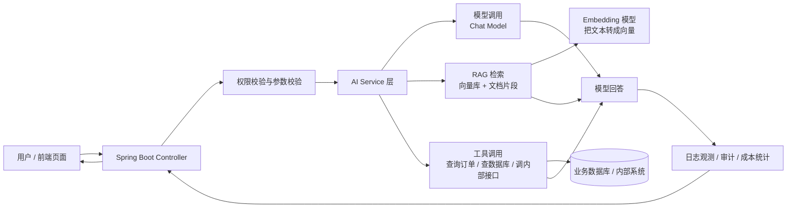

<!-- generated_at: 2026-09-20T08:31:27+08:00 -->

# 2026-09-20 从 Spring AI 看 Java AI 工程化：给大二升大三学生的学习文章

> 生成时间：2026-09-20  
> 读者定位：中北大学软件学院大二升大三学生，已具备 Java、数据库、Web 基础，正在补工程化与 AI 应用开发能力。  
> 今日主题：以 Spring AI 为主线，把模型调用、RAG、工具调用、岗位要求和动手任务串成一条 Java AI 学习路径。

## 目录

| 序号 | 部分 | 你能读到什么 |
|---:|---|---|
| 1 | [先用一张图建立整体认识](#一先用一张图建立整体认识) | Java AI 应用从用户请求到模型、知识库、工具调用的整体结构 |
| 2 | [今日核心项目](#二今日核心项目) | 为什么选择 Spring AI，它适合用来补哪些工程能力 |
| 3 | [最新信息怎么影响学习](#三最新信息怎么影响学习) | AI 新闻、GitHub 项目、招聘和比赛对学习方向的影响 |
| 4 | [适合当前阶段的知识拆解](#四适合当前阶段的知识拆解) | 用 Java 后端视角解释 RAG、Embedding、Agent、MCP 等概念 |
| 5 | [今天可以动手做什么](#五今天可以动手做什么) | 3-5 个能落地的小任务，带建议耗时和产出物 |
| 6 | [资料来源](#六资料来源) | 本文使用到的仓库、新闻、招聘和比赛链接 |

## 一、先用一张图建立整体认识

很多同学刚接触 AI 应用时，会把重点放在“怎么调大模型接口”。这当然重要，但企业里的 Java AI 应用通常不只是一个 `Controller` 调一次模型 API。它更像一个普通后端系统加上 AI 能力：要有登录权限、配置管理、日志、限流、数据库、缓存、文档检索、工具调用和异常处理。

下面这张图可以先帮你建立整体认识：

如果你已经学过 Java Web、数据库和 Spring Boot，可以这样理解：AI 应用不是推翻原来的后端知识，而是在原有后端工程上增加“模型能力”和“知识检索能力”。你的 Java 基础仍然有用，只是服务层里多了模型调用、Prompt 组织、向量检索和工具编排。

## 二、今日核心项目

今天的核心项目选择 GitHub 上真实存在的 **spring-projects/spring-ai**。

| 项目 | 信息 |
|---|---|
| 仓库名 | spring-projects/spring-ai |
| 原始链接 | https://github.com/spring-projects/spring-ai |
| 主要语言 | Java |
| 项目描述 | Spring 生态的 AI 应用抽象层，覆盖模型接入、向量库、工具调用、ETL 与 RAG |
| 数据限制 | 当前数据中 star、fork、更新时间无法确认，因此本文不使用这些指标做判断 |

Spring AI 适合当前阶段的原因很直接：你们已经学过 Java、数据库、Web 基础，很多人也接触过 Spring Boot。Spring AI 的价值不是“让你一夜之间会大模型”，而是把 AI 能力放进熟悉的 Spring 工程结构里。

你可以把它理解成：以前 Service 层调用的是数据库、Redis、第三方 HTTP 接口；现在 Service 层还可以调用大模型、向量库、Embedding 模型和工具函数。它和下面这些方向都有关系：

| 学习点 | 和 Spring AI 的关系 | 和 Java 后端学习的关系 |
|---|---|---|
| Spring Boot | Spring AI 可以嵌入 Spring Boot 应用 | 继续使用 Controller、Service、配置文件、依赖注入 |
| RAG | 支持围绕文档、向量库、检索增强生成构建问答应用 | 类似“先查数据库再组织回答”，只是查询对象变成了向量库和文档片段 |
| 工具调用 | 模型可以在需要时调用后端定义的函数或服务 | 本质上是把已有业务接口包装成可被模型使用的工具 |
| Agent | 可用于构建具备多步决策能力的 AI 流程 | 需要你理解流程编排、异常兜底和状态管理 |
| 工程化 | 涉及配置、日志、限流、安全、监控、部署 | 这正是普通 Demo 和企业项目的差距 |

对大二升大三的同学来说，不建议一开始就追求“智能体平台”“复杂工作流”“多模型调度”。更稳的路线是：先用 Spring Boot 写一个最小 Chat API，再加文档问答，再加工具调用，最后补日志、权限和限流。

## 三、最新信息怎么影响学习

今天的数据里有几类信息：AI 新闻、Java AI 相关 GitHub 项目、招聘方向和比赛活动。它们看起来分散，但其实指向同一个趋势：企业不是只需要“会调模型 API”的人，而是需要能把 AI 能力接进真实业务系统的人。

OpenAI Developers 中出现了 **Docs MCP**、开发者插件、实时音频等内容，说明模型正在从“聊天窗口”走向“能连接工具、文档和开发环境”的应用形态。对于 Java 学生来说，重点不是马上研究所有新概念，而是先理解 MCP、工具调用和后端接口之间的关系：模型不能直接安全地操作你的数据库，通常需要通过受控的服务接口来完成任务。

Hugging Face Blog 中的 **Your Agent Aced the Task. Will It Do It Again?** 关注 Agent 执行的一致性。这个问题很工程化：一次成功不代表系统稳定，企业要看多次运行是否可靠、失败时是否可追踪、是否有日志和评估指标。你们做课程设计时，程序能跑通就算完成；但企业项目里，系统要能解释“为什么失败”“哪里慢”“哪次调用花费高”。

Planet AI 中出现了 llama.cpp 发布、LangChain 相关 Agent 评估、OpenClaw 更新等信息。这说明本地模型、Agent 评估、插件热更新、会话分享这类能力都在快速发展。对 Java 后端同学来说，不必每个项目都追，但要看懂它们背后的共性：模型只是核心能力之一，周围还需要插件、评估、权限、部署和可观测性。

招聘信息也在强化这个方向。阿里巴巴、腾讯、字节跳动、百度、美团的招聘入口中，关注点包括 Java 后端、AI 工程化、AI 平台、大模型应用、智能体应用。也就是说，未来找实习或校招时，“Java + Spring Boot + 数据库”仍然是基础，但如果你能再讲清楚一个 RAG 项目、一个工具调用 Demo、一次日志与限流设计，会比只会写普通 CRUD 更有区分度。

比赛活动方面，AI4J Intelligent Java Conference 更贴近 Java AI 应用开发，关键词包括 Spring AI、LangChain4j、RAG、Agent；中国人工智能大赛更偏大模型应用和行业创新；WAIC 更适合观察产业趋势；Google Cloud Next 则偏云端 AI 应用和 Agent Builder。你可以不急着参赛，但可以用这些活动的主题反推学习路线：Java AI 不只是算法比赛，也包括工程落地。

## 四、适合当前阶段的知识拆解

下面这些概念建议按“能不能写进 Spring Boot 项目”来理解，不要只背定义。

| 概念 | 朴素解释 | 和 Java 后端的关系 |
|---|---|---|
| 模型调用 | 后端向大模型发送问题、上下文和参数，然后接收回答 | 类似调用第三方 REST API，但要额外处理 Prompt、超时、重试和安全过滤 |
| RAG | 先从自己的资料库里检索相关内容，再把内容交给模型回答 | 类似“先查数据库再返回结果”，适合做课程资料问答、企业知识库问答 |
| Embedding | 把文本转换成一组数字向量，用来判断语义相似度 | 可以理解成一种“语义索引”，常和向量数据库一起使用 |
| 工具调用 | 让模型在需要时调用后端定义好的函数，比如查订单、查课表、查库存 | 本质是把 Java Service 方法包装成可控工具，关键是权限和参数校验 |
| Agent | 能根据目标进行多步决策的 AI 程序，例如先查资料、再调用接口、最后总结 | 类似一个带决策能力的流程编排器，但必须限制它能做什么 |
| MCP | Model Context Protocol，用统一协议把工具、文档、服务暴露给模型使用 | 对 Java 同学来说，可以理解为“给模型用的标准化接口层” |

这里要特别提醒：不要把 Agent 想得太神。企业中的 Agent 不是“随便让模型操作系统”，而是“在受限范围内调用经过授权的工具”。比如一个教务问答 Agent 可以查课程表，但不能修改学生成绩；一个报销 Agent 可以查询规则，但不能绕过审批流程。

## 五、今天可以动手做什么

下面 4 个任务都偏工程实践，不要求一次做大项目。建议你把产出物放进同一个 GitHub 仓库，后续逐步扩展成自己的 Java AI 作品集。

| 任务 | 建议耗时 | 具体做法 | 产出物 |
|---|---:|---|---|
| 画一个 AI 应用工程架构图 | 30-45 分钟 | 按“入口、权限、模型网关、RAG、工具调用、日志审计、成本统计”画出系统结构 | 一张 Mermaid 图或 draw.io 图 |
| 拆一个 AI / Java 岗位 JD | 40-60 分钟 | 从阿里、腾讯、字节、百度或美团招聘官网选一个岗位，提取 5 个高频能力关键词 | 一张“岗位能力 -> 学习任务”表 |
| 写 Spring AI 最小 Chat API Demo | 1.5-2.5 小时 | 用 Spring Boot 暴露 `/chat` 接口，模型 endpoint 和 key 放到配置文件 | 一个能启动的 Demo 项目 |
| 设计一个 MCP Server 草案 | 45-60 分钟 | 把一个内部接口假设成工具，例如“查询课程表”，写出工具名、入参、出参和安全限制 | 一份 Markdown 设计文档 |

如果今天只能做一个任务，优先做 **Spring AI 最小 Chat API Demo**。原因是它能把你已经学过的 Spring Boot、配置文件、Controller、Service 都串起来，还能自然引出后面的 RAG、工具调用和日志观测。

一个合理的练习目标不是“做出很强的 AI”，而是让项目具备基本工程形态：

| 模块 | 最低要求 |
|---|---|
| Controller | 提供 `/chat` 或 `/api/chat` 接口 |
| Service | 封装模型调用逻辑，不要把调用代码直接写在 Controller |
| 配置 | endpoint、key、模型名放在 `application.yml` |
| 异常处理 | 模型超时、key 缺失、请求为空时给出明确错误 |
| 日志 | 记录请求时间、模型名称、是否成功，不记录用户敏感内容 |

## 六、资料来源

| 类型 | 名称 | 链接 |
|---|---|---|
| GitHub 仓库 | spring-projects/spring-ai | https://github.com/spring-projects/spring-ai |
| GitHub 仓库 | langchain4j/langchain4j | https://github.com/langchain4j/langchain4j |
| GitHub 仓库 | alibaba/spring-ai-alibaba | https://github.com/alibaba/spring-ai-alibaba |
| GitHub 仓库 | modelcontextprotocol/java-sdk | https://github.com/modelcontextprotocol/java-sdk |
| GitHub 仓库 | microsoft/semantic-kernel | https://github.com/microsoft/semantic-kernel |
| GitHub 仓库 | 1Panel-dev/MaxKB | https://github.com/1Panel-dev/MaxKB |
| 新闻源 | OpenAI Developers | https://developers.openai.com/ |
| 新闻条目 | Docs MCP | https://developers.openai.com/learn/docs-mcp/ |
| 新闻条目 | OpenAI Developers plugin | https://developers.openai.com/learn/developers-codex-plugin/ |
| 新闻条目 | Realtime and audio guide | https://platform.openai.com/docs/guides/realtime |
| 新闻源 | Hugging Face Blog | https://huggingface.co/blog |
| 新闻条目 | Your Agent Aced the Task. Will It Do It Again? | https://huggingface.co/blog/ibm-research/altk-evolve-consistency |
| 新闻条目 | Async GRPO with LoRA across HF Jobs | https://huggingface.co/blog/asyncgrpo-lora-hfjobs |
| 新闻条目 | Rebuilding AUTOMATIC1111 with Gradio Workflow | https://huggingface.co/blog/gradio-workflow-1111 |
| 新闻源 | Planet AI | https://planet-ai.net/ |
| 新闻条目 | llama.cpp b11057 | https://github.com/ggml-org/llama.cpp/releases/tag/b11057 |
| 新闻条目 | Can Jev Be a Better Agent Evaluator? | https://www.langchain.com/blog/jev-agent-evals-langsmith |
| 新闻条目 | OpenClaw Releases 2026.9.5 | https://www.marktechpost.com/2026/09/19/openclaw-releases-2026-9-5/ |
| 招聘官网 | 阿里巴巴招聘 | https://talent.alibaba.com/ |
| 招聘官网 | 腾讯招聘 | https://careers.tencent.com/ |
| 招聘官网 | 字节跳动招聘 | https://jobs.bytedance.com/ |
| 招聘官网 | 百度招聘 | https://talent.baidu.com/ |
| 招聘官网 | 美团招聘 | https://zhaopin.meituan.com/ |
| 比赛 / 活动 | AI4J Intelligent Java Conference | https://ai4j.io/ |
| 比赛 / 活动 | 中国人工智能大赛 | https://www.aicomp.cn/ |
| 比赛 / 活动 | 世界人工智能大会 WAIC | https://www.worldaic.com.cn/ |
| 比赛 / 活动 | Google Cloud Next | https://cloud.withgoogle.com/next |
