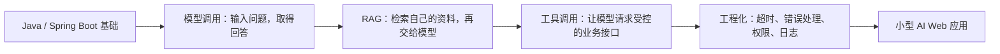

<!-- generated_at: 2026-09-25T08:31:15+08:00 -->

# 2026-09-25 从 LangChain4j 看 Java AI 应用工程化：大二升大三学习文章

> 生成时间：2026-09-25
> 读者定位：中北大学软件学院大二升大三学生，已具备 Java、数据库、Web 基础，正在补工程化与 AI 应用开发能力。
> 今日主题：从 Java AI 框架出发，把模型调用、RAG、工具权限和工程实践连成一条可动手的学习路线。

## 目录

| 序号 | 部分 | 你能读到什么 |
|---|---|---|
| 1 | [一、先用一张图建立整体认识](#part-1) | Java 后端基础如何连接到 AI 应用开发 |
| 2 | [二、今日核心项目](#part-2) | 用 LangChain4j 观察 Java AI 应用的工程组成 |
| 3 | [三、最新信息怎么影响学习](#part-3) | 如何理解新闻、项目、招聘和活动数据 |
| 4 | [四、适合当前阶段的知识拆解](#part-4) | 读懂模型调用、RAG、Embedding、工具调用和观测 |
| 5 | [五、今天可以动手做什么](#part-5) | 3 个能留下代码或文档成果的小任务 |
| 6 | [六、资料来源](#part-6) | 本文使用的项目、招聘、活动和新闻来源 |

## 一、先用一张图建立整体认识 {#part-1}

对已经会写 Java、连接数据库、开发简单 Web 接口的同学来说，学习 AI 应用不必从“训练大模型”开始。更实际的路线是：先把模型当作一种外部服务接入，再逐步为它补上知识检索、业务工具和必要的工程保护。

下面这张图把一条基础路线串起来了：

可以把它理解成给现有 Web 项目逐步“加能力”：

- **模型调用**类似调用一个外部 API，只是请求和返回内容更灵活。
- **RAG**类似“先查数据库或文档，再带着查询结果去问模型”。
- **工具调用**让模型能够请求后端执行操作，但是否执行、能执行什么，仍由 Java 服务控制。
- **工程化**则是让这些能力在异常、权限和真实请求下也尽量可控。

## 二、今日核心项目 {#part-2}

今天选择 **LangChain4j** 作为核心项目。它是数据中列出的真实 GitHub 仓库，项目描述明确覆盖 Java 大模型应用开发中的聊天模型、RAG、Embedding、工具调用和 Agent 编排。

- **项目：** [langchain4j/langchain4j](https://github.com/langchain4j/langchain4j)
- **项目描述：** Java LLM 应用开发框架，覆盖聊天模型、RAG、Embedding、工具调用和 Agent 编排。
- **为什么适合 Java AI 学习：** 它使用 Java，关注的是“怎样在 Java 程序里构建 AI 应用”，和已有的类、接口、依赖管理及 Web 服务开发经验衔接较直接。可以先把它当作一份技术地图，逐项弄清模型、检索和工具如何进入应用。
- **和常见后端技术的关系：** 可以把框架放进 Spring Boot 项目中，作为应用层调用 AI 能力的部分；RAG 和 Embedding 对应知识检索链路；工具调用和 Agent 对应“模型提出请求、应用决定如何处理”的业务编排；错误处理、权限与日志则属于把功能做稳的工程化工作。

需要注意，当前数据里这个仓库的 Star、Fork 和更新时间无法确认，因此本文不据此评价项目热度或活跃度。学习时应以仓库当前文档、示例代码和版本说明为准。

## 三、最新信息怎么影响学习 {#part-3}

把今天的数据放在一起看，得到的重点不是“立刻追逐某个新名词”，而是：**Java AI 学习应围绕可落地的应用链路展开，同时保持对模型与岗位变化的观察。**

首先，AI 新闻源的数据并不完整。OpenAI Developers、Hugging Face Blog 和 Microsoft AI Blog 在本次采集时未能连接，因而没有可核验的新闻条目。Planet AI 的条目中出现了 `llama.cpp` 的 b11171、b11172、b11173 发布链接，其中 b11173 的发布时间标为 2026-09-25。这个信息可以作为关注本地模型运行工具的线索，但仅凭发布标题无法推断具体功能变化；要了解细节，应直接查看对应发布说明。

其次，GitHub 项目清楚显示了 Java AI 的学习方向不只有“调模型”。除 LangChain4j 外，数据中还列有 Spring AI、Spring AI Alibaba、Semantic Kernel 的 Java SDK 和 MCP Java SDK 等项目。它们分别让人看到 Spring 生态接入、不同模型与云环境适配、Agent 编排，以及工具协议接入等方向。学生不必一口气全部学习：可以先做一个小应用，再按遇到的问题比较框架抽象。

招聘来源所列岗位关注点包括 Java 后端、AI 工程化、大模型应用、AI 平台和智能体应用。它们不能代表某家公司当日的具体招聘情况，也没有给出岗位要求详情；但足以提醒我们，**Java 基础不会因为接入模型而失去价值**。接口设计、数据库、异常处理、权限控制和服务稳定性，仍然是 AI 应用落地的一部分。

活动方面，AI4J Intelligent Java Conference 的主题直接涉及 Java AI 应用、Spring AI、LangChain4j、RAG 和 Agent；中国人工智能大赛聚焦大模型应用、智能体和行业创新。是否有当期报名或比赛安排，需再查看活动官网。对学生来说，可以先把课程知识整理成小型知识库问答，练习“展示答案来源”和“限制工具权限”，这类成果既适合自学，也能成为参与活动或项目展示的原型。

## 四、适合当前阶段的知识拆解 {#part-4}

下面的概念不要求一次学完。建议先理解每一项在 Java 后端里对应什么问题，再到项目文档中找相应接口和示例。

| 概念 | 通俗解释 | 和 Java 后端的关系 |
|---|---|---|
| 模型调用 | 把问题发给模型服务，再拿回回答 | 和调用外部 HTTP 服务相似，要处理配置、超时、异常和返回值 |
| Embedding（向量化） | 把文本转换成便于计算相似度的一组数字 | 常用于把问题和文档片段做语义匹配，通常要和向量存储一起使用 |
| RAG | 先从自己的资料中找相关内容，再让模型据此回答 | 像一次“检索加回答”的后端流程，可把检索结果作为模型输入 |
| 工具调用 | 模型提出使用某个业务功能的请求 | Java 服务负责提供接口、校验参数和权限，不能把关键操作的决定权直接交给模型 |
| Agent | 围绕目标安排多个步骤，可能会调用模型或工具 | 可以理解成带有流程控制的应用逻辑；应关注步骤、边界和失败处理，而不只是“自动思考” |
| 日志与观测 | 记录一次请求经历了哪些步骤、在哪里失败 | 有助于排查模型超时、检索无结果、工具参数错误等问题，和普通 Web 服务运维同样相关 |

尤其是工具调用和 Agent，容易被误解成“让模型替系统做决定”。更稳妥的做法是：**模型可以提出建议或调用请求，Java 后端仍负责校验输入、检查权限，并决定是否执行。**

## 五、今天可以动手做什么 {#part-5}

不必一次完成全部任务。挑一项开始，并把结果保存到代码仓库或学习笔记中。

| 任务 | 建议耗时 | 产出物 |
|---|---:|---|
| 给一个 RAG demo 增加引用来源返回：让接口返回 `answer`、`source_title`、`source_url` 和 `chunk_id` | 60–90 分钟 | 一个改过的接口、请求与响应示例，以及一条验证记录 |
| 为一次模型调用补上超时、重试、错误分类和 fallback 文案 | 60–90 分钟 | 调用封装代码和异常场景测试；重试应有限次，避免失败时不断重复请求 |
| 设计只读工具调用白名单：仅允许模型请求 2–3 个只读业务接口，并写清权限边界 | 45–60 分钟 | 一张工具清单、参数校验规则和禁止调用的说明 |

可以按这个顺序起步：先做第一项，确认答案能指出资料来源；再做第二项，让服务知道请求失败时如何响应；最后做第三项，练习把 AI 能力限制在清晰的业务边界内。

完成后，至少留下一样可检查的结果：代码提交、接口示例、测试记录或一页设计说明。这样比“看过一个框架”更容易复盘，也更容易继续扩展成完整的课程项目。

## 六、资料来源 {#part-6}

下表列出本文引用或用于分析的来源。招聘和活动链接是官方入口；数据未提供具体岗位详情、报名状态或活动日期，因此请以官网当前信息为准。

| 类别 | 来源 | 说明 |
|---|---|---|
| GitHub 项目 | [LangChain4j](https://github.com/langchain4j/langchain4j) | 本文核心项目 |
| GitHub 项目 | [Spring AI](https://github.com/spring-projects/spring-ai) | Spring 生态 AI 应用抽象层 |
| GitHub 项目 | [Spring AI Alibaba](https://github.com/alibaba/spring-ai-alibaba) | 面向国内模型服务和云生态的扩展与实践 |
| GitHub 项目 | [MaxKB](https://github.com/1Panel-dev/MaxKB) | 企业知识库问答与智能体编排参考 |
| GitHub 项目 | [Semantic Kernel](https://github.com/microsoft/semantic-kernel) | 含 Java SDK 的 AI 编排项目 |
| GitHub 项目 | [MCP Java SDK](https://github.com/modelcontextprotocol/java-sdk) | Java 服务接入 MCP 工具协议的 SDK |
| AI 新闻源 | [Planet AI](https://planet-ai.net/)；[llama.cpp b11173 发布页](https://github.com/ggml-org/llama.cpp/releases/tag/b11173) | 本次数据包含 b11173 等发布链接 |
| AI 新闻源 | [OpenAI Developers](https://developers.openai.com/)；[Hugging Face Blog](https://huggingface.co/blog)；[Microsoft AI Blog](https://blogs.microsoft.com/ai/) | 本次采集未能连接，未引用具体新闻 |
| 招聘官网 | [阿里巴巴招聘](https://talent.alibaba.com/) | 数据所列关注方向包括 Java 后端、AI 工程化和大模型应用 |
| 招聘官网 | [腾讯招聘](https://careers.tencent.com/) | 数据所列关注方向包括后台开发、AI 平台和智能体应用 |
| 招聘官网 | [字节跳动招聘](https://jobs.bytedance.com/) | 数据所列关注方向包括后端研发、AI 平台和大模型工程 |
| 招聘官网 | [百度招聘](https://talent.baidu.com/) | 数据所列关注方向包括 AI 原生应用、智能云和大模型平台 |
| 招聘官网 | [美团招聘](https://zhaopin.meituan.com/) | 数据所列关注方向包括 Java 后端、平台工程和 AI 应用场景 |
| 比赛与活动 | [AI4J Intelligent Java Conference](https://ai4j.io/) | Java AI 应用开发、Spring AI、LangChain4j、RAG 和 Agent |
| 比赛与活动 | [中国人工智能大赛](https://www.aicomp.cn/) | 大模型应用、智能体和行业 AI 创新赛事 |
| 比赛与活动 | [世界人工智能大会 WAIC](https://www.worldaic.com.cn/) | AI 产业趋势、企业级应用和开发者生态 |
| 比赛与活动 | [Google Cloud Next](https://cloud.withgoogle.com/next) | Gemini、Vertex AI、Agent Builder 和云端 AI 开发主题 |
