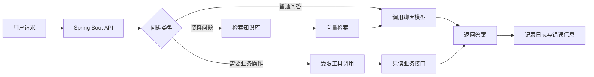

<!-- generated_at: 2026-09-26T08:31:21+08:00 -->

# 2026-09-26 用 LangChain4j 串起 Java AI 应用：大二升大三学习文章

> 生成时间：2026-09-26  
> 读者定位：中北大学软件学院大二升大三学生，已具备 Java、数据库、Web 基础，正在补工程化与 AI 应用开发能力。  
> 今日主题：从 Java AI 框架出发，把模型调用、知识检索和后端工程实践连成一条可动手的学习路线。

## 目录

| 序号 | 部分 | 你能读到什么 |
|---|---|---|
| 1 | [一、先用一张图建立整体认识](#一先用一张图建立整体认识) | Java 后端如何逐步接入 AI 能力 |
| 2 | [二、今日核心项目](#二今日核心项目) | LangChain4j 是什么，如何作为学习入口 |
| 3 | [三、最新信息怎么影响学习](#三最新信息怎么影响学习) | 新闻、招聘与比赛如何转化为学习方向 |
| 4 | [四、适合当前阶段的知识拆解](#四适合当前阶段的知识拆解) | 5 个 AI 应用概念与后端知识的联系 |
| 5 | [五、今天可以动手做什么](#五今天可以动手做什么) | 4 个有明确产出物的小任务 |
| 6 | [六、资料来源](#六资料来源) | 项目、新闻、招聘与比赛的原始链接 |

## 一、先用一张图建立整体认识

学 Java AI 应用，不是先从“训练一个大模型”开始。对已有 Java、数据库和 Web 基础的同学，更实际的路径是：先做一个能调用模型的接口，再让它能查自己的资料，最后补上权限、异常处理和日志。

这张图里的很多东西，其实和已有的后端学习能对应起来：Spring Boot 接收请求，业务代码判断如何处理，数据库或向量库提供数据，日志记录运行情况。AI 部分不是替代后端，而是增加了一种处理自然语言输入、生成回答和选择工具的能力。

## 二、今日核心项目

### LangChain4j：用 Java 组织大模型应用

[LangChain4j GitHub 仓库](https://github.com/langchain4j/langchain4j) 的项目描述将它定位为 Java LLM 应用开发框架，涉及聊天模型、RAG、Embedding、工具调用和 Agent 编排。当前提供的数据无法确认它的 star 数、fork 数和最近更新时间，下面只根据项目描述和仓库链接讨论，不把未确认的信息当作事实。

**为什么适合现在学习：**如果只用 HTTP 客户端直接调用模型接口，很快就会遇到请求与响应格式、上下文管理、提示词组织和异常处理等问题。LangChain4j 可以作为观察 Java AI 应用常见组成部分的入口。学习时建议从项目文档和示例入手，再自己写一个小服务验证，而不是一开始就追求搭建复杂 Agent。

| 关注点 | 在项目描述中的对应内容 | 和 Java 后端学习的联系 |
|---|---|---|
| Spring Boot | 项目本身是 Java AI 框架；也可在 Spring Boot 应用中研究如何组织模型调用 | 把 AI 能力封装成普通业务服务和 Web API |
| RAG | 项目描述包含 RAG | 把“先查资料再回答”拆为文档处理、检索和模型生成 |
| Embedding | 项目描述包含 Embedding | 了解如何把文本转成向量，以便按语义查找相近内容 |
| 工具调用 | 项目描述包含工具调用 | 将模型提出的操作请求映射到受控的 Java 方法或接口 |
| Agent 编排 | 项目描述包含 Agent 编排 | 研究如何组织多步任务；要先学会给步骤和权限设边界 |
| 工程化 | 由上述能力延伸到超时、异常、日志与接口设计 | 把演示程序改造成可观察、可测试、可维护的服务 |

> **建议的学习边界：**先完成“模型调用 + 清晰的异常处理”，再加检索；工具调用先限制在只读接口。能跑通一个小闭环，比一次接入很多 AI 概念更有价值。

## 三、最新信息怎么影响学习

### 新闻：不只追“模型变强”，也要留意评测与工作流

Hugging Face 在 **2026-09-24** 发布了关于 LFM2.5-VL-DSpark 的文章，主题是加速视觉语言模型；在 **2026-09-22** 发布了关于 UK AISI 和 EvalEval 如何让基准测试结果可复现的文章。前者可以提醒我们：AI 应用不只处理文字，也可能处理图像等输入；后者则把注意力拉回工程常识——测试结果要能复现，模型效果也不能只凭一次演示来判断。

OpenAI Developers 的条目包含 Docs MCP 和 Developers plugin 等主题。它们提示开发者关注“模型如何获取文档、如何与工具或开发工作流衔接”。对 Java 学生而言，暂时不必急着追所有新名词；先把工具接口、参数校验和调用记录设计清楚，再理解协议和生态会更扎实。

### GitHub 项目：把关注点落到可运行的 Java 代码

LangChain4j 的描述明确覆盖模型调用、检索和工具等能力，所以适合作为今天的动手入口。其他候选项目也提供了不同观察角度：Spring AI 面向 Spring 生态，Spring AI Alibaba 面向国内模型服务和云生态，MCP Java SDK 面向 Java 服务接入模型工具协议。它们是进一步比较的方向，不代表今天必须全部学完。

### 招聘动态：岗位关键词对应哪些基本功

阿里巴巴、腾讯、字节跳动、百度和美团的招聘官网都被列为关注来源，给出的方向涉及 Java 后端、AI 平台、大模型应用、智能体或平台工程。**这只是招聘官网及岗位方向的线索，不代表当前存在某个具体职位或某项统一的招聘要求。**

对正在升大三的同学，可以把这些方向转成可展示的能力：写得出 Spring Boot API，能接数据库，能解释一次模型调用失败如何处理，并能说明工具调用为什么需要权限边界。企业项目经验还不完整时，一个结构清楚、能演示、能说明取舍的课程或个人项目，就是练习这些能力的好载体。

### 比赛与活动：让小项目有使用场景

AI4J Intelligent Java Conference 的关注点包括 Java AI 应用、Spring AI、LangChain4j、RAG 和 Agent；中国人工智能大赛关注大模型应用与行业 AI 创新。这些方向适合用来找选题：例如围绕校园办事资料做知识问答，或设计一个只调用只读接口的校园信息助手。WAIC 和 Google Cloud Next 的链接更适合作为观察行业趋势和开发者生态的入口。

活动页面是否有正在报名的场次或赛题，需要以官网当前信息为准；本文不据此推断具体时间安排。

## 四、适合当前阶段的知识拆解

先从 5 个概念开始。它们不是彼此孤立的新技术，而是能接到 Java Web 服务上的一组应用能力。

| 概念 | 朴素解释 | 和 Java 后端的关系 | 入门时要留意 |
|---|---|---|---|
| 模型调用 | Java 服务把问题发给模型，再接收回答 | 类似调用外部 HTTP 服务，可以封装为 Service | 设置超时，处理网络错误和模型返回异常 |
| Embedding | 把一段文本转换成一组数字，以便比较内容的语义相似度 | 是语义检索常用的基础，通常和向量库配合 | 它不是答案本身，而是检索时使用的表示 |
| RAG | 回答前先从自己的资料中找相关内容，再把问题和资料交给模型 | 可以拆成资料导入、检索和生成几步 | 检索不到相关资料时，不要让系统装作知道 |
| 工具调用 | 模型提出调用某个函数或接口的请求，由 Java 程序执行 | 和调用业务服务类似，但要由后端决定是否允许执行 | 先限制工具范围，并校验参数与权限 |
| 日志观测 | 记录请求、耗时、错误类型和处理路径，帮助定位问题 | 和普通后端排查问题一样重要，AI 应用也需要它 | 注意不要把不该保存的用户数据写入日志 |

这几个概念之间可以这样理解：模型调用是起点；Embedding 帮助从资料中找内容；RAG 把检索结果带回模型；工具调用让模型请求 Java 服务代为执行某些操作；日志观测则帮助你确认上述步骤到底发生了什么。学到最后，最重要的仍然是能解释系统如何工作、哪里可能失败，以及失败时程序如何处理。

## 五、今天可以动手做什么

下面的任务不要求先搭完整知识库或多步 Agent。今天挑两三个完成即可，重点是留下可检查的产出物。

| 任务 | 建议耗时 | 具体做法 | 产出物 |
|---|---:|---|---|
| 给模型调用补上可靠性处理 | 45–60 分钟 | 为一次调用设置超时；区分超时、网络错误和参数错误；必要时配置有限重试，并准备清晰的 fallback 文案 | 一段 Java 调用代码、错误分类说明和 3 条失败场景记录 |
| 设计只读工具白名单 | 30–45 分钟 | 选 2–3 个只读业务接口，例如查询课程或公告；明确每个工具可读什么、禁止做什么，并校验参数 | 一张工具权限表和对应的 Java 接口草图 |
| 比较两个 Java AI 抽象 | 40–60 分钟 | 对照 LangChain4j 与 Spring AI 的仓库说明，分别查找模型、Embedding、向量存储相关入口 | 5 条比较结论，说明共同点、差异和暂时不确定之处 |
| 设计问题意图识别 | 30–40 分钟 | 写一个简单 prompt，将输入分类为问答、检索、任务执行或闲聊；准备至少 8 条测试输入 | prompt 文本、测试样例及分类结果记录 |

做完后，可以用一个问题检查自己的工程思路：**如果模型调用超时，用户会看到什么，后端会记录什么，系统会不会重复执行有副作用的操作？**能回答这个问题，就比单纯展示一段模型回答更接近真实项目开发。

## 六、资料来源

### GitHub 项目

- [langchain4j/langchain4j](https://github.com/langchain4j/langchain4j) — Java LLM 应用开发框架。
- [spring-projects/spring-ai](https://github.com/spring-projects/spring-ai) — Spring 生态 AI 应用抽象层。
- [1Panel-dev/MaxKB](https://github.com/1Panel-dev/MaxKB) — 知识库问答与智能体编排项目。
- [alibaba/spring-ai-alibaba](https://github.com/alibaba/spring-ai-alibaba) — Spring AI 扩展与应用实践项目。
- [microsoft/semantic-kernel](https://github.com/microsoft/semantic-kernel) — AI 编排 SDK，项目描述包含 Java SDK。
- [modelcontextprotocol/java-sdk](https://github.com/modelcontextprotocol/java-sdk) — Model Context Protocol 的 Java SDK。

### 新闻与技术文章

- [Hugging Face Blog：Accelerating vision-language models with LFM2.5-VL-DSpark](https://huggingface.co/blog/LiquidAI/lfm2-5-vl-dspark)（数据所列日期：2026-09-24）
- [Hugging Face Blog：How UK AISI and EvalEval Are Making Benchmark Results Reproducible](https://huggingface.co/blog/evaleval-aisi)（数据所列日期：2026-09-22）
- [OpenAI Developers：Docs MCP](https://developers.openai.com/learn/docs-mcp/)
- [OpenAI Developers：Developers Codex plugin](https://developers.openai.com/learn/developers-codex-plugin/)
- [OpenAI Developers 官方站点](https://developers.openai.com/)

### 招聘官网

- [阿里巴巴招聘](https://talent.alibaba.com/)
- [腾讯招聘](https://careers.tencent.com/)
- [字节跳动招聘](https://jobs.bytedance.com/)
- [百度招聘](https://talent.baidu.com/)
- [美团招聘](https://zhaopin.meituan.com/)

### 比赛与活动官网

- [AI4J Intelligent Java Conference](https://ai4j.io/)
- [中国人工智能大赛](https://www.aicomp.cn/)
- [世界人工智能大会 WAIC](https://www.worldaic.com.cn/)
- [Google Cloud Next](https://cloud.withgoogle.com/next)
