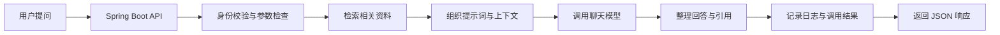

<!-- generated_at: 2026-10-06T08:31:19+08:00 -->

# 2026-10-06 从 LangChain4j 看 Java AI 应用工程化：给大二升大三学生的学习文章
> 生成时间：2026-10-06  
> 读者定位：中北大学软件学院大二升大三学生，已具备 Java、数据库、Web 基础，正在补工程化与 AI 应用开发能力。  
> 今日主题：从 LangChain4j 出发，把模型调用、知识库检索和工具调用放回熟悉的 Java 后端工程中理解。

## 目录

| 序号 | 部分 | 你能读到什么 |
|---|---|---|
| 1 | [先用一张图建立整体认识](#part-1) | 一次 AI 问答从用户请求到后端返回，大致经过哪些环节 |
| 2 | [今日核心项目](#part-2) | LangChain4j 是什么，为什么适合 Java 学生入门 |
| 3 | [最新信息怎么影响学习](#part-3) | 新闻、项目、招聘方向和活动如何连成学习主线 |
| 4 | [适合当前阶段的知识拆解](#part-4) | 用后端开发的语言理解 5 个 AI 应用概念 |
| 5 | [今天可以动手做什么](#part-5) | 可在一天内完成的 4 个工程练习 |
| 6 | [资料来源](#part-6) | 项目、新闻、招聘和活动的原始链接 |

## 一、先用一张图建立整体认识 {#part-1}

先把“大模型应用”想成一个接在普通 Web 后端中的功能，而不是一个独立的黑盒。用户照常发起 HTTP 请求，后端负责校验输入、准备资料、调用模型，并把结果整理成前端能使用的响应。

这张图里的很多工作并不陌生：API、身份校验、日志和 JSON 响应，本来就是 Java Web 的内容。AI 应用新增的重点，是后端如何把资料交给模型、如何限制模型可以做什么，以及模型出错时怎样让服务可控。

## 二、今日核心项目 {#part-2}

### LangChain4j：用 Java 组件搭建 LLM 应用

[LangChain4j](https://github.com/langchain4j/langchain4j) 是一个 Java LLM 应用开发框架。给定的数据将它描述为覆盖聊天模型、RAG、Embedding、工具调用和 Agent 编排的项目。

| 观察角度 | 对应内容 |
|---|---|
| 项目描述 | Java LLM 应用开发框架，提供聊天模型、RAG、Embedding、工具调用和 Agent 编排相关能力。 |
| 原始链接 | [github.com/langchain4j/langchain4j](https://github.com/langchain4j/langchain4j) |
| 为什么适合 Java AI 学习 | 不必先离开 Java 技术栈。可以把调用模型看成一项外部服务集成，再逐步学习检索和工具调用。 |
| 与 Spring Boot 的关系 | 可把 AI 能力接进已有的 Java Web 服务：由 Controller 接收请求，业务层组织调用，再返回接口响应。 |
| 与 RAG、Agent、工具调用的关系 | 项目描述覆盖这些能力，适合用来了解它们如何组成 AI 应用；具体 API 和使用方式应以仓库当前文档为准。 |
| 与工程化的关系 | 有了框架仍要自行考虑接口边界、异常处理、超时、日志、权限和测试，不能把“调用成功”当作“服务可靠”。 |

对当前阶段的同学来说，建议先做一个很小的 Web 接口：接收问题、调用聊天模型、返回答案。接着再给它加上资料检索和引用。不要一开始就追求“全自动 Agent”，先弄清楚每一步的输入、输出和失败情况。

## 三、最新信息怎么影响学习 {#part-3}

### 新闻提醒：Agent 的结果要回到真实数据核对

Hugging Face Blog 在 2026 年 10 月 3 日发布了 **“The Agent Said It Was Done. The Database Disagreed.”** 这一标题。只根据标题就能提炼一个对后端开发很实用的问题：Agent 说“已完成”，是否代表数据库里的业务状态真的改变了？

做练习时，可以把这两者分开验证：模型的自然语言回答是一种输出，数据库记录或只读业务接口返回的状态则是另一种证据。不要仅凭模型说“提交成功”，就向用户展示业务已经完成。需要确认业务结果时，应由后端查询实际数据。

同一来源还列出了 AstaBrief 开源和企业 Agent 训练数据生成等文章。这些标题提示我们，AI 应用除了“回答问题”，也涉及报告生成、数据准备等任务。不过仅凭标题不能判断文章的具体技术方案，想深入时应阅读原文。

### GitHub 项目：框架解决的是“怎么接入”，不是“自动变可靠”

LangChain4j 提供 Java 开发者可以研究的模型应用能力。它适合帮助你认识常见组件，但框架不会替项目自动决定业务权限，也不能保证每次回答准确。

这和新闻带出的数据库核验问题正好连在一起：即便框架能编排 Agent 或工具调用，执行涉及业务数据的操作时，仍应由 Java 后端明确约束可用接口、校验权限，并检查实际结果。

### 招聘方向：保住后端基本功，再补 AI 应用能力

给出的招聘入口涵盖阿里巴巴、腾讯、字节跳动、百度和美团，关注方向包括 Java 后端、AI 工程化、AI 平台、智能体应用及大模型应用。这些是招聘官网入口和方向摘要，不等同于当前正在开放的具体职位，也不能据此推断录用要求。

对大二升大三学生，比较稳妥的准备方式是把熟悉的 Java 后端能力和 AI 应用能力连起来：会写接口、操作数据库、处理异常，再能说明模型如何接入、资料如何检索、服务如何观察与限制。完成一个小而清楚的项目，通常比只会描述概念更能体现工程实践。

### 比赛与活动：拿真实问题做完整闭环

给出的活动来源包括关注 Java AI 应用的 AI4J Intelligent Java Conference、中国人工智能大赛、WAIC 和 Google Cloud Next。它们关注的范围不同，但都能作为观察 AI 应用、行业场景或开发者生态的入口。数据没有提供报名时间或具体赛题，因此需要到活动官网核对最新安排。

如果想把学习变成作品，可以选一个校内场景：例如课程资料问答。先让系统能导入资料、回答问题，再加入引用来源和失败处理。这样的项目既贴近 Java Web，又可以逐步扩展成 RAG 应用。

## 四、适合当前阶段的知识拆解 {#part-4}

| 概念 | 用朴素的话解释 | 和 Java 后端的关系 |
|---|---|---|
| 模型调用 | 后端把问题发给一个模型服务，再接收模型返回的文本或结构化结果。 | 和调用第三方 HTTP 服务类似；要处理配置、网络异常、超时和返回值校验。 |
| Embedding 与 RAG | Embedding 把文本转换成便于比较的向量；RAG 会先找出与问题相关的资料，再把资料和问题一起交给模型。 | 文档切分、向量存储和检索都可以作为后端的数据处理流程；回答时还能返回资料出处。 |
| 工具调用 | 模型根据任务请求后端提供的某个函数或接口，实际执行仍由应用程序负责。 | 可以类比业务服务方法，但不能让模型任意调用所有接口。要在 Java 侧检查参数、权限和调用结果。 |
| Agent | 把“理解任务、选择步骤、使用工具、继续处理”组织成一套流程。 | 比单次模型调用多了流程控制和状态管理；步骤越多，越需要限制范围、记录执行过程并处理失败。 |
| 日志观测、超时与权限 | 日志帮助定位发生了什么；超时限制等待时间；权限决定某个请求可以做什么。 | 这些是后端服务可靠性的基础。AI 请求也要记录失败原因、设置调用边界，并区分用户身份和可访问数据。 |

学习顺序可以从简单到复杂：先完成一次模型调用，再做资料检索与引用，然后添加只读工具，最后才尝试多步骤 Agent。每一步都尽量保留明确的输入、输出和错误处理。

## 五、今天可以动手做什么 {#part-5}

以下任务来自给定的工程练习方向。可以选择其中两项完成；重点不是堆功能，而是让功能的行为能够被检查。

| 任务 | 建议耗时 | 产出物 |
|---|---:|---|
| 给一个 RAG demo 增加引用来源返回，接口返回 `answer`、`source_title`、`source_url` 和 `chunk_id`。 | 60–90 分钟 | 一份接口 JSON 示例，以及至少一个能对应回原始资料片段的测试样例。 |
| 为一次模型调用增加超时、重试、错误分类和 fallback 文案，并记录失败原因。 | 60–90 分钟 | 一段调用封装代码、一张错误分类表，以及模拟超时或失败的测试结果。 |
| 设计一个工具调用白名单，只允许模型调用 2–3 个只读业务接口，并写清权限边界。 | 45–60 分钟 | 工具白名单配置或代码、接口说明，以及“允许/拒绝”各一条测试用例。 |
| 对比 LangChain4j 与 Spring AI 的 `ChatModel`、`EmbeddingModel`、`VectorStore` 抽象差异。 | 45–60 分钟 | 5 条对比结论，注明查阅的官方文档或源码位置。 |

一个建议的提交顺序是：先完成功能，再补一份 README，写清楚如何运行、接口接收什么、异常时返回什么。这样你的成果不只是“我试过 AI”，而是一个别人可以理解和复现的小型工程。

## 六、资料来源 {#part-6}

| 类型 | 来源 | 备注 |
|---|---|---|
| GitHub 项目 | [LangChain4j](https://github.com/langchain4j/langchain4j) | 今日核心项目；项目能力说明依据给定数据，具体使用细节请查阅仓库文档。 |
| AI 新闻 | [Hugging Face Blog：The Agent Said It Was Done. The Database Disagreed.](https://huggingface.co/blog/microsoft/thinkingbox) | 数据所列发布时间为 2026-10-03；本文对内容只依据标题提炼学习问题。 |
| AI 新闻 | [Hugging Face Blog：Open-sourcing AstaBrief](https://huggingface.co/blog/allenai/astabrief) | 数据所列发布时间为 2026-10-02。 |
| AI 新闻 | [Hugging Face Blog：AutoSynthData](https://huggingface.co/blog/ServiceNow-AI/autosynthdata) | 数据所列发布时间为 2026-10-02。 |
| 招聘官网 | [阿里巴巴人才招聘](https://talent.alibaba.com/) | 给定方向摘要：Java 后端、AI 工程化、大模型应用；具体岗位请以官网为准。 |
| 招聘官网 | [腾讯招聘](https://careers.tencent.com/) | 给定方向摘要：后台开发、AI 平台、智能体应用；具体岗位请以官网为准。 |
| 招聘官网 | [字节跳动招聘](https://jobs.bytedance.com/) | 给定方向摘要：后端研发、AI 平台、大模型工程；具体岗位请以官网为准。 |
| 招聘官网 | [百度人才招聘](https://talent.baidu.com/) | 给定方向摘要：AI 原生应用、智能云、大模型平台；具体岗位请以官网为准。 |
| 招聘官网 | [美团招聘](https://zhaopin.meituan.com/) | 给定方向摘要：Java 后端、平台工程、AI 应用场景；具体岗位请以官网为准。 |
| 比赛与活动 | [AI4J Intelligent Java Conference](https://ai4j.io/) | 给定关注方向：Java AI 应用、Spring AI、LangChain4j、RAG、Agent。 |
| 比赛与活动 | [中国人工智能大赛](https://www.aicomp.cn/) | 给定关注方向：大模型应用、智能体和行业 AI 创新赛事。 |
| 比赛与活动 | [世界人工智能大会 WAIC](https://www.worldaic.com.cn/) | 给定关注方向：AI 产业趋势、企业级 AI 应用与开发者生态。 |
| 比赛与活动 | [Google Cloud Next](https://cloud.withgoogle.com/next) | 给定关注方向：Gemini、Vertex AI、Agent Builder 和云端 AI 应用开发。 |

给定的 OpenAI Developers 数据源未获取到文章，Microsoft AI Blog 数据源返回 HTTP 410，因此本文没有把它们作为新闻内容引用。
